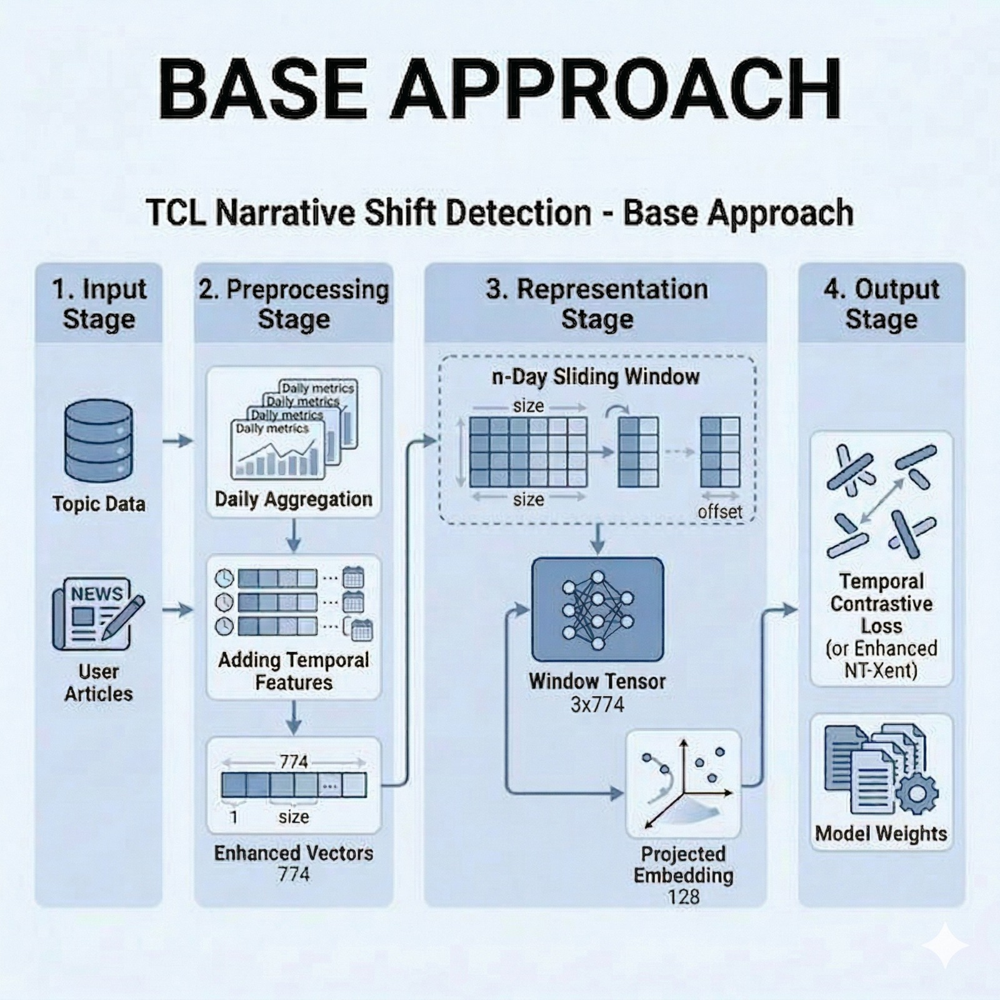
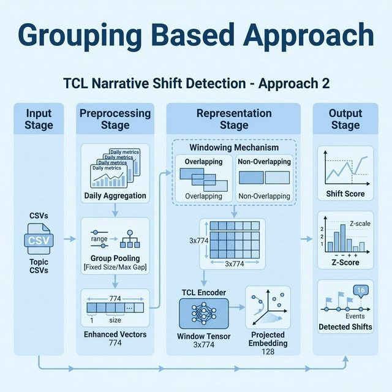
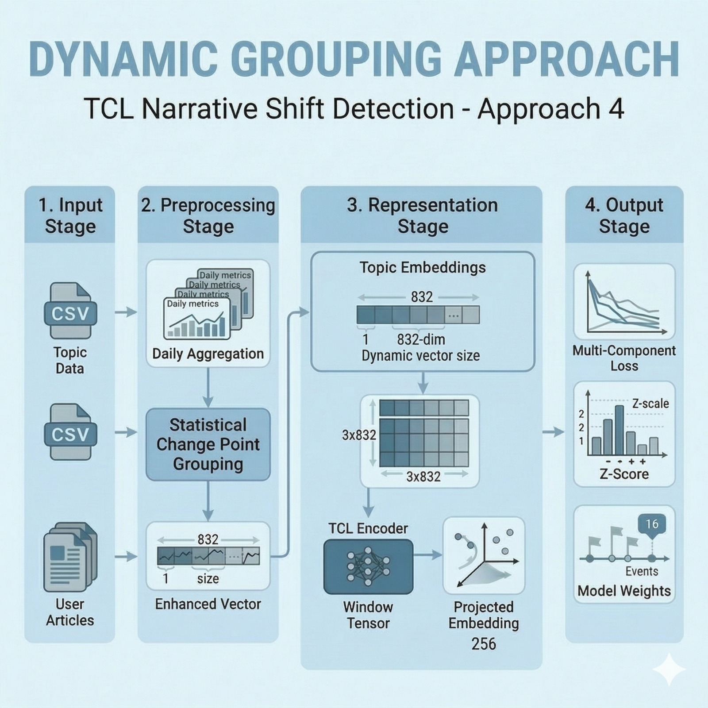
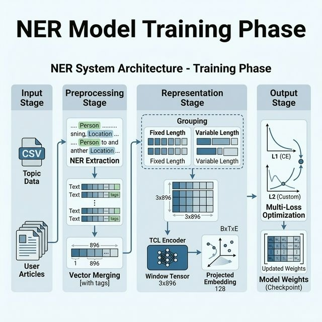
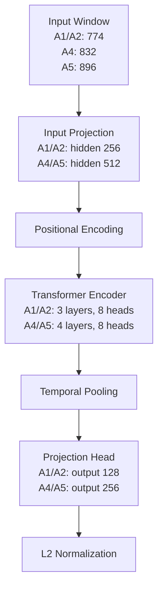

# Narrative Shift Detection with Temporal Contrastive Learning

This repository contains a full research pipeline for detecting narrative shifts in news data using Temporal Contrastive Learning (TCL). It includes data preparation notebooks, multiple TCL modeling approaches, model evaluation outputs, and detailed technical documentation.

The primary topics covered are:
- `War`
- `Health`
- `Technology`
- `Climate`
- `Economics`

Testing/runtime note:
- `testing.py` interactive testing currently exposes approaches `1`, `2`, and `4` in the option menu.
- Approach `5` remains implemented in the codebase, but is not shown in the current testing option list.

Quick run (top-level):

```bash
python testing.py
```

## Table of Contents

- [Project Overview](#project-overview)
- [Approach Summary](#approach-summary)
- [High-Level Pipelines](#high-level-pipelines)
- [Model Architecture](#model-architecture)
- [End-to-End Workflow](#end-to-end-workflow)
- [Repository Structure](#repository-structure)
- [Key Files and Entry Points](#key-files-and-entry-points)
- [Setup](#setup)
- [How to Run](#how-to-run)
- [Outputs](#outputs)
- [Documentation Map](#documentation-map)
- [Notes](#notes)

## Project Overview

Goal of the project:
- Learn temporally-aware embeddings for topic narratives.
- Detect narrative shifts across time windows.
- Provide sentence-level evidence for detected drift.
- Compare multiple approach designs under one framework.

This codebase currently emphasizes four implemented approaches: `1`, `2`, `4`, `5`.

For interactive testing (`testing.py`), selectable options are currently `1`, `2`, and `4`.

## Approach Summary

| Dimension | Approach 1 | Approach 2 | Approach 4 | Approach 5 |
|---|---|---|---|---|
| Core Idea | Baseline day windows | Group-based temporal units | Ruptures PELT segmentation | Entity-aware TCL |
| Input Dim | 774 | 774 | 832 | 896 |
| Model Size | 1.96M params | 1.96M params | 13.4M params | 13.5M params |
| Segmentation | Fixed days | Fixed-size or max-gap grouping | Adaptive (PELT) | Adaptive (PELT) |
| Entity Awareness | No | No | No | Yes |

Reference: `TCL/docs/TCL_Approaches_Comparison.md`

## High-Level Pipelines

Approach-wise high-level pipeline images are used here for quick understanding.

### Approach 1: Baseline Day-Level TCL


### Approach 2: Group-Based TCL


### Approach 4: Ruptures-Based TCL


### Approach 5: Entity-Aware TCL


## Model Architecture

All approaches use a transformer-style temporal encoder. Approaches `4` and `5` scale up hidden size/layers and add richer input features.



Model architecture docs:
- `TCL/docs/approach_1_model_architecture.md`
- `TCL/docs/approach_2_model_architecture.md`
- `TCL/docs/approach_4_model_architecture.md`
- `TCL/docs/approach_5_model_architecture.md`

## End-to-End Workflow

1. Prepare and clean source datasets in `Pre_Processing/`.
2. Build combined and processed datasets in `Processed_Data/`.
3. Train/evaluate TCL pipelines from `TCL/TCL_Pipeline_*.ipynb`.
4. Save checkpoints, metrics, plots, and shift outputs under `TCL/tcl_output_new_*` and `Output/`.
5. Compare approaches with `TCL/docs/TCL_Approaches_Comparison.md`.

## Repository Structure

```text
Naretve_Shift/
├── README.md
├── requirements.txt
├── reference.md
├── report.md
├── TCL_Framework_Complete.pdf
│
├── DATA/                               # Raw source datasets
├── Input/                              # User/sample input articles
├── Processed_Data/                     # Processed artifacts for training/inference
│   ├── ALL_Combined_Data.csv
│   ├── DATA_W3.csv
│   ├── all_articles_english_with_dates.csv
│   ├── topic_embeddings.json
│   ├── Distributed_Data/
│   ├── Soft_Labeling_Topic_Articles/
│   ├── Stage_3_3_w3/
│   ├── Topic_Wise_w3/
│   └── Topic_Wise_w5/
│
├── Pre_Processing/                     # Data preprocessing and preparation notebooks
│   ├── CSV_Explorer.ipynb
│   ├── Data_Combine.ipynb
│   ├── Data_Preprocessing.ipynb
│   ├── Data_balancing.ipynb
│   ├── Kaggle_CSV_Merger.ipynb
│   ├── Kaggle_Embedding_Optimizer.ipynb
│   └── Narrative_Shift_Detection.ipynb
│
├── TCL/                                # Main modeling code and docs
│   ├── README.md
│   ├── TCL_Pipeline_1.ipynb            # Approach 1
│   ├── TCL_Pipeline_2.ipynb            # Approach 2
│   ├── TCL_Pipeline_4.ipynb            # Approach 4
│   ├── TCL_Pipeline_5.ipynb            # Approach 5
│   ├── ap4-narrative-shift-detection.ipynb
│   ├── tcl_output_new_1/
│   ├── tcl_output_new_2/
│   ├── tcl_output_new_4/
│   ├── tcl_output_new_5/
│   └── docs/
│       ├── TCL_Approaches_Comparison.md
│       ├── approach_1.md
│       ├── approach_2.md
│       ├── approach_3.md
│       ├── approach_4.md
│       ├── approach_5.md
│       ├── approach_1_model_architecture.md
│       ├── approach_2_model_architecture.md
│       ├── approach_4_model_architecture.md
│       ├── approach_5_model_architecture.md
│       └── images/
│           ├── approch_1/
│           ├── approch_2/
│           ├── approch_4/
│           └── approch_5/
│
├── Output/                             # Final outputs and visual analytics
│   ├── Data_Cleaning_Visualization/
│   ├── Model/
│   ├── Model_Testing/
│   ├── Model_output/
│   ├── Narrative_Shift_Window_Detection/
│   └── Topic_Labeling_Comparison/
│
├── SBERT_semantic_drift/               # SBERT drift scripts and thresholds
├── K_Means_Drift/                      # Alternative drift analysis material
├── Research_Paper/                     # Research notes and draft artifacts
└── Report/                             # Reporting artifacts
```

## Key Files and Entry Points

Main comparison and docs:
- `TCL/docs/TCL_Approaches_Comparison.md`
- `TCL/docs/approach_1.md`
- `TCL/docs/approach_2.md`
- `TCL/docs/approach_4.md`
- `TCL/docs/approach_5.md`

Main runnable notebooks:
- `TCL/TCL_Pipeline_1.ipynb`
- `TCL/TCL_Pipeline_2.ipynb`
- `TCL/TCL_Pipeline_4.ipynb`
- `TCL/TCL_Pipeline_5.ipynb`

Interactive testing entry point:
- `testing.py` (HF model/config loader + topic-wise inference test)

Supporting preprocessing notebooks:
- `Pre_Processing/Data_Preprocessing.ipynb`
- `Pre_Processing/Data_Combine.ipynb`
- `Pre_Processing/Data_balancing.ipynb`

## Setup

```bash
python -m venv .venv
source .venv/bin/activate
pip install -r requirements.txt
python -m spacy download en_core_web_sm
```

## How to Run

Run any pipeline notebook from `TCL/`:

```bash
cd TCL
jupyter notebook TCL_Pipeline_1.ipynb
```

Examples:
- Baseline: `TCL_Pipeline_1.ipynb`
- Group-based: `TCL_Pipeline_2.ipynb`
- Ruptures-based: `TCL_Pipeline_4.ipynb`
- Entity-aware: `TCL_Pipeline_5.ipynb`

Run interactive testing script (current menu options: `1`, `2`, `4`):

```bash
python testing.py
```

### Testing Runtime Sources (Where model/data come from)

When you run `testing.py`, artifacts are loaded from these sources:

1. Model config and checkpoint:
- Source: Hugging Face repo `HF_REPO_ID` (default `meet5568/tcl-approach`)
- Token: `HF_TOKEN_READ`
- Revision: `main`
- Subfolder resolution: `HF_SUBFOLDER` if set, else `approach_<id>`
- Files loaded: `base_approch_<id>_config.json` and `base_approch_<id>_best.pt`

2. Input data for testing:
- Source: Google Drive folder URL (`GOOGLE_DRIVE_FOLDER_URL`)
- Download method: `gdown.download_folder(...)`
- CSV discovery: recursive under downloaded temp folder

3. Topic prototype embeddings (for soft labeling):
- Source: JSON inside downloaded Drive folder tree
- Override via `TOPIC_EMBEDDINGS_JSON` (must point inside active working directory tree)

4. Topic embedding table used in temporal feature construction:
- Approach `4`: uses `config["topic_embedding_table"]` from loaded model config.
- Approach `5`: expects `approach5_topic_embedding_table` loaded from HF artifacts (code path exists, but Approach 5 is not in the current testing menu).

5. Output behavior:
- Current testing run prints topic-wise results to console (`Output: console_only` in script logs).
- Temporary working directory is auto-cleaned after run.

## Outputs

Typical outputs include:
- Trained model checkpoints (`.pt`)
- Training curves and heatmaps
- Intra-topic and inter-topic similarity metrics
- Separation scores
- JSON shift reports with sentence-level evidence

Where outputs appear:
- Approach-local outputs: `TCL/tcl_output_new_1`, `TCL/tcl_output_new_2`, `TCL/tcl_output_new_4`, `TCL/tcl_output_new_5`
- Consolidated folders: `Output/Model_output` and related subfolders

## Documentation Map

- Full approach comparison: `TCL/docs/TCL_Approaches_Comparison.md`
- Deep architecture references:
  - `TCL/docs/approach_1_model_architecture.md`
  - `TCL/docs/approach_2_model_architecture.md`
  - `TCL/docs/approach_4_model_architecture.md`
  - `TCL/docs/approach_5_model_architecture.md`
- TCL-local summary: `TCL/README.md`

## Notes

- Approach `3` is documented but currently deferred in practice.
- For metrics and latest comparisons, use `TCL/docs/TCL_Approaches_Comparison.md` as source-of-truth.
- Folder names under `TCL/docs/images` use `approch_*` spelling; this README follows those exact paths.
