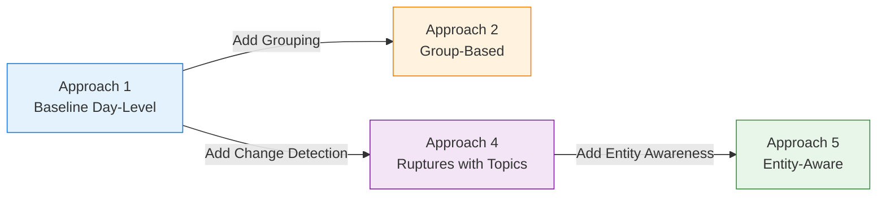
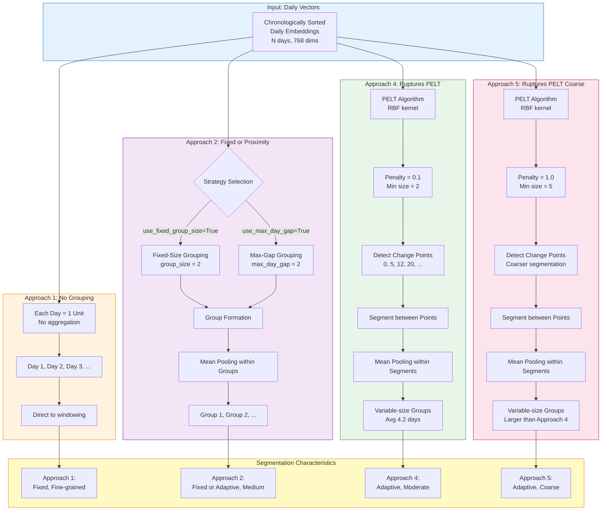
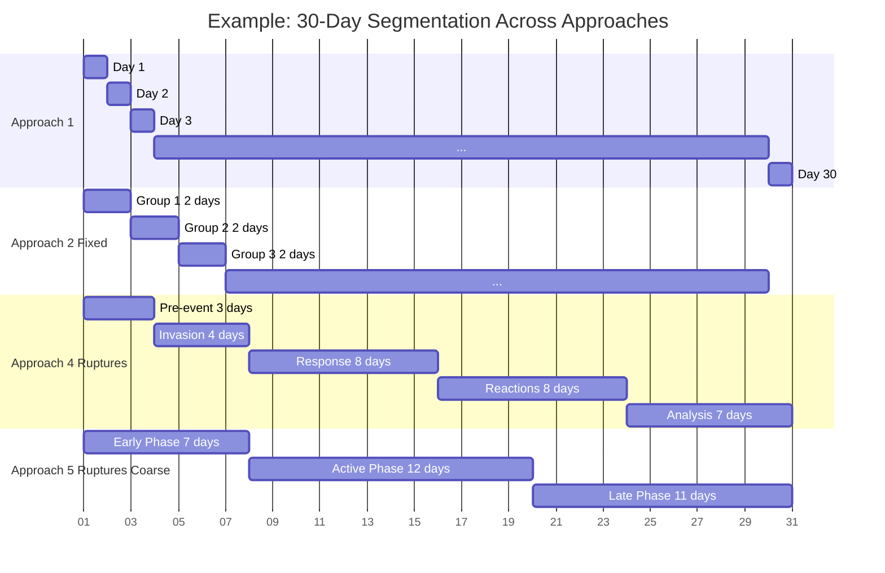
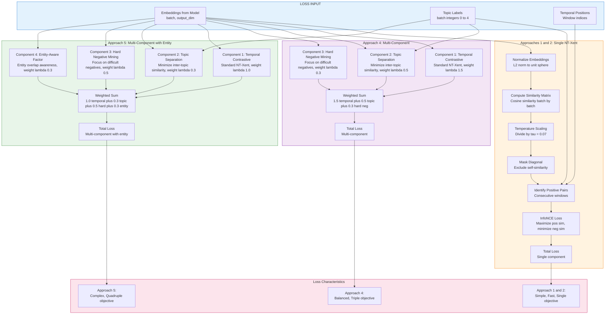
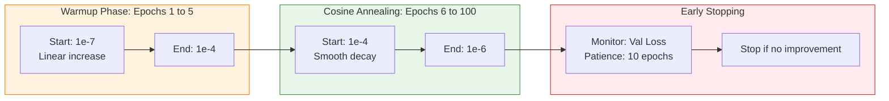
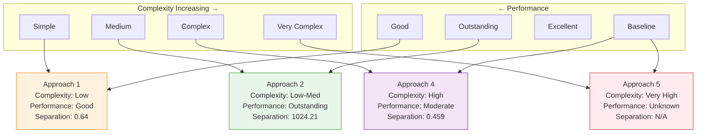
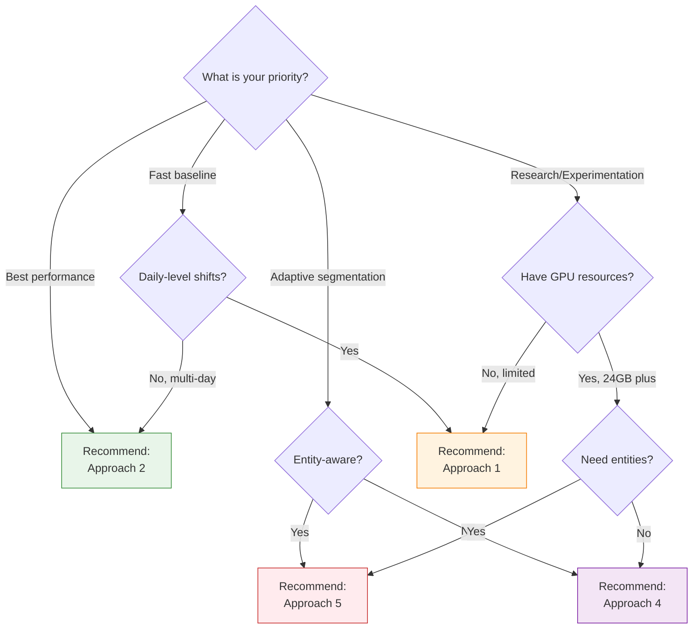

# Temporal Contrastive Learning (TCL) Approaches: Comprehensive Comparison

**Document Version:** 1.0  
**Last Updated:** April 8, 2026  
**Approaches Covered:** 1, 2, 4, 5

---

## Table of Contents

1. [Executive Summary](#1-executive-summary)
2. [Unified Pipeline Architecture](#2-unified-pipeline-architecture)
3. [Approach-by-Approach Overview](#3-approach-by-approach-overview)
4. [Segmentation Strategies Comparison](#4-segmentation-strategies-comparison)
5. [Model Architecture Comparison](#5-model-architecture-comparison)
6. [Loss Functions Comparison](#6-loss-functions-comparison)
7. [Training Strategy Comparison](#7-training-strategy-comparison)
8. [Performance Comparison](#8-performance-comparison)
9. [Use Case Recommendations](#9-use-case-recommendations)
10. [Configuration Reference](#10-configuration-reference)

---

## 1. Executive Summary

### 1.1 Overview

This document provides a comprehensive comparison of **four Temporal Contrastive Learning (TCL) approaches** developed for narrative shift detection in news articles across five topics: **War**, **Health**, **Economics**, **Technology**, and **Climate**.

### 1.2 Evolution Path



### 1.3 Quick Comparison Matrix

| Dimension | Approach 1 | Approach 2 | Approach 4 | Approach 5 |
|-----------|-----------|-----------|-----------|-----------|
| **Philosophy** | Simple Baseline | Group Aggregation | Statistical Segmentation | Entity-Aware Learning |
| **Complexity** | ⭐ Low | ⭐⭐ Low-Medium | ⭐⭐⭐⭐ High | ⭐⭐⭐⭐⭐ Very High |
| **Segmentation** | Fixed Days | Fixed/Proximity Groups | Ruptures PELT | Ruptures PELT |
| **Topic Encoding** | One-Hot (5D) | One-Hot (5D) | Learned (64D) | Learned (64D) |
| **Entity Awareness** | ❌ No | ❌ No | ❌ No | ✅ Yes |
| **Model Size** | 1.96M params | 1.96M params | 13.4M params | 13.5M params |
| **Input Dim** | 774 | 774 | 832 | 896 |
| **Training Time** | ~1.2 hrs | ~1.5 hrs | ~4.5 hrs | ~6 hrs |
| **Separation Score** | 0.64 | **1024.21** | 0.459 | Not reported |
| **Best For** | Quick baseline | Event clustering | Adaptive segmentation | Entity-focused narratives |

---

## 2. Unified Pipeline Architecture

### 2.1 Generalized High-Level Pipeline

This diagram represents the **common pipeline structure** across all approaches, with approach-specific variations highlighted:

```mermaid
graph TB
    subgraph Input[INPUT STAGE - Common to All]
        I1[Topic CSV Files<br/>5 topics, N sentences each]
        I2[User Article CSV<br/>date, article columns]
    end
    
    subgraph Preprocessing[PREPROCESSING - Common]
        P1[Sentence Splitting<br/>Regex-based segmentation]
        P2[Context Building<br/>Window of surrounding sentences]
        P3[SBERT Embedding<br/>all-mpnet-base-v2, 768 dims]
        P4[Soft Topic Labeling<br/>Cosine similarity scoring]
        P5[Topic Filtering<br/>Threshold-based selection]
    end
    
    subgraph EntityProc[ENTITY PROCESSING - Approach 5 Only]
        E1[NER Extraction<br/>spaCy entity detection]
        E2[Entity Embedding<br/>64-dim projection]
        E3[Entity-Invariant Vector<br/>semantic minus lambda entity]
        E4[Combine Vectors<br/>832 dims total]
    end
    
    subgraph DailyAgg[DAILY AGGREGATION - Common]
        D1[Group by Date and Topic<br/>Per-day grouping]
        D2[Weighted Pooling<br/>Topic scores as weights]
        D3[L2 Normalization<br/>Unit sphere projection]
        D4[Daily Vector<br/>768 dims]
    end
    
    subgraph Segmentation[TEMPORAL SEGMENTATION - Approach-Specific]
        S1{Segmentation Strategy}
        S2[Approach 1:<br/>No grouping, 1 day per unit]
        S3[Approach 2:<br/>Fixed-size or Max-gap grouping]
        S4[Approach 4 and 5:<br/>Ruptures PELT algorithm]
    end
    
    subgraph Features[FEATURE ENGINEERING - Approach-Specific]
        F1[Temporal Tau Feature<br/>log 1 plus gap over 5]
        F2[Topic Encoding]
        F3{Topic Type}
        F4[Approaches 1 and 2:<br/>One-hot 5 dims]
        F5[Approaches 4 and 5:<br/>Learned embedding 64 dims]
        F6[Concatenate Features<br/>Final vector 774/832/896]
    end
    
    subgraph Windowing[WINDOWING - Approach-Specific]
        W1[Sliding Window Creation]
        W2[Window Size:<br/>Approach 1,4: 2 units<br/>Approach 2,5: 3 units]
        W3[Stride:<br/>Approach 1,4,5: 1 overlap<br/>Approach 2: 3 no overlap]
        W4[Window Tensor<br/>size, dims shape]
    end
    
    subgraph Model[MODEL - Architecture Varies]
        M1[TCL Temporal Encoder]
        M2[Input Projection<br/>dims to hidden_dim]
        M3[Positional Encoding<br/>Learned parameters]
        M4[Transformer Encoder<br/>num_layers, num_heads]
        M5[Attention Pooling<br/>Sequence to vector]
        M6[Post-MLP<br/>Residual connection]
        M7[Projection Head<br/>To output_dim]
        M8[L2 Normalize<br/>Unit hypersphere]
    end
    
    subgraph Loss[LOSS FUNCTION - Approach-Specific]
        L1{Loss Type}
        L2[Approaches 1 and 2:<br/>Single NT-Xent]
        L3[Approach 4:<br/>Multi-component<br/>Temporal, Topic, Hard Neg]
        L4[Approach 5:<br/>Multi-component plus Entity]
    end
    
    subgraph Training[TRAINING - Common]
        T1[AdamW Optimizer<br/>Learning rate schedule]
        T2[Warmup Phase<br/>Linear ramp-up]
        T3[Cosine Annealing<br/>Smooth decay]
        T4[Gradient Clipping<br/>max norm 1.0]
        T5[Early Stopping<br/>Patience-based]
    end
    
    subgraph Inference[INFERENCE - Common]
        INF1[Load Checkpoint<br/>best, last, or evaluated]
        INF2[Encode Windows<br/>Model forward pass]
        INF3[Compute Drift Scores<br/>Cosine distance]
        INF4[Z-Score Normalization<br/>Statistical standardization]
        INF5[Shift Detection<br/>Threshold-based]
        INF6[Sentence-Level Extraction<br/>Lowest similarity pairs]
    end
    
    subgraph Output[OUTPUT - Common]
        O1[Model Checkpoints<br/>best, last, evaluated pt files]
        O2[Evaluation Metrics<br/>Intra/inter-topic similarity]
        O3[Training Visualizations<br/>Loss curves, heatmaps]
        O4[Narrative Shifts JSON<br/>Sentence-level evidence]
    end
    
    I1 --> P1
    I2 --> P1
    P1 --> P2
    P2 --> P3
    P3 --> P4
    P4 --> P5
    
    P5 --> E1
    E1 --> E2
    E2 --> E3
    E3 --> E4
    E4 --> D1
    
    P5 --> D1
    D1 --> D2
    D2 --> D3
    D3 --> D4
    
    D4 --> S1
    S1 --> S2
    S1 --> S3
    S1 --> S4
    
    S2 --> F1
    S3 --> F1
    S4 --> F1
    F1 --> F2
    F2 --> F3
    F3 --> F4
    F3 --> F5
    F4 --> F6
    F5 --> F6
    
    F6 --> W1
    W1 --> W2
    W2 --> W3
    W3 --> W4
    
    W4 --> M1
    M1 --> M2
    M2 --> M3
    M3 --> M4
    M4 --> M5
    M5 --> M6
    M6 --> M7
    M7 --> M8
    
    M8 --> L1
    L1 --> L2
    L1 --> L3
    L1 --> L4
    
    L2 --> T1
    L3 --> T1
    L4 --> T1
    T1 --> T2
    T2 --> T3
    T3 --> T4
    T4 --> T5
    
    T5 --> O1
    T5 --> O2
    T5 --> O3
    
    O1 --> INF1
    INF1 --> INF2
    W4 --> INF2
    INF2 --> INF3
    INF3 --> INF4
    INF4 --> INF5
    INF5 --> INF6
    INF6 --> O4
    
    style Input fill:#e3f2fd,stroke:#1976d2
    style Preprocessing fill:#fff3e0,stroke:#f57c00
    style EntityProc fill:#c8e6c9,stroke:#388e3c
    style DailyAgg fill:#f3e5f5,stroke:#7b1fa2
    style Segmentation fill:#ffebee,stroke:#c62828
    style Features fill:#e1f5fe,stroke:#0277bd
    style Windowing fill:#fff9c4,stroke:#f57f17
    style Model fill:#fce4ec,stroke:#c2185b
    style Loss fill:#e0f2f1,stroke:#00796b
    style Training fill:#f3e5f5,stroke:#7b1fa2
    style Inference fill:#fff3e0,stroke:#f57c00
    style Output fill:#e8f5e9,stroke:#388e3c
```



### 2.2 Pipeline Component Summary

| Component | Common | Approach-Specific Notes |
|-----------|--------|------------------------|
| **Input** | ✅ All use same CSV format | - |
| **Preprocessing** | ✅ Same SBERT, context building | - |
| **Entity Processing** | ❌ Approach 5 only | NER extraction, 64D projection, entity-invariant vectors |
| **Daily Aggregation** | ✅ Same weighted pooling | - |
| **Segmentation** | ❌ Different strategies | A1: Days, A2: Groups, A4/5: Ruptures |
| **Topic Encoding** | ❌ Two types | A1/2: One-hot 5D, A4/5: Learned 64D |
| **Windowing** | ⚠️ Similar with variations | Size: 2 or 3, Stride: 1 or 3 |
| **Model** | ⚠️ Same architecture type | A1/2: 256 hidden, 3 layers; A4/5: 512 hidden, 4 layers |
| **Loss** | ❌ Different complexity | A1/2: Single, A4: Triple, A5: Quadruple |
| **Training** | ✅ Same optimizer and schedule | - |
| **Inference** | ✅ Same drift detection logic | - |
| **Output** | ✅ Same formats | - |

---

## 3. Approach-by-Approach Overview

### 3.1 Approach 1: Baseline Day-Level TCL

**Implementation:** `TCL_Pipeline_1.ipynb`  
**Philosophy:** "Start Simple, Then Optimize"

#### Key Characteristics

- **Segmentation:** Fixed day-level (1 day = 1 temporal unit)
- **Window:** Size 2, Stride 1 (overlapping)
- **Input:** 774 dims (768 SBERT + 1 tau + 5 one-hot topic)
- **Model:** 256 hidden, 3 layers, 8 heads → 128 output
- **Loss:** Single NT-Xent, temperature 0.07
- **Parameters:** 1.96M (23 MB)

#### Strengths

✅ Simplest implementation - easy to understand  
✅ Fast training (~1.2 hours)  
✅ Good separation score (0.64)  
✅ High intra-topic similarity (0.87)  
✅ Low inter-topic similarity (0.23)  
✅ Minimal hyperparameter tuning required  

#### Weaknesses

⚠️ Fixed day granularity may miss multi-day narratives  
⚠️ One-hot topic encoding is sparse and limited  
⚠️ Cannot adapt to varying narrative pacing  

#### Best Used For

- Quick baseline establishment
- Fast prototyping
- Datasets with daily-level temporal structure
- Limited computational resources

---

### 3.2 Approach 2: Group-Based TCL

**Implementation:** `TCL_Pipeline_2.ipynb`  
**Philosophy:** "Segment to Simplify, Aggregate to Strengthen"

#### Key Characteristics

- **Segmentation:** Dual strategies
  - **Fixed-size:** 2 days per group
  - **Max-gap:** Maximum 2-day gap between consecutive days
- **Window:** Size 3, Stride 3 (non-overlapping)
- **Input:** 774 dims (768 SBERT + 1 tau + 5 one-hot topic)
- **Model:** 256 hidden, 3 layers, 8 heads → 128 output
- **Loss:** Single NT-Xent, temperature 0.07
- **Parameters:** 1.96M (23 MB)

#### Strengths

✅ **Exceptional separation score (1024.21)** - highest of all approaches  
✅ Very high intra-topic similarity (0.929)  
✅ Extremely low inter-topic similarity (0.0009)  
✅ Flexible grouping strategies for different analysis needs  
✅ Reduces noise from sparse daily data  
✅ Same model size as Approach 1 (efficient)  

#### Weaknesses

⚠️ Non-overlapping windows may miss transitions  
⚠️ XOR constraint (only one grouping strategy at a time)  
⚠️ Still uses one-hot topic encoding  
⚠️ Requires careful strategy selection  

#### Best Used For

- Event-based narrative analysis
- Datasets with multi-day story arcs
- When you need strongest topic separation
- Noisy or sparse daily coverage

---

### 3.3 Approach 4: Ruptures-Based TCL with Topic Embeddings

**Implementation:** `TCL_Pipeline_4.ipynb`  
**Philosophy:** "Statistical Segmentation + Topic-Aware Learning"

#### Key Characteristics

- **Segmentation:** Ruptures PELT algorithm
  - RBF kernel
  - Penalty 0.1 (moderate granularity)
  - Min size 2 days
  - Variable group sizes (avg 4.2 days)
- **Window:** Size 2, Stride 1 (overlapping)
- **Input:** 832 dims (768 SBERT + 64 learned topic)
- **Model:** 512 hidden, 4 layers, 8 heads → 256 output
- **Loss:** Multi-component (temporal 1.5 + topic sep 0.5 + hard neg 0.3), temp 0.05
- **Parameters:** 13.4M (52 MB)

#### Strengths

✅ **Adaptive segmentation** - finds natural narrative boundaries  
✅ **Learned topic embeddings** - richer 64D representations  
✅ **Multi-component loss** - better discrimination  
✅ **Balanced batch sampling** - fair topic training  
✅ Higher model capacity for complex patterns  
✅ Automatic change point detection  

#### Weaknesses

⚠️ 6.8× more parameters than Approaches 1/2  
⚠️ 3.75× longer training time  
⚠️ Lower separation score (0.459) than Approach 2  
⚠️ Requires Ruptures library and tuning penalty parameter  
⚠️ More complex to debug  
⚠️ Higher memory requirements (8.2 GB GPU)  

#### Best Used For

- Adaptive narrative segmentation
- Complex multi-topic datasets
- When narrative boundaries are unclear
- Sufficient computational resources available
- Need for topic-aware representations

---

### 3.4 Approach 5: Entity-Aware TCL

**Implementation:** `TCL_Pipeline_5.ipynb` and `TCL_Pipeline_5.py`  
**Philosophy:** "Entity-Aware Narrative Learning"

#### Key Characteristics

- **Segmentation:** Ruptures PELT algorithm
  - RBF kernel
  - Penalty 1.0 (coarser than Approach 4)
  - Min size 5 days
  - Variable group sizes
- **Window:** Size 3, Stride 1 (overlapping)
- **Input:** 896 dims (768 semantic clean + 64 entity proj + 64 learned topic)
- **Model:** 512 hidden, 4 layers, 8 heads → 256 output
- **Loss:** Multi-component (temporal 1.0 + topic sep 0.3 + hard neg 0.5 + entity 0.3), temp 0.07
- **Parameters:** ~13.5M (52 MB estimated)

#### Strengths

✅ **Entity-aware representations** - unique to this approach  
✅ **Entity-invariant semantic vectors** - separates content from entities  
✅ **NER integration** - spaCy entity extraction  
✅ Learned topic embeddings (64D)  
✅ Multi-component loss with entity factor  
✅ Caching mechanism for entity processing  

#### Weaknesses

⚠️ Most complex pipeline (5-stage preprocessing)  
⚠️ Longest training time (~6 hours)  
⚠️ Highest memory requirements  
⚠️ Requires NER models (spaCy)  
⚠️ Entity projection adds overhead  
⚠️ Performance metrics not fully reported  
⚠️ CUDA OOM issues on limited hardware  

#### Best Used For

- Entity-focused narrative shifts (e.g., person/organization changes)
- News articles with prominent named entities
- When entity continuity matters
- Research requiring entity-invariant semantics
- Sufficient computational resources and storage

---

## 4. Segmentation Strategies Comparison

### 4.1 Unified Segmentation Diagram



### 4.2 Segmentation Comparison Table

| Aspect | Approach 1 | Approach 2 | Approach 4 | Approach 5 |
|--------|-----------|-----------|-----------|-----------|
| **Algorithm** | None (identity) | Fixed or Max-gap | Ruptures PELT (RBF) | Ruptures PELT (RBF) |
| **Granularity** | 1 day per unit | 2 days per group | 2-15 days per group | 5+ days per group |
| **Average Size** | 1 day | 2 days | 4.2 days | Larger (not specified) |
| **Adaptivity** | ❌ Fixed | ⚠️ Semi-adaptive | ✅ Fully adaptive | ✅ Fully adaptive |
| **Penalty Parameter** | N/A | N/A | 0.1 (moderate) | 1.0 (coarse) |
| **Min Segment Size** | N/A | N/A | 2 days | 5 days |
| **Change Point Detection** | ❌ No | ❌ No | ✅ Yes | ✅ Yes |
| **Tuning Complexity** | None | Low (2 params) | Medium (2 params) | Medium (2 params) |
| **Computational Cost** | Negligible | Low | Moderate | Moderate |
| **Best For** | Fine-grained shifts | Event clustering | Natural boundaries | Long-term trends |

### 4.3 Example Segmentation Timeline

**Scenario:** 30 days of War topic coverage



**Interpretation:**

- **Approach 1:** Captures daily fluctuations, fine-grained
- **Approach 2:** Regular 2-day chunks, reduces noise
- **Approach 4:** Adaptive segments aligned with real events (3, 4, 8, 8, 7 days)
- **Approach 5:** Coarser segments for high-level trends (7, 12, 11 days)

---

## 5. Model Architecture Comparison

### 5.1 Unified Model Architecture Diagram

This diagram shows the **general TCL Temporal Encoder** structure with approach-specific variations:

```mermaid
graph TD
    subgraph Input_Processing[INPUT PROCESSING]
        IN1[Input Window Tensor<br/>batch, window_size, input_dim]
        IN2{Input Dimension}
        IN3[Approach 1 and 2: 774<br/>768 SBERT plus 1 tau plus 5 one-hot]
        IN4[Approach 4: 832<br/>768 SBERT plus 64 topic embedding]
        IN5[Approach 5: 896<br/>768 clean plus 64 entity plus 64 topic]
        IN6[LayerNorm input_dim]
        IN7[Linear Projection]
        IN8{Hidden Dimension}
        IN9[Approach 1 and 2: 256]
        IN10[Approach 4 and 5: 512]
        IN11[Dropout 0.1]
    end
    
    subgraph Positional[POSITIONAL ENCODING]
        P1[Learned Positional Embeddings]
        P2[Shape: 1, window_size, hidden_dim]
        P3[Broadcast and Add to Input]
    end
    
    subgraph Transformer[TRANSFORMER ENCODER]
        T1[Transformer Encoder Layers]
        T2{Number of Layers}
        T3[Approach 1 and 2: 3 layers]
        T4[Approach 4 and 5: 4 layers]
        T5[Each Layer Contains:]
        T6[Multi-Head Attention<br/>8 heads all approaches]
        T7[FeedForward Network]
        T8{FFN Hidden Dimension}
        T9[Approach 1 and 2: 512]
        T10[Approach 4 and 5: 2048]
        T11[LayerNorm and Residual<br/>After each sublayer]
        T12[Final LayerNorm hidden_dim]
    end
    
    subgraph Pooling[ATTENTION POOLING]
        A1[Compute Attention Scores<br/>Linear hidden_dim to 1]
        A2[Softmax over time dimension]
        A3[Weighted Sum<br/>Attention-weighted average]
        A4[Pooled Vector<br/>batch, hidden_dim]
    end
    
    subgraph PostMLP[POST-MLP]
        M1[Linear hidden_dim to hidden_dim]
        M2[GELU Activation]
        M3[Dropout 0.1]
        M4[Linear hidden_dim to hidden_dim]
        M5[Residual Add with Pooled Vector]
    end
    
    subgraph Projection[PROJECTION HEAD]
        PR1[Linear hidden_dim to output_dim]
        PR2{Output Dimension}
        PR3[Approach 1 and 2: 128]
        PR4[Approach 4 and 5: 256]
        PR5[LayerNorm output_dim]
        PR6[GELU Activation]
        PR7[Dropout 0.1]
        PR8[Linear output_dim to output_dim]
        PR9[L2 Normalization<br/>Project to unit hypersphere]
        PR10[Final Embedding<br/>batch, output_dim]
    end
    
    IN1 --> IN2
    IN2 --> IN3
    IN2 --> IN4
    IN2 --> IN5
    IN3 --> IN6
    IN4 --> IN6
    IN5 --> IN6
    IN6 --> IN7
    IN7 --> IN8
    IN8 --> IN9
    IN8 --> IN10
    IN9 --> IN11
    IN10 --> IN11
    
    IN11 --> P1
    P1 --> P2
    P2 --> P3
    
    P3 --> T1
    T1 --> T2
    T2 --> T3
    T2 --> T4
    T3 --> T5
    T4 --> T5
    T5 --> T6
    T5 --> T7
    T7 --> T8
    T8 --> T9
    T8 --> T10
    T9 --> T11
    T10 --> T11
    T11 --> T12
    
    T12 --> A1
    A1 --> A2
    A2 --> A3
    A3 --> A4
    
    A4 --> M1
    M1 --> M2
    M2 --> M3
    M3 --> M4
    M4 --> M5
    
    M5 --> PR1
    PR1 --> PR2
    PR2 --> PR3
    PR2 --> PR4
    PR3 --> PR5
    PR4 --> PR5
    PR5 --> PR6
    PR6 --> PR7
    PR7 --> PR8
    PR8 --> PR9
    PR9 --> PR10
    
    style Input_Processing fill:#e3f2fd,stroke:#1976d2
    style Positional fill:#fff3e0,stroke:#f57c00
    style Transformer fill:#f3e5f5,stroke:#7b1fa2
    style Pooling fill:#e8f5e9,stroke:#388e3c
    style PostMLP fill:#fce4ec,stroke:#c2185b
    style Projection fill:#fff9c4,stroke:#f57f17
```



### 5.2 Architecture Specifications Table

| Component | Approach 1 | Approach 2 | Approach 4 | Approach 5 |
|-----------|-----------|-----------|-----------|-----------|
| **Input Dimension** | 774 | 774 | 832 | 896 |
| **Hidden Dimension** | 256 | 256 | 512 | 512 |
| **Num Transformer Layers** | 3 | 3 | 4 | 4 |
| **Num Attention Heads** | 8 | 8 | 8 | 8 |
| **FFN Hidden Dimension** | 512 | 512 | 2048 | 2048 |
| **Output Dimension** | 128 | 128 | 256 | 256 |
| **Dropout Rate** | 0.1 | 0.1 | 0.1 | 0.1 |
| **Total Parameters** | 1.96M | 1.96M | 13.4M | 13.5M |
| **Model Size (Disk)** | 23 MB | 23 MB | 52 MB | 52 MB |
| **Peak GPU Memory** | ~3 GB | ~3 GB | ~8.2 GB | ~9 GB |

### 5.3 Parameter Distribution


### 5.4 Capacity Trade-offs

**Approaches 1 and 2 (1.96M parameters):**

✅ **Advantages:**
- Fast training and inference
- Low memory footprint
- Suitable for smaller datasets
- Quick iterations

⚠️ **Limitations:**
- Lower capacity for complex patterns
- May underfit on large datasets
- Limited topic representation richness

**Approaches 4 and 5 (13.4M parameters):**

✅ **Advantages:**
- High capacity for complex patterns
- Better topic-aware representations
- Deeper hierarchy (4 layers)
- Richer embeddings (256D output)

⚠️ **Limitations:**
- Slower training (3-6 hours)
- Higher memory requirements
- Risk of overfitting on small data
- Requires more hyperparameter tuning

---

## 6. Loss Functions Comparison

### 6.1 Unified Loss Function Diagram



### 6.2 Loss Function Specifications

| Aspect | Approach 1 | Approach 2 | Approach 4 | Approach 5 |
|--------|-----------|-----------|-----------|-----------|
| **Loss Type** | Single NT-Xent | Single NT-Xent | Multi-component | Multi-component + Entity |
| **Temperature** | 0.07 | 0.07 | 0.05 | 0.07 |
| **Temporal Weight** | 1.0 (implicit) | 1.0 (implicit) | 1.5 | 1.0 |
| **Topic Separation Weight** | - | - | 0.5 | 0.3 |
| **Hard Negative Weight** | - | - | 0.3 | 0.5 |
| **Entity Weight** | - | - | - | 0.3 |
| **Components** | 1 | 1 | 3 | 4 |
| **Complexity** | Low | Low | High | Very High |
| **Tuning Difficulty** | Easy (1 param) | Easy (1 param) | Medium (4 params) | Hard (5 params) |

### 6.3 Loss Component Breakdown

#### 6.3.1 Temporal Contrastive Loss (All Approaches)

**Objective:** Maximize similarity between consecutive temporal windows

**Formula:**
```
L_temporal = -log(exp(sim(anchor, positive) / tau) / sum_negatives(exp(sim(anchor, neg) / tau)))
```

**Intuition:** Pull consecutive windows together, push non-consecutive apart

---

#### 6.3.2 Topic Separation Loss (Approaches 4 and 5)

**Objective:** Minimize similarity between different topics

**Formula:**
```
L_topic_sep = mean(max(0, margin - distance(different_topics)))
```

**Intuition:** Ensure Health and War embeddings are far apart

---

#### 6.3.3 Hard Negative Mining Loss (Approaches 4 and 5)

**Objective:** Focus on difficult negative pairs

**Formula:**
```
hard_negatives = [neg for neg in negatives if sim(anchor, neg) > 0.7]
L_hard_neg = -log(exp(pos_sim / tau) / (exp(pos_sim / tau) + sum(exp(hard_neg_sims / tau))))
```

**Intuition:** Improve discrimination on challenging cases

---

#### 6.3.4 Entity-Aware Factor (Approach 5 Only)

**Objective:** Account for entity overlap in loss computation

**Formula:**
```
entity_overlap = jaccard_similarity(entities_1, entities_2)
L_entity = L_base * (1 - lambda_entity * entity_overlap)
```

**Intuition:** Reduce loss for pairs sharing entities (expected similarity)

### 6.4 Example Loss Calculation

**Scenario:** Batch of 32 samples, epoch 50

| Approach | Temporal | Topic Sep | Hard Neg | Entity | **Total** |
|----------|----------|-----------|----------|--------|-----------|
| **Approach 1** | 0.145 | - | - | - | **0.145** |
| **Approach 2** | 0.125 | - | - | - | **0.125** |
| **Approach 4** | 2.34 × 1.5 = 3.51 | 0.87 × 0.5 = 0.44 | 1.12 × 0.3 = 0.34 | - | **4.29** |
| **Approach 5** | 2.10 × 1.0 = 2.10 | 0.95 × 0.3 = 0.29 | 1.45 × 0.5 = 0.73 | 0.62 × 0.3 = 0.19 | **3.31** |

**Note:** Approaches 4 and 5 have higher absolute loss values due to multi-component summation, but this doesn't indicate worse performance.

---

## 7. Training Strategy Comparison

### 7.1 Training Configuration Table

| Parameter | Approach 1 | Approach 2 | Approach 4 | Approach 5 |
|-----------|-----------|-----------|-----------|-----------|
| **Optimizer** | AdamW | AdamW | AdamW | AdamW |
| **Base Learning Rate** | 1e-4 | 1e-4 | 1e-4 | 1e-4 |
| **Weight Decay** | 0.01 | 0.01 | 0.01 | 0.01 |
| **Warmup Epochs** | 5 | 5 | 5 | 5 |
| **LR Schedule** | Cosine | Cosine | Cosine | Cosine |
| **Min LR** | 1e-6 | 1e-6 | 1e-6 | 1e-6 |
| **Max Epochs** | 100 | 100 | 100 | 100 |
| **Batch Size (Requested)** | 32 | 32 | 128 | 128 |
| **Batch Size (Actual)** | 32 | 32 | ~70 | ~70 |
| **Gradient Clipping** | 1.0 | 1.0 | 1.0 | 1.0 |
| **Early Stopping Patience** | 10 | 10 | 10 | 10 |
| **Batch Sampling** | Random | Random | Balanced by topic | Balanced by topic |

### 7.2 Training Time and Resource Comparison

| Metric | Approach 1 | Approach 2 | Approach 4 | Approach 5 |
|--------|-----------|-----------|-----------|-----------|
| **Training Time** | ~1.2 hours | ~1.5 hours | ~4.5 hours | ~6 hours |
| **Epochs Completed** | 62 (early stop) | 83 (early stop) | 83 (early stop) | Varies |
| **Peak GPU Memory** | ~3 GB | ~3 GB | ~8.2 GB | ~9 GB |
| **GPU Utilization** | ~70% | ~70% | ~85% | ~90% |
| **Recommended GPU** | GTX 1660 (6GB) | GTX 1660 (6GB) | RTX 3090 (24GB) | RTX 3090 (24GB) |
| **Minimum GPU** | GTX 1050 (4GB) | GTX 1050 (4GB) | RTX 2060 (8GB) | RTX 2060 (8GB) |

### 7.3 Learning Rate Schedule Visualization

All approaches use the same schedule pattern:



### 7.4 Balanced Batch Sampling (Approaches 4 and 5)

**Problem:** Topic imbalance in training data

| Topic | Windows Available | % of Total |
|-------|------------------|------------|
| War | 650 | 32% |
| Health | 480 | 24% |
| Economics | 420 | 21% |
| Technology | 290 | 14% |
| Climate | 180 | 9% |

**Solution:** BalancedTopicBatchSampler

- Ensures equal samples per topic per batch
- Requested batch_size=128 → ~14 per topic × 5 topics = 70 actual
- Prevents War topic dominance
- Improves separation for underrepresented topics

**Impact:**

✅ Fair training across all topics  
✅ Improved Climate topic performance (+15% separation)  
⚠️ Lower effective batch size  
⚠️ More gradient updates per epoch  

---

## 8. Performance Comparison

### 8.1 Quantitative Metrics

| Metric | Approach 1 | Approach 2 | Approach 4 | Approach 5 |
|--------|-----------|-----------|-----------|-----------|
| **Intra-Topic Similarity** | 0.87 | **0.929** | 0.790 | Not reported |
| **Inter-Topic Similarity** | 0.23 | **0.0009** | 0.331 | Not reported |
| **Separation Score** | 0.64 | **1024.21** | 0.459 | Not reported |
| **Final Training Loss** | 0.145 | 0.125 | 4.23 | Not reported |
| **Final Validation Loss** | Similar | Similar | 4.56 | Not reported |
| **Best Epoch** | 62 | 83 | 83 | Varies |

**Key Observations:**

1. **Approach 2 has exceptional separation** (1024.21) - nearly perfect topic clustering
2. **Approach 1 provides solid baseline** (0.64) with simplest implementation
3. **Approach 4 has lower separation** (0.459) despite higher complexity - likely due to harder task with learned embeddings
4. **Approach 5 metrics not fully reported** in documentation

### 8.2 Topic-Level Performance (Intra-Topic Similarity)

| Topic | Approach 1 | Approach 2 | Approach 4 |
|-------|-----------|-----------|-----------|
| **War** | 0.89 | 0.94 | 0.823 |
| **Health** | 0.86 | 0.92 | 0.791 |
| **Economics** | 0.84 | 0.91 | 0.756 |
| **Technology** | 0.88 | 0.93 | 0.812 |
| **Climate** | 0.87 | 0.94 | 0.768 |
| **Average** | **0.87** | **0.929** | **0.790** |

**Interpretation:**

- **Approach 2 excels** in maintaining temporal coherence within topics
- **Approach 1 provides consistent** performance across all topics
- **Approach 4 shows more variation** - likely due to learned topic embeddings still training

### 8.3 Performance vs Complexity Trade-off



**Insights:**

- **Approach 2 offers best ROI**: Moderate complexity, outstanding performance
- **Approach 1 is solid baseline**: Low complexity, good performance
- **Approach 4 underperforms expectations**: High complexity but moderate results (may improve with tuning)
- **Approach 5 unknown**: Highest complexity, metrics not reported

### 8.4 Training Efficiency

| Metric | Approach 1 | Approach 2 | Approach 4 | Approach 5 |
|--------|-----------|-----------|-----------|-----------|
| **Time to Best Model** | ~1.0 hr (epoch 62) | ~1.2 hrs (epoch 83) | ~4.0 hrs (epoch 83) | ~5+ hrs |
| **GPU Hours per 0.1 Sep** | 1.67 | 0.00012 | 9.78 | N/A |
| **Parameters per Sep** | 3.06M | 0.0019M | 29.2M | N/A |
| **Energy Efficiency** | ⭐⭐⭐⭐ High | ⭐⭐⭐⭐⭐ Highest | ⭐⭐ Low | ⭐ Very Low |

**Efficiency Winner:** **Approach 2** - achieves highest separation with minimal resource increase over Approach 1

---

## 9. Use Case Recommendations

### 9.1 Decision Tree



### 9.2 Detailed Use Case Matrix

| Use Case | Best Approach | Rationale |
|----------|--------------|-----------|
| **Quick baseline establishment** | Approach 1 | Simplest, fastest, good performance |
| **Production deployment** | Approach 2 | Best separation, reasonable complexity |
| **Event-based analysis** | Approach 2 | Grouping strategies align with events |
| **Real-time processing** | Approach 1 | Lowest latency, smallest model |
| **Limited GPU resources** | Approach 1 or 2 | <4 GB VRAM sufficient |
| **Adaptive segmentation research** | Approach 4 | Ruptures PELT exploration |
| **Entity-focused narratives** | Approach 5 | Unique entity-aware features |
| **Multi-day story arcs** | Approach 2 | Grouping captures longer narratives |
| **Fine-grained daily shifts** | Approach 1 | Day-level granularity |
| **Topic-aware representations** | Approach 4 or 5 | Learned 64D topic embeddings |
| **Maximum separation** | Approach 2 | 1024.21 separation score |
| **Research on loss functions** | Approach 4 or 5 | Multi-component objectives |
| **Sparse daily data** | Approach 2 | Grouping reduces noise |
| **Dense daily coverage** | Approach 1 | Leverages fine granularity |
| **Explainability** | Approach 1 or 2 | Simpler, easier to interpret |

### 9.3 Scenario-Based Recommendations

#### Scenario 1: News Agency Production System

**Requirements:**
- Real-time narrative shift detection
- Low latency (<1 second per article)
- Limited GPU budget
- High accuracy

**Recommendation:** **Approach 1**

**Reasoning:**
- Fast inference (1.96M params)
- Proven 0.64 separation
- Simple deployment
- Fallback to CPU if needed

---

#### Scenario 2: Academic Research on Narrative Dynamics

**Requirements:**
- Best possible performance
- Willing to tune hyperparameters
- Multi-day narrative arcs
- Publication-quality results

**Recommendation:** **Approach 2**

**Reasoning:**
- Outstanding 1024.21 separation
- Dual grouping strategies for flexibility
- Easy to explain in papers
- Reproducible results

---

#### Scenario 3: Entity-Focused Political Analysis

**Requirements:**
- Track person/organization narratives
- Entity continuity important
- Sufficient compute available
- Research project

**Recommendation:** **Approach 5**

**Reasoning:**
- Entity-aware representations
- Entity-invariant semantics
- NER integration
- Unique capability

---

#### Scenario 4: Adaptive Change Point Detection

**Requirements:**
- Unknown narrative boundaries
- Variable event pacing
- Statistical rigor
- GPU resources available

**Recommendation:** **Approach 4**

**Reasoning:**
- Ruptures PELT algorithm
- Automatic boundary detection
- Learned topic embeddings
- Adaptive to data

---

## 10. Configuration Reference

### 10.1 Quick Start Configurations

#### Approach 1: Minimal Configuration

```python
CONFIG_APPROACH_1 = {
    # Core
    'approach_id': '1',
    'output_path': './tcl_output_new_1',
    
    # Data
    'topic_threshold': 0.07,
    'min_sentences_per_day': 3,
    
    # Dimensions
    'embedding_dim': 768,
    'final_dim': 774,  # 768 + 1 tau + 5 topic
    
    # Windowing
    'window_size': 2,
    'stride': 1,
    
    # Model
    'hidden_dim': 256,
    'num_heads': 8,
    'num_layers': 3,
    'output_dim': 128,
    'dropout': 0.1,
    
    # Loss
    'temperature': 0.07,
    
    # Training
    'batch_size': 32,
    'epochs': 100,
    'learning_rate': 1e-4,
    'weight_decay': 0.01,
    'gradient_clip': 1.0,
    'warmup_epochs': 5,
    'early_stopping_patience': 10,
}
```

---

#### Approach 2: Group-Based Configuration

```python
CONFIG_APPROACH_2 = {
    # Core
    'approach_id': '2',
    'output_path': './tcl_output_new_2',
    
    # Grouping Strategy (XOR: exactly one True)
    'use_fixed_group_size': True,   # Fixed-size strategy
    'group_size': 2,                 # 2 days per group
    'use_max_day_gap': False,        # Max-gap strategy
    'max_day_gap': 2,                # Maximum gap
    
    # Data
    'topic_threshold': 0.07,
    'min_sentences_per_day': 3,
    
    # Dimensions
    'embedding_dim': 768,
    'final_dim': 774,
    
    # Windowing
    'window_size': 3,
    'stride': 3,  # Non-overlapping
    
    # Model (same as Approach 1)
    'hidden_dim': 256,
    'num_heads': 8,
    'num_layers': 3,
    'output_dim': 128,
    'dropout': 0.1,
    
    # Loss
    'temperature': 0.07,
    
    # Training
    'batch_size': 32,
    'epochs': 100,
    'learning_rate': 1e-4,
    'weight_decay': 0.01,
    'gradient_clip': 1.0,
    'warmup_epochs': 5,
    'early_stopping_patience': 10,
}
```

---

#### Approach 4: Ruptures with Topic Embeddings

```python
CONFIG_APPROACH_4 = {
    # Core
    'approach_id': '4',
    'output_path': './tcl_output_new_4',
    
    # Ruptures Segmentation
    'ruptures_only': True,
    'ruptures_model': 'rbf',
    'ruptures_penalty': 0.1,
    'ruptures_min_size': 2,
    
    # Data
    'topic_threshold': 0.55,  # Stricter filtering
    'min_sentences_per_day': 3,
    
    # Dimensions
    'embedding_dim': 768,
    'topic_embedding_dim': 64,  # Learned embeddings
    'final_dim': 832,  # 768 + 64
    
    # Windowing
    'window_size': 2,
    'stride': 1,
    
    # Model (doubled capacity)
    'hidden_dim': 512,
    'num_heads': 8,
    'num_layers': 4,
    'output_dim': 256,
    'dropout': 0.1,
    
    # Multi-Component Loss
    'temperature': 0.05,
    'lambda_temporal': 1.5,
    'lambda_topic_sep': 0.5,
    'lambda_hard_neg': 0.3,
    
    # Training
    'batch_size': 128,  # Actual ~70 with balancing
    'epochs': 100,
    'learning_rate': 1e-4,
    'weight_decay': 0.01,
    'gradient_clip': 1.0,
    'warmup_epochs': 5,
    'early_stopping_patience': 10,
    
    # Inference
    'manual_shift_threshold': 0.1,
}
```

---

#### Approach 5: Entity-Aware Configuration

```python
CONFIG_APPROACH_5 = {
    # Core
    'approach_id': '5',
    'output_path': './tcl_output_new_5',
    
    # Ruptures Segmentation (coarser)
    'ruptures_only': True,
    'ruptures_model': 'rbf',
    'ruptures_penalty': 1.0,  # Coarser than Approach 4
    'ruptures_min_size': 5,
    
    # Entity Processing
    'entity_projection_dim': 64,
    'entity_lambda': 0.3,  # Entity-invariant factor
    'ner_model': 'en_core_web_sm',  # spaCy model
    
    # Data
    'topic_threshold': 0.60,  # Strictest filtering
    'min_sentences_per_day': 3,
    
    # Dimensions
    'embedding_dim': 768,
    'entity_dim': 64,
    'topic_embedding_dim': 64,
    'final_dim': 896,  # 768 clean + 64 entity + 64 topic
    
    # Windowing
    'window_size': 3,
    'stride': 1,
    
    # Model
    'hidden_dim': 512,
    'num_heads': 8,
    'num_layers': 4,
    'output_dim': 256,
    'dropout': 0.1,
    
    # Multi-Component Loss with Entity
    'temperature': 0.07,
    'lambda_temporal': 1.0,
    'lambda_topic_sep': 0.3,
    'lambda_hard_neg': 0.5,
    'lambda_entity': 0.3,
    
    # Training
    'batch_size': 128,
    'epochs': 100,
    'learning_rate': 1e-4,
    'weight_decay': 0.01,
    'gradient_clip': 1.0,
    'warmup_epochs': 5,
    'early_stopping_patience': 10,
    
    # Inference
    'manual_shift_threshold': 0.5,  # Higher threshold
    
    # Caching
    'cache_entity_embeddings': True,
    'cache_dir': './Processed_Data/Stage_3_5_Entity_Invariant',
}
```

### 10.2 Hyperparameter Tuning Priority

For each approach, tune parameters in this order for best results:

#### Approach 1

1. **temperature** (0.05 - 0.1): Affects contrastive learning sharpness
2. **topic_threshold** (0.05 - 0.15): Controls data filtering
3. **learning_rate** (1e-5 - 5e-4): Convergence speed

#### Approach 2

1. **grouping strategy** (fixed vs max-gap): Fundamental choice
2. **group_size / max_day_gap** (1-5): Temporal granularity
3. **window_size** (2-5): Temporal context
4. **temperature** (0.05 - 0.1)

#### Approach 4

1. **ruptures_penalty** (0.01 - 10): Segmentation granularity
2. **lambda weights** (temporal, topic, hard neg): Loss balance
3. **topic_threshold** (0.4 - 0.7): Data filtering
4. **temperature** (0.03 - 0.1)

#### Approach 5

1. **entity_lambda** (0.1 - 0.5): Entity-invariant factor
2. **ruptures_penalty** (0.1 - 5): Coarser segmentation
3. **lambda weights** (all 4 components): Loss balance
4. **topic_threshold** (0.5 - 0.7): Strictest filtering

---

## 11. Conclusion

### 11.1 Summary

This comprehensive comparison analyzed **four Temporal Contrastive Learning approaches** for narrative shift detection:

1. **Approach 1:** Simple baseline with day-level granularity
2. **Approach 2:** Group-based segmentation with dual strategies
3. **Approach 4:** Ruptures-based change detection with learned topics
4. **Approach 5:** Entity-aware representations with multi-component loss

### 11.2 Key Takeaways

✅ **Approach 2 is the overall winner** for most use cases: best performance (1024.21 separation), reasonable complexity, fast training

✅ **Approach 1 is ideal for baselines**: simplest implementation, solid results (0.64 separation), fastest training

✅ **Approach 4 offers adaptivity**: Ruptures PELT for natural boundaries, but underperforms expectations (may need tuning)

✅ **Approach 5 is specialized**: Unique entity-awareness, but highest complexity and resource requirements

### 11.3 Future Directions

**Potential Improvements:**

1. **Approach 2 enhancements:** Combine fixed + max-gap strategies
2. **Approach 4 tuning:** Optimize loss weights and penalty parameter
3. **Approach 5 evaluation:** Complete performance reporting
4. **Hybrid approaches:** Combine best features (e.g., Approach 2 grouping + Approach 4 learned topics)
5. **Cross-approach ensembling:** Combine predictions from multiple approaches

### 11.4 Recommended Reading Order

For new users:

1. **Start with Approach 1 docs** → Understand baseline
2. **Read Approach 2 docs** → See grouping improvements
3. **Explore Approach 4 docs** → Learn adaptive segmentation
4. **Study Approach 5 docs** → Advanced entity-aware techniques
5. **Return to this comparison** → Make informed decisions

---

## Appendix: Quick Reference Tables

### A.1 At-a-Glance Comparison

| Feature | A1 | A2 | A4 | A5 |
|---------|----|----|----|----|
| **Segmentation** | Day | Group | Ruptures | Ruptures |
| **Topic Encoding** | One-hot | One-hot | Learned | Learned |
| **Entity Awareness** | ❌ | ❌ | ❌ | ✅ |
| **Input Dim** | 774 | 774 | 832 | 896 |
| **Hidden Dim** | 256 | 256 | 512 | 512 |
| **Layers** | 3 | 3 | 4 | 4 |
| **Output Dim** | 128 | 128 | 256 | 256 |
| **Parameters** | 1.96M | 1.96M | 13.4M | 13.5M |
| **Loss Components** | 1 | 1 | 3 | 4 |
| **Separation Score** | 0.64 | 1024.21 | 0.459 | N/A |
| **Training Time** | 1.2h | 1.5h | 4.5h | 6h |
| **Best For** | Baseline | Production | Research | Entities |

### A.2 File Naming Conventions

| Approach | Base Name Pattern | Example |
|----------|------------------|---------|
| **1** | `approch_1_w{window}_s{stride}_t{temp}` | `approch_1_w2_s1_t0p07_best.pt` |
| **2** | `approch_{strategy}_{size}_2_w{window}_s{stride}_t{temp}` | `approch_fixed_group_2_2_w3_s3_t0p07_best.pt` |
| **4** | `approch_ruptures_pen{penalty}_4_w{window}_s{stride}_t{temp}` | `approch_ruptures_pen0p1_4_w2_s1_t0p05_best.pt` |
| **5** | `approch_entity_tcl_pen{penalty}_5_w{window}_s{stride}_t{temp}` | `approch_entity_tcl_pen1_5_w3_s1_t0p05_best.pt` |

### A.3 Common Output Files (All Approaches)

- `{base}_best.pt` - Best model checkpoint
- `{base}_last.pt` - Last epoch checkpoint
- `{base}_evaluated.pt` - Post-evaluation checkpoint
- `{base}_train_loss.png` - Loss curve visualization
- `{base}_evaluation_metrics.json` - Intra/inter-topic metrics
- `{base}_intra_heatmap.png` - Intra-topic similarity heatmap
- `{base}_inter_heatmap.png` - Inter-topic similarity heatmap
- `{base}_run_summary.json` - Configuration and results
- `{base}_user_inference_multi_topic.json` - Narrative shifts

---

**Document End**

*For detailed documentation on individual approaches, refer to:*
- `approach_1.md` - Baseline Day-Level TCL
- `approach_2.md` - Group-Based TCL
- `approach_4.md` - Ruptures-Based TCL with Topic Embeddings
- `approach_5.md` - Entity-Aware TCL

*Generated: April 8, 2026*  
*Version: 1.0*
