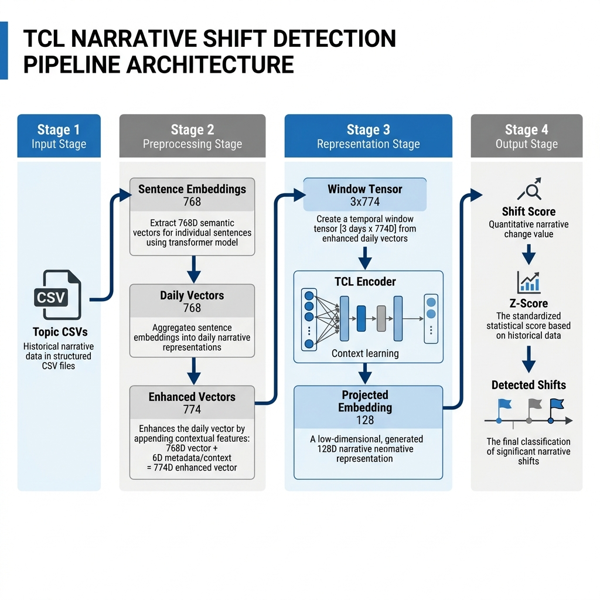
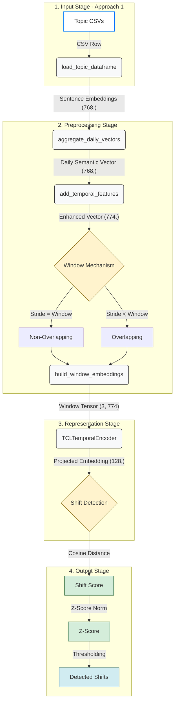
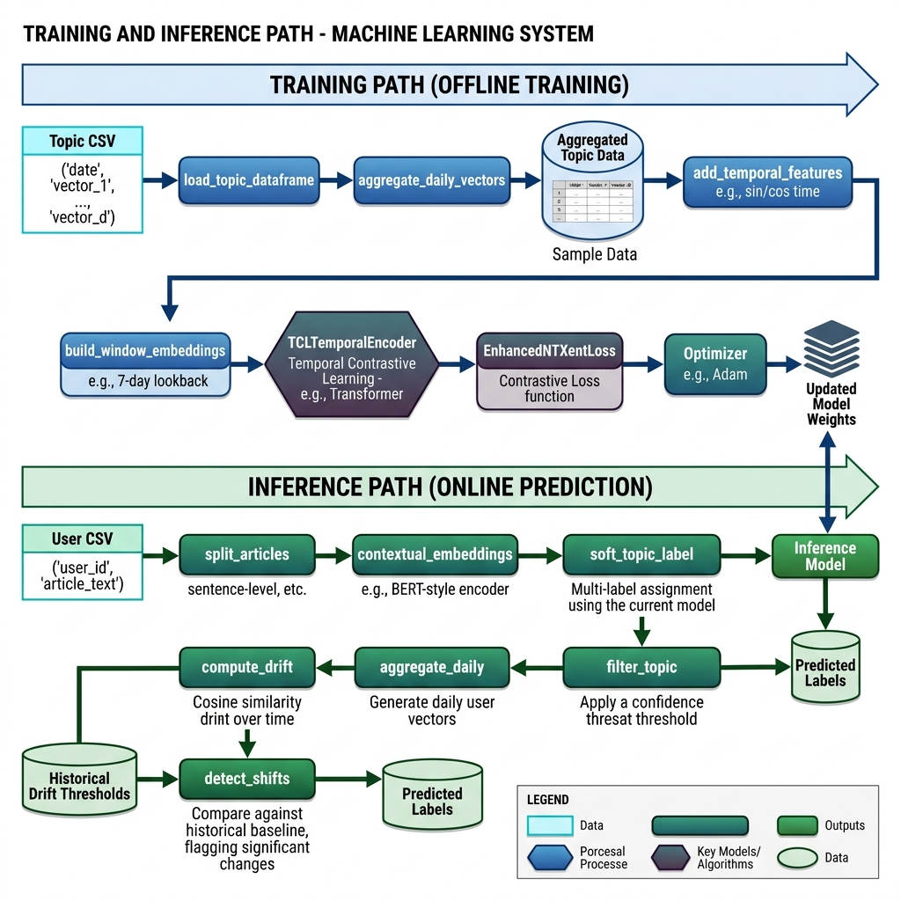
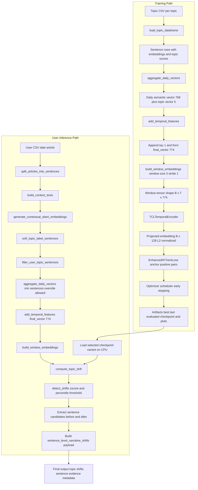
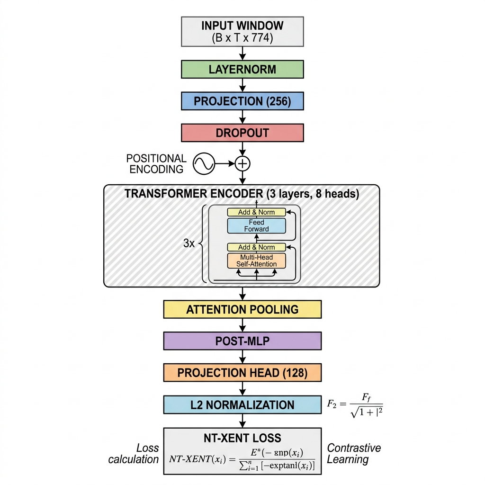

# README_TCL_Pipeline_new_1

Detailed technical documentation for `TCL/TCL_Pipeline_new_1.ipynb`.

This README covers:
- end-to-end pipeline architecture
- model core architecture
- function-by-function behavior
- exact input/output columns
- dimensions at every stage
- hyperparameters used by each block
- training and inference execution patterns

## 1. Pipeline Objective

This notebook implements a Temporal Contrastive Learning (TCL) workflow for narrative-shift detection across topics.

It supports two major modes:
- Training mode: build topic-wise temporal windows and train TCL encoder.
- Inference mode: process user article CSV, map to topic relevance, build temporal windows, score shifts with trained TCL checkpoint.

## 2. Pipeline Architecture & Data Flow (Approach 1)

The following diagram illustrates the end-to-end data flow for **Approach 1**, including the **Windowing Mechanism**.



### 2.1 Windowing Mechanism (Temporal Context)

Approach 1 uses a sliding window over daily vectors to capture temporal dynamics. The behavior is controlled by the `stride` parameter:

#### 1. Non-Overlapping Windows
- **Condition**: `stride == window_size`
- **Logic**: Each window contains a unique set of days. No overlap between consecutive windows.
- **Use Case**: Best for distinct, event-based narrative analysis.

#### 2. Overlapping Windows
- **Condition**: `stride < window_size`
- **Logic**: Consecutive windows share one or more days.
- **Use Case**: Best for smooth narrative tracking and capturing transitions between days.

### 2.2 Text-Based Pipeline Overview (Fallback)

If the image above does not load, use this text-based representation:

```text
[1. Input Stage]
   Topic CSVs (date, text, topic)
   ↓
   load_topic_dataframe()
   ↓
[2. Preprocessing Stage]
   Sentence Embeddings (768-dim)
   ↓
   aggregate_daily_vectors() -> Daily Semantic Vector (768-dim)
   ↓
   add_temporal_features() -> Enhanced Vector (774-dim: 768 + 5 topic + 1 time)
   ↓
   build_window_embeddings() -> Window Tensor (3 x 774)
   ↓
[3. Representation Stage]
   TCLTemporalEncoder (Transformer + Attention Pooling)
   ↓
   Projected Embedding (128-dim, L2 Normalized)
   ↓
[4. Output Stage]
   Shift Detection (Cosine Distance)
   ↓
   Shift Score (Scalar) -> Z-Score Norm -> Detected Shifts
```

### 2.3 Styled Mermaid Diagram (Approach 1)



### 2.1 Input Data Example

The pipeline expects topic-specific CSV files (e.g., `War.csv`). Below is an example of the required data structure:

| date | w5_embedding | main_sentence | sentence_id | War | Health | ... |
| :--- | :--- | :--- | :--- | :--- | :--- | :--- |
| 2023-01-01 | `[0.12, -0.05, ...]` | "The conflict intensified." | "War_s1" | 0.92 | 0.01 | ... |

- **date**: Publication timestamp (ISO 8601).
- **w5_embedding**: 768-dimensional SBERT vector (string or list).
- **main_sentence**: The raw text of the sentence.
- **topic scores (War, Health, etc.)**: Confidence scores [0-1] for weighting.

## 3. Full Pipeline Architecture (Detailed)





## 4. Model Core Architecture (Detailed)




Model parity note:
- `TCL_Pipeline_new_1.ipynb` and `TCL_Pipeline_new_2.ipynb` use the same core model class (`TCLTemporalEncoder`) and same loss class (`EnhancedNTXentLoss`) with the same key dimensions and blocks.

## 4. Core Config and Dimensions

Main configured defaults from notebook:
- Topics: `War`, `Health`, `Economics`, `Technology`, `Climate`
- `embedding_dim = 768`
- `topic_dim = 5`
- `time_dim = 1`
- `final_dim = 774`
- `window_size = 3`
- `stride = 1`
- `context_window = 5`

Model hyperparameters:
- `hidden_dim = 256`
- `num_heads = 8`
- `num_layers = 3`
- `feed_forward_dim = 512`
- `dropout = 0.1`
- `projection_dim = 128`

Training hyperparameters:
- `batch_size = 32`
- `learning_rate = 1e-4`
- `epochs = 100`
- `weight_decay = 0.01`
- `warmup_epochs = 5`
- `min_lr = 1e-6`
- `temperature = 0.07`
- `gradient_clip = 1.0`
- `use_amp = True` (used only if CUDA is available)
- `patience = 10`
- `min_delta = 1e-3`

Shift detection hyperparameters:
- `drift_smoothing_window = 3`
- `zscore_threshold = 1.0` (or your experiment override)
- `percentile_threshold = 50` (or your experiment override)

Inference hyperparameters:
- `topic_threshold = 0.45` (can be overridden per run)
- `inference_batch_size = 32`

## 5. Data Contracts and Columns

### 5.1 Training topic CSV expected columns

Required:
- `date`
- one embedding column: `w5_embedding` (preferred) or `w3_embedding`

Optional but used when available:
- `main_sentence`
- `sentence_id`
- topic score columns: `War`, `Health`, `Economics`, `Technology`, `Climate`
- `topic_probabilities`

### 5.2 Output of `load_topic_dataframe(...)`

Columns returned:
- `date`: `datetime64`
- `sentence_embeddings`: `np.ndarray(768,)` float32
- `topic_embeddings`: one-hot `np.ndarray(5,)` by file topic
- `main_sentence`: string
- `sentence_id`: string
- `War`, `Health`, `Economics`, `Technology`, `Climate`: float32 per row

Important behavior:
- Topic score columns are kept for weighting logic.
- `topic_embeddings` stays one-hot by file topic (Approach-1 identity encoding).

### 5.3 User inference input CSV

Required columns:
- `date`
- `article`

Optional:
- `article_id` (auto-generated if absent)

### 5.4 User inference topic prototype JSON

Must contain 5 keys with vectors of length 768:
- `War`, `Health`, `Economics`, `Technology`, `Climate`

## 6. Function-by-Function Reference

### 6.1 Data loading functions

`parse_embedding(embedding_value)`
- Input: string/list/ndarray embedding representation.
- Output: `np.ndarray` float32.
- Used in: training CSV embedding parsing and optional topic vector parsing.

`apply_with_optional_progress(series, func, desc=None)`
- Input: pandas Series + transform function.
- Output: transformed Series.
- Logic: tries `tqdm` progress apply, falls back to normal apply.

`load_topic_dataframe(topic_name, config)`
- Input: topic name and global config.
- Output: normalized sentence dataframe for one topic.
- Hyperparameters used: `data_path`, `topic_files`, `embedding_column`, `embedding_dim`, `topics`.
- Column effects:
  - adds `sentence_embeddings`
  - ensures topic score columns exist
  - sets `topic_embeddings` one-hot by topic file
  - guarantees `main_sentence`, `sentence_id`

### 6.2 Preprocessing functions

`aggregate_daily_vectors(topic_dataframe, topic_name, config)`
- Input columns needed:
  - `date`
  - `sentence_embeddings`
  - topic column named as `topic_name` for weighting (if present)
  - `topic_embeddings` (optional; else fallback one-hot)
- Output columns:
  - `date`
  - `daily_vectors` `(768,)`
  - `topic_embeddings` `(5,)`
  - `topic_name`, `topic_id`, `num_sentences`
- Hyperparameters used:
  - `min_sentences_per_day`
  - `topics`
- Weighting logic:
  - If topic column exists, weighted pooling by that column.
  - Else uniform pooling.

`add_temporal_features(daily_dataframe)`
- Input: daily dataframe from `aggregate_daily_vectors`.
- Output: list of dict records containing `final_vector`.
- Formula:
  - `tau = log1p(day_gap)/5.0`
  - `final_vector = concat(daily_embedding[768], tau[1], topic_embedding[5])`
- Final dimension: `774`.

`build_window_embeddings(enhanced_records, topic_name, topic_id, config)`
- Input: temporal records with `final_vector`.
- Output: list of windows with metadata.
- Hyperparameters used:
  - `window_size`
  - `stride`
- Guarantee: sorts records by date before windowing.

### 6.3 Model and loss functions

`TemporalWindowDataset`
- Input: list of window dicts.
- Output:
  - regular index access returns `(tensor, topic_id)`
  - `sample_consecutive_pairs(batch_size)` returns anchor/positive windows.

`TCLTemporalEncoder(config)`
- Input tensor shape: `(B, T, 774)`.
- Output shape: `(B, 128)` normalized.
- Hyperparameters used:
  - `final_dim`, `hidden_dim`, `window_size`, `num_heads`, `feed_forward_dim`, `dropout`, `num_layers`, `projection_dim`.

`EnhancedNTXentLoss(temperature)`
- Input: two embedding batches `(B, D)`.
- Output: scalar contrastive loss.
- Hyperparameter used: `temperature`.

### 6.4 Training functions

`build_scheduler(optimizer, config)`
- Warmup then cosine decay schedule.
- Hyperparameters used: `warmup_epochs`, `epochs`, `min_lr`, `learning_rate`.

`train_tcl_model(...)`
- Executes training loop.
- Hyperparameters used:
  - `epochs`, `batch_size`, `gradient_clip`, `use_amp`, `patience`, `min_delta`.
- Writes best checkpoint:
  - `./tcl_output_new_1/tcl_model_best_new_1.pt`

### 6.5 Evaluation function

`evaluate_model_quality(model, topic_window_data, config, device, per_topic_limit=200)`
- Computes intra-topic and inter-topic cosine similarities.
- Returns dict:
  - `intra_scores`
  - `inter_scores`
  - `separation_score`

### 6.6 Inference functions

`split_articles_into_sentences(input_dataframe)`
- Input columns required: `date`, `article`.
- Output columns:
  - `date`, `article_id`, `sentence_id`, `sentence_text`, `sentence_order`

`build_context_texts(sentence_dataframe, context_window)`
- Adds `context_text` per sentence.
- Hyperparameter used: `context_window` (`3` or `5`).

`generate_contextual_sbert_embeddings(sentence_dataframe, config, sbert_model_name)`
- Input: dataframe with `context_text`.
- Output: adds `sentence_embeddings` `(768,)`.
- Hyperparameters used:
  - `embedding_dim` (must be 768)
  - `inference_batch_size`
- In final notebook sequence, a CPU override version is provided for OOM-safe inference.

`load_topic_embedding_prototypes(topic_embeddings_json_path, config)`
- Loads and normalizes each topic prototype vector.
- Validates each vector length is `embedding_dim`.

`soft_topic_label_sentences(sentence_dataframe, topic_embeddings, config)`
- For each sentence:
  - cosine similarity to each topic prototype
  - softmax -> topic probabilities
- Output columns include:
  - `date`, `article_id`, `sentence_id`, `sentence_text`, `sentence_order`
  - `sentence_embeddings`
  - `topic_embeddings` (probability vector, shape 5)
  - `topic_probabilities` (same content)
  - `w3_embedding`, `w5_embedding`
  - topic score columns: `War`, `Health`, `Economics`, `Technology`, `Climate`

`build_topic_score_rows(labeled_sentence_dataframe, config)`
- Builds long-format explainability rows:
  - `sentence_id`, `topic`, `similarity_score`

`filter_user_topic_sentences(labeled_sentence_dataframe, user_topic, config)`
- Keeps rows where topic column `>= topic_threshold`.
- Adds:
  - `selected_topic`
  - `similarity_score` (copy of selected topic column)

`validate_inference_alignment(config, filtered_sentence_dataframe)`
- Validates:
  - required columns exist
  - sentence embedding dimension == 768
  - topic probability dimension == 5

`compute_topic_drift(model, topic_windows, config, device)`
- Encodes windows and computes drift between consecutive windows:
  - `raw_drift = 1 - cosine`
  - smoothed by rolling window
  - z-score normalization
- Hyperparameters used:
  - `drift_smoothing_window`

`detect_shifts(drift_rows, config)`
- Flags shifts when z-score exceeds either:
  - `zscore_threshold`
  - percentile cutoff from `percentile_threshold`

`build_sentence_context_map(sentence_dataframe, context_span=1)`
- Builds a lookup for sentence-level local context.
- Output per `sentence_id`:
  - `context_before`: sentence(s) immediately before target sentence
  - `context_after`: sentence(s) immediately after target sentence

`extract_sentence_level_narrative_shifts(...)`
- Trigger condition: only drift points that pass z-score / percentile threshold via `detect_shifts`.
- Date pairing rule: compares `date_2` (detected shift date) against previous available filtered date `date_1`.
- Sentence pairing rule:
  - takes top topic-relevant sentences per date (configurable cap)
  - computes pairwise cosine similarities
  - selects lowest-similarity pair as strongest narrative change evidence
- Adds context around both sentences:
  - `context_1` (for date_1 sentence)
  - `context_2` (for date_2 sentence)
- Enforces cross-date comparison (`date_1` and `date_2` are different dates).
- Final output keys per shift include:
  - `date_1`, `date_2`
  - `article_id_1`, `sentence_num_1`, `sentence_id_1`, `sentence_text_1`, `topic_weight_1`, `context_1`
  - `article_id_2`, `sentence_num_2`, `sentence_id_2`, `sentence_text_2`, `topic_weight_2`, `context_2`
  - `similarity`, `shift_score`, `day_level_shift_score`, `day_level_z_score`

`run_user_level_inference(...)`
- Full orchestration pipeline from user CSV to shift output.
- Returns:
  - `call_order`
  - `sentence_level_narrative_shifts`
  - `top_topic_sentences`
  - `topic_score_rows`
  - `training_like_rows`

`run_user_level_inference_approach1_compatible(...)`
- Alias wrapper for explicit naming compatibility.

## 7. Inference Experiment Cell (Current Notebook Behavior)

The final user-inference execution cell includes:
- CPU inference mode for stability on low-VRAM GPUs.
- checkpoint reload from `config["output_path"]/tcl_model_best_new_1.pt`.
- PyTorch 2.6-compatible checkpoint loader fallback (`weights_only=False` when trusted local checkpoint is used).
- local `inference_config` for experiment overrides.

You can change these per run without touching function definitions:
- `inference_config["topic_threshold"]`
- `inference_config["zscore_threshold"]`
- `inference_config["percentile_threshold"]`
- `inference_config["drift_smoothing_window"]`
- optional `context_window`, `min_sentences_per_day`, `inference_batch_size`

## 8. End-to-End Shapes

- Parsed sentence embedding: `(768,)`
- Topic identity vector: `(5,)`
- Daily final vector: `(774,)`
- Window tensor: `(3, 774)` by default
- Encoder output per window: `(128,)`
- Drift sequence length: `num_windows - 1`

## 9. Output Schemas

`sentence_level_narrative_shifts` element (final user-level output):
```json
{
  "date_1": "YYYY-MM-DD",
  "date_2": "YYYY-MM-DD",
  "sentence_id_1": "article_0_s3",
  "article_id_1": 0,
  "sentence_num_1": 3,
  "sentence_text_1": "...",
  "topic_weight_1": 0.71,
  "context_1": "...",
  "sentence_id_2": "article_4_s8",
  "article_id_2": 4,
  "sentence_num_2": 8,
  "sentence_text_2": "...",
  "topic_weight_2": 0.79,
  "context_2": "...",
  "similarity": 0.23,
  "shift_score": 0.77,
  "day_level_shift_score": 0.44,
  "day_level_z_score": 2.11
}
```

Note:
- The current final user-facing stage is sentence-level only.
- Day/window-level drift is still used internally to trigger sentence-pair extraction.

`top_topic_sentences` element:
```json
{
  "date": "YYYY-MM-DD",
  "sentence_id": "article_0_s3",
  "sentence_text": "...",
  "similarity_score": 0.87
}
```

`topic_score_rows` element:
```json
{
  "sentence_id": "article_0_s3",
  "topic": "War",
  "similarity_score": 0.87
}
```

## 10. Recommended Execution Order

Training run:
1. Run cells 1 to 22 in order.

Inference-only run using stored checkpoint:
1. Run cells 1 to 5.
2. Run cell 13 (model class definitions must exist).
3. Run cell 20 (inference functions).
4. Run cell 24 (CPU SBERT override).
5. Run cell 25 (corrected user-inference flow definitions in call order).
6. Run cell 26 (checkpoint load + inference experiment).
7. Optional: run cell 28 to preview `sentence_level_narrative_shifts` table.

### User inference call order in cell output
The inference execution cell prints this exact order:
1. split_articles_into_sentences
2. build_context_texts
3. generate_contextual_sbert_embeddings
4. soft_topic_label_sentences
5. filter_user_topic_sentences
6. aggregate_daily_vectors -> add_temporal_features -> build_window_embeddings
7. compute_topic_drift + detect_shifts (article/day level)
8. extract_sentence_level_narrative_shifts (cross-date sentence pairs + context)

## 11. Troubleshooting

CUDA OOM during inference:
- Use CPU inference cell (already provided in notebook).

Checkpoint load error in PyTorch 2.6:
- Use compatibility loader in final inference cell (already provided).

Empty shift output:
- Lower `topic_threshold`.
- Lower `min_sentences_per_day`.
- Increase temporal coverage in user input data.

Dimension mismatch:
- Ensure topic prototype vectors are length `768`.
- Ensure sentence embeddings are parsed as float32 vectors of length `768`.
