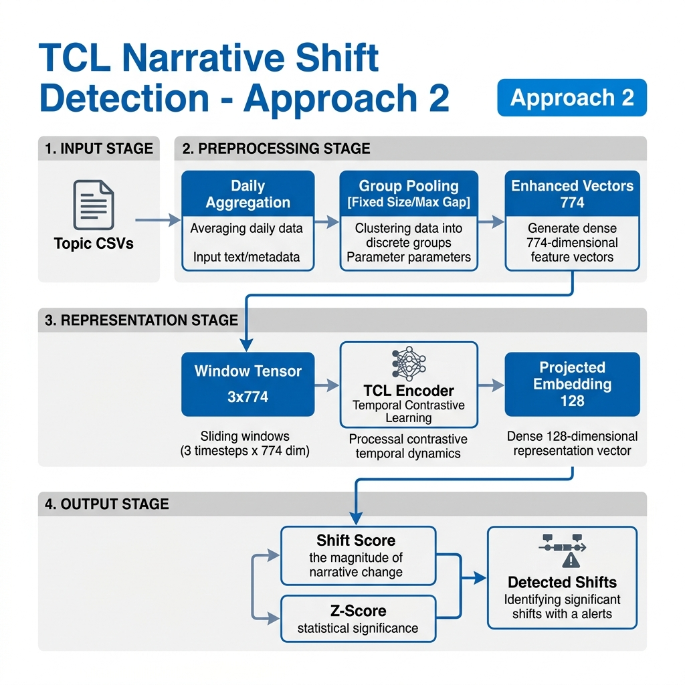
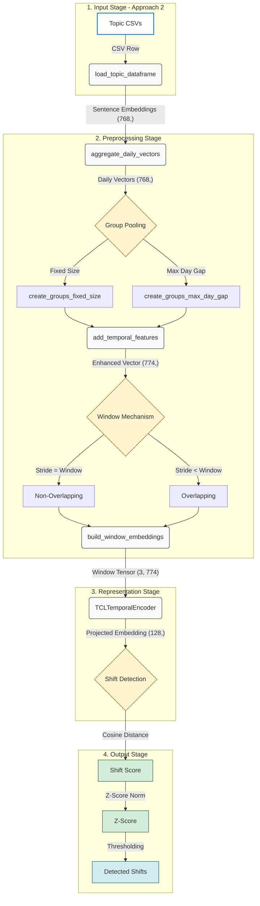
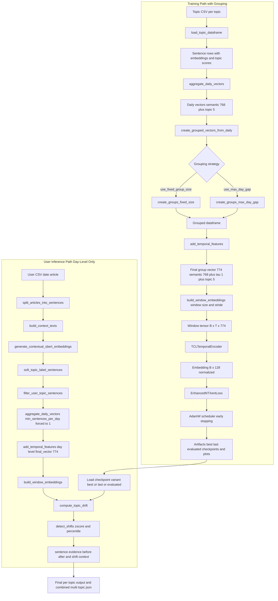

# README_TCL_Pipeline_new_2

Detailed technical documentation for `TCL/TCL_Pipeline_new_2.ipynb`.

This pipeline keeps the same model architecture, loss, training style, evaluation style, and user inference style as Pipeline New 1.
The core modeling difference is temporal input construction during training:
- Pipeline 1: day-level sequence
- Pipeline 2: day-level -> group-level sequence -> windows

## 1. Objective

Pipeline New 2 detects narrative shift with TCL while using grouped temporal representations.
It is designed to test whether grouping days before windowing improves temporal robustness.

## 2. Pipeline Architecture & Data Flow (Approach 2)

The following diagram illustrates the end-to-end data flow for **Approach 2**, including the unique **Group Pooling** stage and the **Windowing Mechanism**.



### 2.1 Windowing Mechanism (Temporal Context)

Similar to Approach 1, Approach 2 uses a sliding window, but it operates over **Grouped Vectors** instead of daily vectors. The behavior is controlled by the `stride` parameter:

#### 1. Non-Overlapping Windows
- **Condition**: `stride == window_size`
- **Logic**: Each window contains a unique set of groups. No overlap between consecutive windows.

#### 2. Overlapping Windows
- **Condition**: `stride < window_size`
- **Logic**: Consecutive windows share one or more groups, providing smoother transitions.

### 2.2 Group Pooling Strategy (Core Innovation)

Approach 2 introduces a **Group Pooling** layer between daily aggregation and window construction. This strategy is designed to handle temporal sparsity and reduce day-to-day noise.

#### 1. Fixed-Size Grouping
- **Logic**: Groups a fixed number of consecutive days (e.g., `fixed_group_size = 2`).
- **Equation**: 
  $$\mathbf{v}_{group} = \text{Norm}\left(\frac{1}{N} \sum_{i=1}^N \mathbf{v}_{day,i}\right)$$
- **Benefit**: Ensures each temporal unit has a consistent amount of data.

#### 2. Max-Day-Gap Grouping
- **Logic**: Groups days that fall within a maximum date gap from the group start (e.g., `max_day_gap = 2`).
- **Equation**: 
  $$\text{Gap} = \text{Date}_{current} - \text{Date}_{start} \leq \text{MaxGap}$$
- **Benefit**: Preserves temporal proximity while aggregating sparse events.

### 2.2 Text-Based Pipeline Overview (Fallback)

```text
[1. Input Stage]
   Topic CSVs (date, text, topic)
   ↓
   load_topic_dataframe()
   ↓
[2. Preprocessing Stage]
   Daily Aggregation -> Daily Vectors (768-dim)
   ↓
   GROUP POOLING (Fixed Size / Max Gap) -> Grouped Vectors (768-dim)
   ↓
   add_temporal_features() -> Enhanced Vector (774-dim)
   ↓
   build_window_embeddings() -> Window Tensor (3 x 774)
   ↓
[3. Representation Stage]
   TCLTemporalEncoder (Transformer + Attention Pooling)
   ↓
   Projected Embedding (128-dim, L2 Normalized)
   ↓
[4. Output Stage]
   Shift Detection (Cosine Distance) -> Shift Score -> Z-Score
```

### 2.4 Styled Mermaid Diagram (Approach 2)



## 3. Full Pipeline Architecture (Detailed)



## 4. Model Core Architecture (Detailed)

```text
[Model Architecture - Approach 2]
Input window (B x T x 774)
   ↓
LayerNorm (774)
   ↓
Projection (774 -> 256)
   ↓
Positional Encoding (Learned)
   ↓
Transformer Encoder (3 Layers, 8 Heads, 512 FF)
   ↓
Attention Pooling (Temporal Axis)
   ↓
Post-MLP (Residual Connection)
   ↓
Projection Head (256 -> 128)
   ↓
L2 Normalization
   ↓
NT-Xent Loss (Temperature 0.07)
```


Architecture consistency check:
- `TCL_Pipeline_new_2.ipynb` has the same core model architecture and same loss architecture as `TCL_Pipeline_new_1.ipynb`.
- The key difference is temporal unit construction before model input:
  - Pipeline 1 training uses day-level units.
  - Pipeline 2 training uses grouped day units.
  - Pipeline 2 user inference keeps day-level units.

## 4. What Is Same As Pipeline 1

- Same encoder: `TCLTemporalEncoder`
- Same contrastive loss: `EnhancedNTXentLoss`
- Same training scheduler, AMP usage, early stopping, and checkpointing style
- Same training loss plot behavior
- Same model evaluation outputs and heatmaps
- Same user inference flow and sentence-level narrative shift output format
- Same multi-topic inference loop and saved JSON output structure

## 5. What Is Different In Pipeline 2

Temporal feature flow changes from:
- day vectors -> windows

to:
- day vectors -> grouped vectors -> windows

Group strategies supported:

1. Fixed-size grouping (by number of days):
- `use_fixed_group_size = True`
- `fixed_group_size = N`

2. Max-day-gap grouping (by date span from group start):
- `use_max_day_gap = True`
- `max_day_gap = N`

If both are configured, fixed-size strategy is used first.

## 6. Core Config Fields

From Pipeline 2 config cell:

- `output_path = ./tcl_output_new_2`
- `approach_id = "1_1"`
- `window_size` and `stride` control temporal windows over groups
- `use_fixed_group_size`, `fixed_group_size`
- `use_max_day_gap`, `max_day_gap`

Artifact naming follows:
- `approch_1_1_w{window_size}_s{stride}_t{temperature_tag}`

Examples:
- `..._best.pt`
- `..._last.pt`
- `..._evaluated.pt`
- `..._train_loss.png`
- `..._intra_heatmap.png`
- `..._inter_heatmap.png`
- `..._user_inference_multi_topic.json`

## 7. Grouped Preprocessing Functions

- `aggregate_daily_vectors(...)`
Creates day-level vectors.

- `create_groups_fixed_size(...)`
Builds groups from consecutive days by fixed count.

- `create_groups_max_day_gap(...)`
Builds groups where each group satisfies max date-gap rule.

- `create_grouped_vectors_from_daily(...)`
Dispatches to one of the two grouping strategies.

- `add_temporal_features(group_dataframe)`
Adds `tau` between groups and creates final vectors of dim `774`.

## 8. End-to-End Dimensions

- sentence embedding: `768`
- topic vector: `5`
- temporal scalar: `1`
- final group vector: `774`
- window tensor: `(window_size, 774)`
- encoder output per window: `128`

## 9. User Inference Notes

User inference keeps Pipeline 1 temporal behavior (day-level, no multi-day grouping):
- filtered sentence rows -> daily vectors -> windows -> drift -> sentence-level shifts

Reason:
- User input can contain very few articles/dates. For inference robustness, each valid day is treated directly as a temporal unit.
- `min_sentences_per_day` is relaxed to `1` in user inference flow.

The final call supports multi-topic execution:
- set `selected_topics = ["War", "Health"]` or `config["topics"]`

Saved multi-topic output includes metadata:
- `approach_id`, `window_size`, `stride`, `temperature`, `load_variant`, `checkpoint_loaded`, thresholds, per-topic results

## 10. Typical Run Order

1. Imports
2. Config
3. Data loading
4. Grouped preprocessing and windows
5. Model definition
6. Training
7. Evaluation
8. Save artifacts
9. User inference (single or multi-topic)

## 11. Important Constraint

Pipeline 2 should keep model/loss architecture aligned with Pipeline 1.
Training uses grouping before windowing, while user inference stays day-level for sparse input stability.