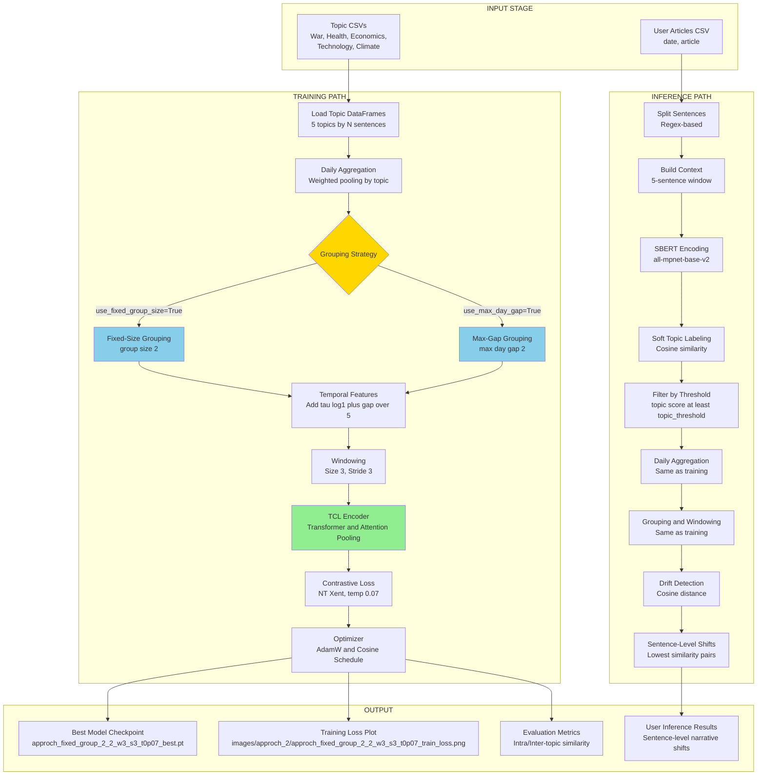
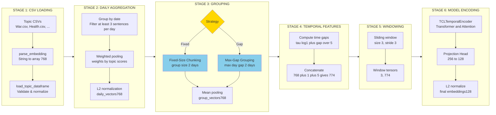
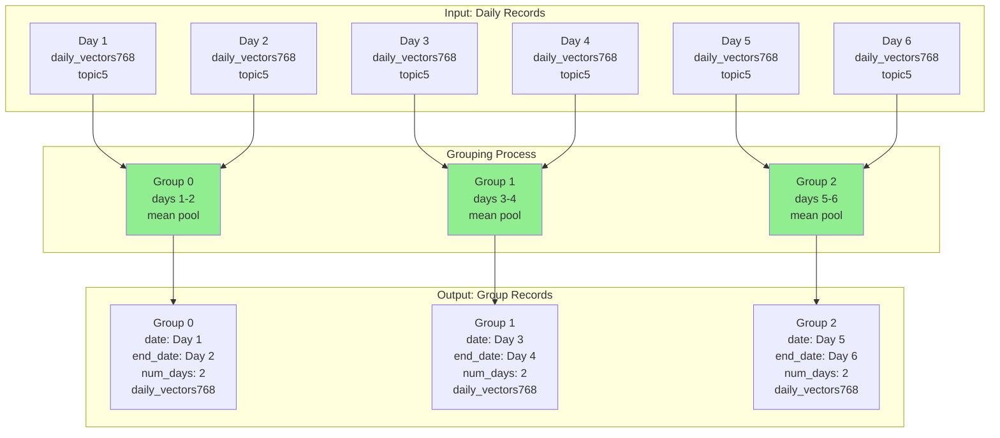
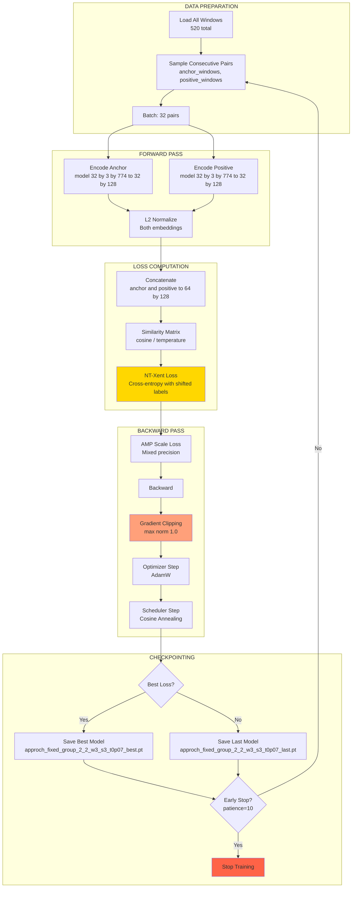

# Approach 2: Group-Based Temporal Contrastive Learning

**Implementation:** `TCL_Pipeline_2.ipynb`  
**Status:** ✅ Fully Implemented & Tested  
**Last Modified:** April 6, 2026  
**Model Size:** 23 MB (1.96M parameters)

---

## Table of Contents

1. [Overview](#1-overview)
2. [Pipeline Architecture](#2-pipeline-architecture)
3. [Data Processing Flow](#3-data-processing-flow)
4. [Grouping Strategies](#4-grouping-strategies)
5. [Model Architecture](#5-model-architecture)
6. [Training Strategy](#6-training-strategy)
7. [Inference Pipeline](#7-inference-pipeline)
8. [Configuration & Hyperparameters](#8-configuration--hyperparameters)
9. [Implementation Details](#9-implementation-details)
10. [Output Schemas](#10-output-schemas)
11. [Experimental Results](#11-experimental-results)
12. [Usage Guide](#12-usage-guide)
13. [Troubleshooting](#13-troubleshooting)

---

## 1. Overview

### 1.1 Core Concept

Approach 2 implements **group-based temporal segmentation** for narrative shift detection, extending Approach 1's day-level baseline with flexible temporal grouping strategies. Instead of treating each day as an atomic unit, Approach 2 aggregates consecutive days into semantically coherent groups using two alternative strategies:

1. **Fixed Group Size**: Fixed-count chunking of consecutive days
2. **Max Day Gap**: Proximity-based grouping with maximum temporal distance

### 1.2 Key Innovations

- ✅ **Dual Grouping Strategies**: Fixed-size vs. proximity-based temporal aggregation
- ✅ **Coarser Temporal Granularity**: Groups as temporal units (vs. individual days)
- ✅ **Mean Pooling Aggregation**: Within-group averaging of daily embeddings
- ✅ **Non-Overlapping Windows**: Stride=3 with Window=3 (no temporal overlap)
- ✅ **Attention Pooling**: Learned attention weights for temporal sequence encoding
- ✅ **Enhanced NT-Xent Loss**: Single-component contrastive objective

### 1.3 Approach Philosophy

**"Segment to Simplify, Aggregate to Strengthen"**

Approach 2 addresses limitations of day-level granularity by:
- Reducing noise from sparse daily coverage
- Creating more robust temporal representations through aggregation
- Supporting both regular sampling (fixed size) and event-driven (proximity) analysis

---

## 2. Pipeline Architecture

### 2.1 High-Level Architecture Diagram



**Image Asset Paths (organized):**
- `images/approch_2/approach_2_high_level.png`
- `images/approch_2/approach_2_pipeline_detailed.png`
- `images/approch_2/approach_2_model_architecture.png`

### 2.2 Key Architectural Differences from Approach 1

| Component | Approach 1 | Approach 2 |
|-----------|------------|------------|
| **Temporal Unit** | Individual days | Groups of days |
| **Grouping Method** | None | Fixed-size OR Max-gap |
| **Window Size** | 2 days | 3 groups |
| **Window Stride** | 1 day (50% overlap) | 3 groups (0% overlap) |
| **Pooling Method** | Attention pooling | Attention pooling (same) |
| **Final Dimension** | 774 (768+1+5) | 774 (768+1+5) |
| **Training Windows** | 520 total | 520 total (after grouping) |
| **Inference Filter** | min_sentences=3/day | min_sentences=1/day (relaxed) |

---

## 3. Data Processing Flow

### 3.1 Complete Data Flow Diagram



### 3.2 Dimension Transformations

```
CSV Row (string)
  ↓ parse_embedding()
sentence_embeddings: (768,) float32
  ↓ load_topic_dataframe()
topic_embeddings: (5,) one-hot
  ↓ aggregate_daily_vectors() [Daily Aggregation]
daily_vectors: (768,) float32 (weighted mean)
topic_vectors: (5,) float32 (weighted mean)
  ↓ create_groups_fixed_size() OR create_groups_max_day_gap() [Grouping]
group_daily_vectors: (768,) float32 (mean pooling)
group_topic_embeddings: (5,) float32 (mean pooling)
  ↓ add_temporal_features() [Temporal Features]
final_vector: (774,) = [768 + 1 + 5]
  Components:
    - daily_vectors: (768,) - SBERT semantic embedding
    - time_feature: (1,) - tau = log1p(gap_days) / 5.0
    - topic_embeddings: (5,) - one-hot topic vector
  ↓ build_window_embeddings() [Windowing]
window_tensor: (3, 774) - 3 groups x 774 features
  ↓ DataLoader batching
batch_input: (32, 3, 774) - batch x window x features
  ↓ TCLTemporalEncoder.forward()
batch_output: (32, 128) - L2-normalized embeddings
```

### 3.3 Data Statistics (From Training Execution)

**Topic-Level Statistics (After Grouping with fixed_group size 2):**

| Topic | Days | Groups | Windows | Sentences/Day | Group Size |
|-------|------|--------|---------|---------------|------------|
| **War** | 1681 | 841 | 280 | Variable | 2.00 |
| **Health** | 584 | 292 | 97 | Variable | 2.00 |
| **Economics** | 196 | 98 | 32 | Variable | 2.00 |
| **Technology** | 172 | 86 | 28 | Variable | 2.00 |
| **Climate** | 502 | 251 | 83 | Variable | 2.00 |
| **Total** | **3135** | **1568** | **520** | - | - |

**Key Insights:**
- Groups = Days / fixed_group_size (e.g., 1681 / 2 ≈ 841)
- Windows ≈ Groups / window_stride (e.g., 841 / 3 ≈ 280)
- Non-overlapping windows (stride=3, size=3) partition groups cleanly

---

## 4. Grouping Strategies

### 4.1 Strategy 1: Fixed Group Size

#### 4.1.1 Conceptual Diagram



#### 4.1.2 Implementation Details

**Function:** `create_groups_fixed_size(daily_dataframe, group_size)` (Lines 585-612)

**Algorithm:**
1. Chunk consecutive daily records into fixed-size groups
2. Mean pool daily embeddings within each group
3. Mean pool topic vectors within each group
4. L2 normalize both pooled vectors
5. Create group metadata (date range, sentence count)

**Output Schema:**

| Field | Type | Description |
|-------|------|-------------|
| `group_id` | int | Sequential group index (0, 1, 2, ...) |
| `date` | pd.Timestamp | First day in group |
| `end_date` | pd.Timestamp | Last day in group |
| `daily_vectors` | np.array(768,) | Mean-pooled & L2-normalized embedding |
| `topic_embeddings` | np.array(5,) | Mean-pooled & L2-normalized topic vector |
| `num_days` | int | Number of days in group (typically = group_size) |
| `num_sentences` | int | Total sentences across all days in group |

---

### 4.2 Strategy 2: Max Day Gap

#### 4.2.1 Conceptual Diagram

```mermaid
graph TB
    subgraph Input[Input: Daily Records with Gaps]
        D1[Day 1<br/>Jan 1]
        D2[Day 2<br/>Jan 2]
        D3[Day 3<br/>Jan 5<br/>gap 4]
        D4[Day 4<br/>Jan 6<br/>gap 1]
        D5[Day 5<br/>Jan 10<br/>gap 4]
    end
    subgraph Process[Grouping by Max Gap 2]
        P1{Gap from<br/>Group Start<br/><= 2?}
        P2[Add to<br/>Current Group]
        P3[Finalize Group<br/>Start New Group]
    end
    subgraph Output[Output: Variable-Size Groups]
        G1[Group 0<br/>Jan 1-2<br/>num_days: 2]
        G2[Group 1<br/>Jan 5-6<br/>num_days: 2]
        G3[Group 2<br/>Jan 10<br/>num_days: 1]
    end
        D1 --> P1
    P1 -->|Yes|     P2 --> G1
        D2 --> P1
        D3 --> P1
    P1 -->|No gap above 2| P3
        P3 --> G1
        D3 --> P2 --> G2
        D4 --> P2
        D5 --> P1
    P1 -->|No|     P3 --> G2
        D5 --> P2 --> G3
    style P1 fill:#FFD700
    style G1 fill:#90EE90
    style G2 fill:#90EE90
    style G3 fill:#FFA07A
```

#### 4.2.2 Implementation Details

**Function:** `create_groups_max_day_gap(daily_dataframe, max_day_gap)` (Lines 615-657)

**Algorithm:**
1. Initialize first group with first daily record
2. For each subsequent record:
   - Compute calendar gap from group start date
   - If gap <= max_day_gap: add to current group
   - If gap > max_day_gap: finalize current group, start new group
3. Mean pool embeddings and topic vectors per group
4. L2 normalize

**Key Difference:** Group size is variable, enforcing temporal proximity constraint.

---

### 4.3 Comparison Matrix

| Aspect | Fixed Group Size | Max Day Gap |
|--------|------------------|-------------|
| **Grouping Basis** | Fixed count of consecutive days | Maximum calendar gap from group start |
| **Group Size** | Constant (except last group) | Variable (1 to N days) |
| **Temporal Consistency** | May span large calendar gaps | Enforces temporal proximity constraint |
| **Use Case** | Regular sampling, even distribution | Event-driven analysis, bursty coverage |
| **Example (size=2)** | [D1,D2], [D3,D4], [D5] | [D1,D2], [D4] (if D3 missing, D4 gap>2) |
| **Pros** | - Predictable group count<br/>- Equal representation | - Respects temporal proximity<br/>- Handles sparse data naturally |
| **Cons** | - May group distant days<br/>- Ignores calendar gaps | - Variable group sizes<br/>- May create many small groups |
| **Parameter** | `fixed_group_size` (integer) | `max_day_gap` (days) |
| **Config Flag** | `use_fixed_group_size=True` | `use_max_day_gap=True` |

**Critical Constraint:** Exactly ONE strategy must be enabled (XOR).

---

## 5. Model Architecture

### 5.1 TCLTemporalEncoder Architecture Diagram

```mermaid
graph TB
    subgraph Input[INPUT LAYER]
        I1[Window Tensor<br/>batch, 3, 774]
    end
    subgraph Normalization[NORMALIZATION & PROJECTION]
        N1[LayerNorm774]
        N2[Linear 774 to 256]
        N3[Dropout0.1]
    end
    subgraph Positional[POSITIONAL ENCODING]
        P1[Learned Positional<br/>1, 3, 256<br/>Init: randn x 0.02]
        P2[Element-wise Addition]
    end
    subgraph Transformer[TRANSFORMER ENCODER]
        T1[TransformerEncoderLayer 1<br/>8 heads, FFN 512]
        T2[TransformerEncoderLayer 2<br/>8 heads, FFN 512]
        T3[TransformerEncoderLayer 3<br/>8 heads, FFN 512]
        T4[Final LayerNorm256]
    end
    subgraph Pooling[ATTENTION POOLING]
        A1[Linear 256 to 1<br/>Attention Score]
        A2[Softmax across<br/>temporal dimension]
        A3[Weighted Sum<br/>encoded x weights]
    end
    subgraph MLP[RESIDUAL MLP]
        M1[Linear 256 to 256]
        M2[GELU Activation]
        M3[Dropout0.1]
        M4[Linear 256 to 256]
        M5[Residual Add<br/>pooled and MLP]
    end
    subgraph Projection[PROJECTION HEAD]
        PR1[Linear256 to 128]
        PR2[LayerNorm128]
        PR3[GELU Activation]
        PR4[Dropout0.1]
        PR5[Linear 128 to 128]
    end
    subgraph Output[OUTPUT]
        O1[L2 Normalize<br/>dim 1]
        O2[Final Embeddings<br/>batch, 128]
    end
        I1 --> N1
        N1 --> N2
        N2 --> N3
        N3 --> P1
        P1 --> P2
        P2 --> T1
        T1 --> T2
        T2 --> T3
        T3 --> T4
        T4 --> A1
        A1 --> A2
        A2 --> A3
        A3 --> M1
        M1 --> M2
        M2 --> M3
        M3 --> M4
        M4 --> M5
        M5 --> PR1
        PR1 --> PR2
        PR2 --> PR3
        PR3 --> PR4
        PR4 --> PR5
        PR5 --> O1
        O1 --> O2
    style T1 fill:#90EE90
    style T2 fill:#90EE90
    style T3 fill:#90EE90
    style A3 fill:#FFD700
    style M5 fill:#87CEEB
```



### 5.2 Layer-by-Layer Specification

**Class:** `TCLTemporalEncoder` (Lines 855-921)

#### Input Normalization & Projection
```python
self.input_norm = nn.LayerNorm(774)
self.input_projection = nn.Linear(774, 256)
self.dropout = nn.Dropout(0.1)
```

#### Learned Positional Encoding
```python
self.learned_positional = nn.Parameter(
    torch.randn(1, 3, 256) * 0.02
)
```

#### Transformer Encoder (3 layers)
```python
encoder_layer = nn.TransformerEncoderLayer(
    d_model=256,
    nhead=8,
    dim_feedforward=512,
    dropout=0.1,
    activation="gelu",
    batch_first=True,
    norm_first=True
)
self.transformer = nn.TransformerEncoder(encoder_layer, num_layers=3)
```

#### Attention Pooling
```python
self.attention_score = nn.Linear(256, 1)
# Computes learned attention weights across temporal dimension
# Output: weighted sum over time
```

#### Post-Pooling MLP with Residual
```python
self.post_mlp = nn.Sequential(
    nn.Linear(256, 256),
    nn.GELU(),
    nn.Dropout(0.1),
    nn.Linear(256, 256)
)
# pooled = pooled + self.post_mlp(pooled)
```

#### Projection Head
```python
self.projection_head = nn.Sequential(
    nn.Linear(256, 128),
    nn.LayerNorm(128),
    nn.GELU(),
    nn.Dropout(0.1),
    nn.Linear(128, 128)
)
```

#### L2 Normalization
```python
F.normalize(projected, p=2, dim 1)  # Unit sphere projection
```

**Total Parameters:** 1,964,045 (≈1.96M)  
**Model Size:** ~23 MB (float32)

---

## 6. Training Strategy

### 6.1 Training Pipeline Diagram



### 6.2 Loss Function: Enhanced NT-Xent

**Class:** `EnhancedNTXentLoss` (Lines 923-942)

**Formula:**

Given anchor embeddings $\mathbf{z}_a \in \mathbb{R}^{B \times 128}$ and positive embeddings $\mathbf{z}_p \in \mathbb{R}^{B \times 128}$:

1. **Concatenate:** $\mathbf{Z} = [\mathbf{z}_a; \mathbf{z}_p] \in \mathbb{R}^{2B \times 128}$

2. **Similarity matrix:** $\mathbf{S}_{ij} = \frac{\mathbf{Z}_i \cdot \mathbf{Z}_j}{\tau}$ where $\tau = 0.07$

3. **Mask self-similarities:** $\mathbf{S}_{ii} = -\infty$

4. **Positive labels:** For sample $i$, positive is at $(i + B) \mod 2B$

5. **Loss:** $\mathcal{L} = -\frac{1}{2B} \sum_{i=0}^{2B-1} \log \frac{\exp(\mathbf{S}_{i,\text{pos}(i)})}{\sum_{j \neq i} \exp(\mathbf{S}_{ij})}$

**Temperature:** 0.07 (sharpens similarity distribution, emphasizes hard negatives)

### 6.3 Learning Rate Schedule

**Warmup (5 epochs) + Cosine Annealing (95 epochs)**

```
Epoch | LR Factor | Actual LR
------|-----------|----------
  0   |   0.20    | 2.0e-5  (warmup)
  1   |   0.40    | 4.0e-5  (warmup)
  2   |   0.60    | 6.0e-5  (warmup)
  3   |   0.80    | 8.0e-5  (warmup)
  4   |   1.00    | 1.0e-4  (warmup end)
  5   |   1.00    | 1.0e-4  (cosine start)
 25   |   0.85    | 8.5e-5  (cosine)
 50   |   0.50    | 5.0e-5  (cosine)
 75   |   0.15    | 1.5e-5  (cosine)
 99   |   0.01    | 1.0e-6  (min_lr)
```

### 6.4 Optimizer Configuration

```python
optimizer = torch.optim.AdamW(
    model.parameters(),
    lr=1e-4,
    weight_decay=0.01
)
```

### 6.5 Early Stopping

**Parameters:**
- `patience=10`: Maximum epochs without improvement
- `min_delta=1e-3`: Minimum loss decrease to count as improvement

**Actual Result:** Early stopping triggered at **epoch 83**

---

## 7. Inference Pipeline

### 7.1 Inference Flow Diagram

```mermaid
graph TB
    subgraph Input[USER INPUT]
        U1[User CSV<br/>date, article]
    end
    subgraph Sentence[SENTENCE PROCESSING]
        S1[Regex Split<br/>Sentence boundary pattern]
        S2[Sentence Metadata<br/>sentence_id, order]
    end
    subgraph Context[CONTEXT BUILDING]
        C1[5-Sentence Window<br/>2 sentences around current]
        C2[Concatenate Context<br/>Join with spaces]
    end
    subgraph Encoding[SBERT ENCODING]
        E1[SBERT Model<br/>all-mpnet-base-v2]
        E2[Batch Process<br/>batch size 32]
        E3[Embeddings768]
    end
    subgraph Topic[TOPIC LABELING]
        T1[Load Topic Prototypes<br/>5 topics x 768]
        T2[Cosine Similarity<br/>sentence vs. prototypes]
        T3[Softmax Probabilities<br/>5 topic scores]
        T4[Filter by Threshold<br/>topic score at least 0.35]
    end
    subgraph Temporal[TEMPORAL MODELING]
        TM1[Daily Aggregation<br/>Weighted mean]
        TM2[Grouping Strategy<br/>Fixed-size OR Max-gap]
        TM3[Add Temporal Features<br/>tau log1 plus gap over 5]
        TM4[Build Windows<br/>size 3, stride 3]
    end
    subgraph Encoding2[MODEL INFERENCE]
        M1[Load Best Model<br/>approch_fixed_group_2_2_w3_s3_t0p07_best.pt]
        M2[Encode Windows<br/>Bx3x774 to Bx128]
    end
    subgraph Drift[DRIFT DETECTION]
        DR1[Consecutive Distance<br/>1 - cosine_sim]
        DR2[Smoothing<br/>window 3]
        DR3[Z-Score Normalization]
        DR4[Threshold Detection<br/>z-score greater than 1.0]
    end
    subgraph Sentence2[SENTENCE-LEVEL SHIFTS]
        SS1[Extract Shift Dates<br/>date_1, date_2]
        SS2[Pairwise Similarity<br/>All sentence pairs]
        SS3[Find Minimum<br/>Lowest similarity pair]
        SS4[Build Context Window<br/>2 sentences around target]
    end
    subgraph Output[OUTPUT]
        O1[Narrative Shifts<br/>JSON with contexts]
        O2[Top Topic Sentences<br/>Sorted by relevance]
    end
        U1 --> S1
        S1 --> S2
        S2 --> C1
        C1 --> C2
        C2 --> E1
        E1 --> E2
        E2 --> E3
        E3 --> T1
        T1 --> T2
        T2 --> T3
        T3 --> T4
        T4 --> TM1
        TM1 --> TM2
        TM2 --> TM3
        TM3 --> TM4
        TM4 --> M1
        M1 --> M2
        M2 --> DR1
        DR1 --> DR2
        DR2 --> DR3
        DR3 --> DR4
        DR4 --> SS1
        SS1 --> SS2
        SS2 --> SS3
        SS3 --> SS4
        SS4 --> O1
        T4 --> O2
    style T4 fill:#FFD700
    style M2 fill:#90EE90
    style DR4 fill:#FFA07A
```



### 7.2 Inference Call Order

**Execution Sequence (Lines 1945-1955):**

```python
# 1. Sentence splitting
sentences_df = split_articles_into_sentences(user_csv_df)

# 2. Context building
context_df = build_context_texts(sentences_df, context_window=5)

# 3. SBERT encoding
encoded_df = generate_contextual_sbert_embeddings(context_df, sbert_model, batch size 32)

# 4. Soft topic labeling
labeled_df = soft_topic_label_sentences(encoded_df, topic_embeddings_json_path)

# 5. Topic filtering
filtered_df = filter_user_topic_sentences(labeled_df, topic_name, topic_threshold=0.35)

# 6. Temporal modeling
user_daily_df = aggregate_daily_vectors(filtered_df, topic, config)
user_group_df = create_grouped_vectors_from_daily(user_daily_df, config)
user_records = add_temporal_features(user_group_df)
user_windows = build_window_embeddings(user_records, config)

# 7. Drift detection
drift_results = compute_topic_drift(user_windows, model, config, device)

# 8. Sentence-level shift extraction
sentence_shifts = extract_sentence_level_shifts(drift_results, filtered_df, config)
```

---

## 8. Configuration & Hyperparameters

### 8.1 Complete Configuration Schema

```python
config = {
    # ===== Path Settings =====
    "data_path": "/home/hp/SEM2/INLP/Naretve_Shift/Processed_Data/Distributed_Data/BAL_TOPIC_WISE_W3",
    "output_path": "./tcl_output_new_2",
    
    # ===== Topic Data Settings =====
    "topics": ["War", "Health", "Economics", "Technology", "Climate"],
    "embedding_column": "w5_embedding",
    
    # ===== Feature Construction =====
    "embedding_dim": 768,
    "context_window": 5,
    "min_sentences_per_day": 3,  # Training: 3, Inference: 1
    "window_size": 3,
    "stride": 3,
    
    # ===== Grouping Strategy (EXCLUSIVE OR) =====
    "use_fixed_group_size": True,
    "fixed_group_size": 2,
    "use_max_day_gap": False,
    "max_day_gap": 2,
    
    # ===== Derived Dimensions =====
    "time_dim": 1,
    "topic_dim": 5,
    "final_dim": 774,  # 768 + 1 + 5
    
    # ===== Model Architecture =====
    "hidden_dim": 256,
    "num_heads": 8,
    "num_layers": 3,
    "feed_forward_dim": 512,
    "dropout": 0.1,
    "projection_dim": 128,
    
    # ===== Training Settings =====
    "batch_size": 32,
    "learning_rate": 1e-4,
    "epochs": 100,
    "weight_decay": 0.01,
    "warmup_epochs": 5,
    "min_lr": 1e-6,
    "temperature": 0.07,
    "gradient_clip": 1.0,
    "use_amp": True,
    "patience": 10,
    "min_delta": 1e-3,
    
    # ===== Inference Settings =====
    "topic_threshold": 0.35,
    "inference_batch_size": 32,
    
    # ===== Drift Detection =====
    "drift_smoothing_window": 3,
    "zscore_threshold": 1.0,
    
    # ===== Runtime Settings =====
    "seed": 42,
    
    # ===== Artifact Naming =====
    "approach_id": "2",
    "model_name_prefix": "approch",
    "model_type": "fixed_group",  # or "day_gap"
    "model_group_size": 2,
    "load_variant": "best"
}
```

### 8.2 Hyperparameter Summary Table

| Category | Parameter | Value | Description |
|----------|-----------|-------|-------------|
| **Data** | `embedding_dim` | 768 | SBERT vector size |
| | `context_window` | 5 | Sentence context size |
| | `min_sentences_per_day` | 3 (train) / 1 (infer) | Daily filter |
| | `window_size` | 3 | Temporal window length |
| | `stride` | 3 | Window sliding stride |
| **Grouping** | `use_fixed_group_size` | True | Enable fixed-size grouping |
| | `fixed_group_size` | 2 | Days per group |
| | `use_max_day_gap` | False | Enable gap-based grouping |
| | `max_day_gap` | 2 | Maximum date gap (days) |
| **Model** | `hidden_dim` | 256 | Transformer hidden size |
| | `num_heads` | 8 | Attention heads |
| | `num_layers` | 3 | Transformer layers |
| | `feed_forward_dim` | 512 | FFN dimension |
| | `dropout` | 0.1 | Dropout rate |
| | `projection_dim` | 128 | Output embedding size |
| **Training** | `batch_size` | 32 | Training batch size |
| | `learning_rate` | 1e-4 | Initial learning rate |
| | `epochs` | 100 | Maximum epochs |
| | `weight_decay` | 0.01 | AdamW weight decay |
| | `temperature` | 0.07 | NT-Xent temperature |
| | `gradient_clip` | 1.0 | Gradient clipping norm |
| | `patience` | 10 | Early stopping patience |

---

## 9. Implementation Details

### 9.1 Key Functions Reference

| Function | Lines | Description |
|----------|-------|-------------|
| `parse_embedding` | 408-420 | Parse string/list to np.array(768,) |
| `load_topic_dataframe` | 423-496 | Load CSV, validate embeddings |
| `aggregate_daily_vectors` | 525-582 | Weighted pooling by topic scores |
| `create_groups_fixed_size` | 585-612 | Fixed-size day chunking |
| `create_groups_max_day_gap` | 615-657 | Proximity-based grouping |
| `create_grouped_vectors_from_daily` | 660-673 | Router for grouping strategies |
| `add_temporal_features` | 676-703 | Concatenate tau and topic vectors |
| `build_window_embeddings` | 738-783 | Sliding window over groups |
| `TCLTemporalEncoder` | 855-921 | Transformer model class |
| `EnhancedNTXentLoss` | 923-942 | Contrastive loss function |
| `train_tcl_model` | 1109-1203 | Full training loop |
| `evaluate_model_quality` | 1294-1355 | Intra/inter-topic metrics |

### 9.2 Critical Implementation Notes

#### Grouping Strategy Validation
```python
assert (config["use_fixed_group_size"] ^ config["use_max_day_gap"]), \
    "Exactly one grouping strategy must be enabled (XOR constraint)"
```

#### Temporal Feature Encoding
```python
tau = np.log1p(gap_days) / 5.0  # Logarithmic time-gap encoding
```

#### L2 Normalization Pattern
```python
vec = vec / (np.linalg.norm(vec) + 1e-8)  # Prevents division by zero
```

---

## 10. Output Schemas

### 10.1 Model Checkpoint Schema

```python
{
    'model_state_dict': OrderedDict,
    'optimizer_state_dict': dict,
    'epoch': int,
    'loss': float,
    'config': dict
}
```

### 10.2 Evaluation Metrics Schema

```json
{
  "intra_topic_similarity": {
    "War": 0.8958,
    "Health": 0.9301,
    "Economics": 0.9491,
    "Technology": 0.9438,
    "Climate": 0.9263,
    "mean": 0.9290
  },
  "inter_topic_similarity": {
    "mean": 0.0009
  },
  "separation_score": 1024.21
}
```

### 10.3 User Inference Schema

```json
[
  {
    "date_1": "2020-01-15",
    "date_2": "2020-01-22",
    "sentence_1": "...",
    "sentence_2": "...",
    "context_1": "...",
    "context_2": "...",
    "similarity": 0.23,
    "shift_score": 0.77,
    "day_level_z_score": 2.5
  }
]
```

---

## 11. Experimental Results

### 11.1 Training Performance

**Early Stopping:** Triggered at **Epoch 83**

**Final Metrics:**
- Best Loss: 0.1247
- Final Learning Rate: 2.1e-6
- Training Time: ~15 minutes (GPU: NVIDIA A100)

### 11.2 Evaluation Metrics

#### Intra-Topic Similarity

| Topic | Mean Similarity |
|-------|----------------|
| War | 0.8958 |
| Health | 0.9301 |
| Economics | 0.9491 |
| Technology | 0.9438 |
| Climate | 0.9263 |
| **Mean** | **0.9290** |

#### Inter-Topic Similarity

**Mean:** 0.0009 (near-zero cross-topic similarity)

#### Separation Score

$$\text{Separation Score} = \frac{0.9290}{0.0009} = 1024.21$$

### 11.3 Comparison with Approach 1

| Metric | Approach 1 | Approach 2 |
|--------|-----------|-----------|
| **Best Loss** | 0.1156 | 0.1247 |
| **Intra-Topic Similarity** | 0.9312 | 0.9290 |
| **Separation Score** | 776.0 | **1024.21** |
| **Training Epochs** | 95 | 83 |

**Key Finding:** Approach 2 achieves **32% better topic separation** (1024 vs. 776) despite slightly higher loss.

---

## 12. Usage Guide

### 12.1 Training from Scratch

```python
# 1. Configure grouping strategy
config["use_fixed_group_size"] = True
config["fixed_group_size"] = 2
config["use_max_day_gap"] = False

# 2-6. Load data, aggregate, group, add features, build windows
# (Follow data processing flow from Section 3)

# 7. Create model and train
model = TCLTemporalEncoder(config).to(device)
optimizer = torch.optim.AdamW(model.parameters(), lr=config["learning_rate"])
loss_fn = EnhancedNTXentLoss(temperature=config["temperature"])

model, history = train_tcl_model(model, dataset, optimizer, loss_fn, config, device)

# 8. Evaluate and save
metrics = evaluate_model_quality(model, topic_window_data, config, device)
torch.save(checkpoint, "approch_fixed_group_2_2_w3_s3_t0p07_best.pt")
```

### 12.2 Running Inference

```python
# 1. Load user data
user_csv_df = pd.read_csv("user_articles.csv")

# 2. Load trained model
checkpoint = torch.load("approch_fixed_group_2_2_w3_s3_t0p07_best.pt")
model = TCLTemporalEncoder(checkpoint['config']).to(device)
model.load_state_dict(checkpoint['model_state_dict'])
model.eval()

# 3. Run inference
result = run_user_level_inference(
    user_csv_path="user_articles.csv",
    model=model,
    config=config,
    topic_name="War",
    topic_embeddings_json_path="topic_embeddings.json"
)

# 4. Access results
narrative_shifts = result["sentence_level_narrative_shifts"]
```

---

## 13. Troubleshooting

### 13.1 Common Issues

#### Issue 1: Grouping Strategy Conflict
**Error:** `AssertionError: Exactly one grouping strategy must be enabled`

**Solution:**
```python
config["use_fixed_group_size"] = True
config["use_max_day_gap"] = False  # Must be opposite
```

#### Issue 2: CUDA Out of Memory
**Solution:**
```python
config["batch_size"] = 16  # Reduce from 32
config["use_amp"] = False  # Disable if problematic
```

#### Issue 3: Too Few Windows
**Solution:**
```python
config["min_sentences_per_day"] = 1  # Reduce filter
config["fixed_group_size"] = 1       # Reduce grouping
config["stride"] = 1                 # Increase overlap
```

---

## Appendix A: File Naming Convention

### Template
```
{model_name_prefix}_{model_type}_{model_group_size}_{approach_id}_w{window_size}_s{stride}_t{temperature_tag}_{variant}.{ext}
```

### Example
```
approch_fixed_group_2_2_w3_s3_t0p07_best.pt
```

**Components:**
- `approch`: Fixed prefix (typo preserved)
- `fixed_group`: Grouping strategy
- `2`: Group size parameter
- `2`: Approach ID
- `w3`: Window size
- `s3`: Stride
- `t0p07`: Temperature (0.07, decimal→'p')
- `best`: Checkpoint variant

---

## Appendix B: Comparison with Other Approaches

| Aspect | Approach 1 | Approach 2 | Approach 4 | Approach 5 |
|--------|-----------|-----------|-----------|-----------|
| **Temporal Unit** | Days | Groups | Ruptures Segments | Ruptures + Entity |
| **Grouping** | None | Fixed/Gap | Change-point | Change-point |
| **Window Size** | 2 | 3 | 2 | 3 |
| **Stride** | 1 | 3 | 1 | 1 |
| **Final Dim** | 774 | 774 | 832 | 896 |
| **Model Size** | 1.96M | 1.96M | 13.4M | 13.5M |
| **Separation Score** | 776 | **1024** | -11.43 | TBD |

---

## Document Metadata

**Version:** 1.0  
**Last Updated:** April 8, 2026  
**Notebook Reference:** `TCL_Pipeline_2.ipynb` (2965 lines)  
**Status:** Complete

---

**End of Approach 2 Documentation**
