# TCL Temporal Encoder: Approach 2 Model Architecture (Group-Based TCL)

**Source:** `TCL_Pipeline_2.ipynb`  
**Model Class:** `TCLTemporalEncoder`  
**Approach:** Group-Based Temporal Contrastive Learning  
**Purpose:** Encode grouped temporal windows into normalized representations for contrastive learning  
**Last Updated:** April 8, 2026

---

## Table of Contents

1. [Architecture Overview](#1-architecture-overview)
2. [Model Specifications](#2-model-specifications)
3. [Layer-by-Layer Architecture](#3-layer-by-layer-architecture)
4. [Forward Pass Data Flow](#4-forward-pass-data-flow)
5. [Parameter Breakdown](#5-parameter-breakdown)
6. [Initialization Details](#6-initialization-details)
7. [Attention Mechanism](#7-attention-mechanism)
8. [Normalization Strategy](#8-normalization-strategy)
9. [Activation Functions](#9-activation-functions)
10. [Regularization Techniques](#10-regularization-techniques)
11. [Mathematical Formulations](#11-mathematical-formulations)
12. [Dimensionality Transformations](#12-dimensionality-transformations)
13. [Approach-Specific Features](#13-approach-specific-features)

---

## 1. Architecture Overview

### 1.1 High-Level Architecture

The `TCLTemporalEncoder` in Approach 2 is **architecturally identical** to Approach 1 but operates on **grouped temporal units** instead of individual days. It processes sequences of group embeddings (temporal windows) and produces fixed-size normalized representations suitable for contrastive learning.

**Key Difference from Approach 1:**
- **Input Segmentation:** Groups consecutive days (fixed_group_size=2 or max_day_gap=2) before temporal modeling
- **Window Parameters:** window_size=3, stride=3 (non-overlapping windows)
- **Model Architecture:** Identical to Approach 1 (256 hidden, 3 layers, 8 heads, 128 output)

```mermaid
graph TD
    subgraph Input[INPUT STAGE]
        I1[Input Tensor<br/>batch B, window_size T, final_dim D<br/>Shape: B, 3, 774]
    end
    
    subgraph Preprocessing[PREPROCESSING LAYERS]
        P1[LayerNorm<br/>Normalize across final_dim 774]
        P2[Linear Projection<br/>774 to 256 hidden_dim]
        P3[Dropout<br/>p equals 0.1]
        P4[Positional Encoding<br/>Learned embeddings 1, 3, 256]
        P5[Element-wise Addition<br/>hidden plus positional]
    end
    
    subgraph Transformer[TRANSFORMER ENCODER]
        T1[TransformerEncoderLayer x 3]
        T2[Layer 1:<br/>Multi-Head Attention 8 heads<br/>FeedForward 512 hidden<br/>Pre-Norm Architecture]
        T3[Layer 2:<br/>Multi-Head Attention 8 heads<br/>FeedForward 512 hidden<br/>Pre-Norm Architecture]
        T4[Layer 3:<br/>Multi-Head Attention 8 heads<br/>FeedForward 512 hidden<br/>Pre-Norm Architecture]
        T5[Final LayerNorm<br/>Normalize hidden_dim 256]
    end
    
    subgraph Pooling[ATTENTION POOLING]
        A1[Attention Score Layer<br/>Linear 256 to 1]
        A2[Softmax Normalization<br/>Over time dimension T]
        A3[Weighted Sum<br/>sum weights_t times encoded_t]
        A4[Pooled Vector<br/>Shape: B, 256]
    end
    
    subgraph PostProcessing[POST-MLP]
        M1[Linear 256 to 256]
        M2[GELU Activation]
        M3[Dropout p equals 0.1]
        M4[Linear 256 to 256]
        M5[Residual Connection<br/>Add original pooled vector]
    end
    
    subgraph Projection[PROJECTION HEAD]
        PR1[Linear 256 to 128 projection_dim]
        PR2[LayerNorm 128]
        PR3[GELU Activation]
        PR4[Dropout p equals 0.1]
        PR5[Linear 128 to 128]
    end
    
    subgraph Output[OUTPUT STAGE]
        O1[L2 Normalization<br/>Project to unit hypersphere]
        O2[Output Tensor<br/>Shape: B, 128<br/>Normalized embeddings]
    end
    
    I1 --> P1
    P1 --> P2
    P2 --> P3
    P3 --> P4
    P4 --> P5
    
    P5 --> T1
    T1 --> T2
    T2 --> T3
    T3 --> T4
    T4 --> T5
    
    T5 --> A1
    T5 --> A3
    A1 --> A2
    A2 --> A3
    A3 --> A4
    
    A4 --> M1
    M1 --> M2
    M2 --> M3
    M3 --> M4
    M4 --> M5
    
    M5 --> PR1
    PR1 --> PR2
    PR2 --> PR3
    PR3 --> PR4
    PR4 --> PR5
    
    PR5 --> O1
    O1 --> O2
    
    style Input fill:#e3f2fd,stroke:#1976d2
    style Preprocessing fill:#fff3e0,stroke:#f57c00
    style Transformer fill:#f3e5f5,stroke:#7b1fa2
    style Pooling fill:#e8f5e9,stroke:#388e3c
    style PostProcessing fill:#fce4ec,stroke:#c2185b
    style Projection fill:#fff9c4,stroke:#f57f17
    style Output fill:#e1f5fe,stroke:#0277bd
```



### 1.2 Design Philosophy

**"Group Days → Process Temporal Sequences → Aggregate Contextually → Project to Contrastive Space"**

1. **Day Grouping:** Aggregate consecutive days into temporal groups (2 days per group)
2. **Input Preprocessing:** Normalize and project group features to hidden dimension
3. **Temporal Encoding:** Add learned positional information for group positions
4. **Transformer Encoding:** Capture inter-group dependencies through self-attention
5. **Attention Pooling:** Aggregate sequence into single representation with learned weights
6. **Post-Processing:** Refine representation with residual MLP
7. **Projection:** Map to lower-dimensional contrastive space
8. **Normalization:** Project to unit hypersphere for cosine similarity

### 1.3 Grouping Strategy

**Two grouping approaches** (mutually exclusive):

#### Fixed Group Size (Default)
```python
use_fixed_group_size = True
fixed_group_size = 2  # Groups of 2 consecutive days
```
- Creates fixed-size groups (e.g., Day1-Day2, Day3-Day4, Day5-Day6)
- Deterministic and uniform group boundaries
- Simpler temporal structure

#### Max Day Gap
```python
use_max_day_gap = True
max_day_gap = 2  # Groups span up to 2 days from start
```
- Groups days within maximum temporal distance from group start
- Adapts to temporal density of data
- More flexible group boundaries

---

## 2. Model Specifications

### 2.1 Configuration Parameters

```python
config = {
    # Input dimensions
    "final_dim": 774,           # 768 SBERT + 1 tau + 5 topic one-hot
    "window_size": 3,           # Temporal window length (groups)
    "stride": 3,                # Non-overlapping windows
    
    # Architecture dimensions
    "hidden_dim": 256,          # Transformer hidden dimension
    "num_heads": 8,             # Multi-head attention heads
    "num_layers": 3,            # Transformer encoder layers
    "feed_forward_dim": 512,    # FFN intermediate dimension
    "projection_dim": 128,      # Output embedding dimension
    
    # Regularization
    "dropout": 0.1,             # Dropout probability
    
    # Grouping strategy
    "use_fixed_group_size": True,
    "fixed_group_size": 2,      # Days per group
    "use_max_day_gap": False,
    "max_day_gap": 2,           # Alternative: max day span
}
```

### 2.2 Model Statistics

| Metric | Value |
|--------|-------|
| **Total Parameters** | 1,964,045 (~1.96M) |
| **Trainable Parameters** | 1,964,045 (100%) |
| **Non-Trainable Parameters** | 0 |
| **Model Size (FP32)** | 23 MB |
| **Model Size (FP16)** | 11.5 MB |
| **Input Shape** | `(batch_size, 3, 774)` |
| **Output Shape** | `(batch_size, 128)` |
| **Peak Memory (Inference)** | ~500 MB (batch_size=32) |
| **Peak Memory (Training)** | ~2.5 GB (batch_size=32, gradients + optimizer states) |

### 2.3 Layer Count Summary

| Layer Type | Count | Total Parameters |
|------------|-------|-----------------|
| **LayerNorm** | 7 | ~6,000 |
| **Linear** | 31 | ~1,850,000 |
| **Dropout** | 7 | 0 (no parameters) |
| **Multi-Head Attention** | 3 | ~790,000 |
| **Learned Positional** | 1 | 768 (1 x 3 x 256) |
| **Total** | **49** | **~1,964,045** |

### 2.4 Performance Metrics

**Training Results:**
- **Best Epoch:** 73
- **Best Loss:** 0.48287
- **Training Duration:** 83 epochs (early stopped)
- **Separation Score:** **1024.21** (best among all approaches)

**Evaluation Metrics:**
| Topic | Intra-topic Similarity |
|-------|----------------------|
| War | 0.8958 |
| Health | 0.9301 |
| Economics | 0.9491 |
| Technology | 0.9438 |
| Climate | 0.9263 |

---

## 3. Layer-by-Layer Architecture

### 3.1 Input Normalization Layer

**Layer:** `self.input_norm`

```python
self.input_norm = nn.LayerNorm(config["final_dim"])  # 774
```

**Purpose:** Normalize input features across the feature dimension to stabilize training

**Input Shape:** `(B, T, 774)` where B=batch_size, T=window_size=3  
**Output Shape:** `(B, 3, 774)`

**Parameters:**
- Weight: `(774,)` - learnable scale parameters
- Bias: `(774,)` - learnable shift parameters
- **Total:** 1,548 parameters

**Mathematical Operation:**
```
normalized = (input - mean) / sqrt(var + epsilon)
output = normalized * weight + bias
```

where:
- `mean` and `var` are computed across the last dimension (774)
- `epsilon = 1e-5` for numerical stability

---

### 3.2 Input Projection Layer

**Layer:** `self.input_projection`

```python
self.input_projection = nn.Linear(config["final_dim"], config["hidden_dim"])  # 774 → 256
```

**Purpose:** Project input features from 774 dimensions to 256-dimensional hidden space

**Input Shape:** `(B, 3, 774)`  
**Output Shape:** `(B, 3, 256)`

**Parameters:**
- Weight matrix: `(256, 774)` = 198,144 parameters
- Bias vector: `(256,)` = 256 parameters
- **Total:** 198,400 parameters

**Mathematical Operation:**
```
output = input @ weight.T + bias
```

---

### 3.3 Input Dropout

**Layer:** `self.dropout`

```python
self.dropout = nn.Dropout(config["dropout"])  # p=0.1
```

**Purpose:** Regularization through random neuron deactivation

**Parameters:** 0 (dropout is a stochastic operation, not learned)

**Behavior:**
- **Training:** Randomly sets 10% of input elements to zero, scales remaining by 1/0.9
- **Inference:** Identity operation (no dropout)

---

### 3.4 Learned Positional Encoding

**Layer:** `self.learned_positional`

```python
self.learned_positional = nn.Parameter(
    torch.randn(1, config["window_size"], config["hidden_dim"]) * 0.02
)
# Shape: (1, 3, 256)
```

**Purpose:** Inject temporal position information into the sequence

**Input Shape:** Broadcasted to `(B, 3, 256)`  
**Output Shape:** Added element-wise to hidden states

**Parameters:**
- Positional embeddings: `(1, 3, 256)` = 768 parameters
- **Total:** 768 parameters

**Initialization:**
- Random normal distribution with standard deviation 0.02
- Small initialization prevents overwhelming the input signal

**Mathematical Operation:**
```
output = hidden + learned_positional.expand(B, 3, 256)
```

**Design Choice:**
- **Learned** (not sinusoidal) to allow model to discover optimal position encoding
- **Window-size specific:** Encodes position within 3-group window

---

### 3.5 Transformer Encoder

**Layer:** `self.transformer`

```python
encoder_layer = nn.TransformerEncoderLayer(
    d_model=config["hidden_dim"],              # 256
    nhead=config["num_heads"],                 # 8
    dim_feedforward=config["feed_forward_dim"], # 512
    dropout=config["dropout"],                 # 0.1
    activation="gelu",
    batch_first=True,
    norm_first=True                            # Pre-LN architecture
)
self.transformer = nn.TransformerEncoder(
    encoder_layer,
    num_layers=config["num_layers"],           # 3
    norm=nn.LayerNorm(config["hidden_dim"])    # Final norm
)
```

**Purpose:** Capture inter-group temporal dependencies through self-attention

**Input Shape:** `(B, 3, 256)`  
**Output Shape:** `(B, 3, 256)`

**Architecture:** Pre-LayerNorm (norm_first=True) - more stable training

**Per-Layer Structure:**
1. LayerNorm
2. Multi-Head Self-Attention (8 heads)
3. Residual connection
4. LayerNorm
5. Feed-Forward Network (256 → 512 → 256)
6. Residual connection

**Parameters per layer:**

#### Layer 1-3 (each layer):

**Multi-Head Attention:**
- Q projection: `(256, 256)` = 65,536
- K projection: `(256, 256)` = 65,536
- V projection: `(256, 256)` = 65,536
- Output projection: `(256, 256)` = 65,536
- Biases: `256 * 4` = 1,024
- **Subtotal:** 263,168 parameters per layer

**Feed-Forward Network:**
- Linear1: `(512, 256)` + bias `(512,)` = 131,584
- Linear2: `(256, 512)` + bias `(256,)` = 131,328
- **Subtotal:** 262,912 parameters per layer

**LayerNorms (2 per layer):**
- Norm1: `(256,)` weight + `(256,)` bias = 512
- Norm2: `(256,)` weight + `(256,)` bias = 512
- **Subtotal:** 1,024 parameters per layer

**Total per layer:** 263,168 + 262,912 + 1,024 = **527,104 parameters**

**All 3 layers:** 527,104 × 3 = **1,581,312 parameters**

**Final LayerNorm:**
- Weight: `(256,)` = 256
- Bias: `(256,)` = 256
- **Total:** 512 parameters

**Transformer Total:** 1,581,312 + 512 = **1,581,824 parameters**

---

### 3.6 Attention Pooling

**Purpose:** Aggregate temporal sequence into single fixed-size representation

**Components:**

#### 3.6.1 Attention Score Layer

**Layer:** `self.attention_score`

```python
self.attention_score = nn.Linear(config["hidden_dim"], 1)  # 256 → 1
```

**Parameters:**
- Weight: `(1, 256)` = 256
- Bias: `(1,)` = 1
- **Total:** 257 parameters

**Operation:**
```python
attention_logits = self.attention_score(encoded)  # (B, 3, 1)
attention_weights = F.softmax(attention_logits, dim=1)  # (B, 3, 1)
```

#### 3.6.2 Weighted Aggregation

```python
pooled = (encoded * attention_weights).sum(dim=1)  # (B, 256)
```

**Mathematical Operation:**
```
pooled = sum_{t=1}^{3} attention_weights[t] * encoded[t]
```

where attention_weights sum to 1 across time dimension.

**Benefit:** Learns which temporal positions are most important for representation.

---

### 3.7 Post-MLP

**Layer:** `self.post_mlp`

```python
self.post_mlp = nn.Sequential(
    nn.Linear(config["hidden_dim"], config["hidden_dim"]),  # 256 → 256
    nn.GELU(),
    nn.Dropout(config["dropout"]),  # 0.1
    nn.Linear(config["hidden_dim"], config["hidden_dim"])   # 256 → 256
)
```

**Purpose:** Refine pooled representation with non-linear transformation

**Input Shape:** `(B, 256)`  
**Output Shape:** `(B, 256)`

**Parameters:**

**Linear1:**
- Weight: `(256, 256)` = 65,536
- Bias: `(256,)` = 256
- **Subtotal:** 65,792

**Linear2:**
- Weight: `(256, 256)` = 65,536
- Bias: `(256,)` = 256
- **Subtotal:** 65,792

**Total:** 131,584 parameters

**Residual Connection:**
```python
pooled = pooled + self.post_mlp(pooled)
```

**Benefit:** Allows learning identity transformation + refinement

---

### 3.8 Projection Head

**Layer:** `self.projection_head`

```python
self.projection_head = nn.Sequential(
    nn.Linear(config["hidden_dim"], config["projection_dim"]),      # 256 → 128
    nn.LayerNorm(config["projection_dim"]),                         # 128
    nn.GELU(),
    nn.Dropout(config["dropout"]),                                   # 0.1
    nn.Linear(config["projection_dim"], config["projection_dim"])   # 128 → 128
)
```

**Purpose:** Project to lower-dimensional space optimized for contrastive learning

**Input Shape:** `(B, 256)`  
**Output Shape:** `(B, 128)`

**Parameters:**

**Linear1:**
- Weight: `(128, 256)` = 32,768
- Bias: `(128,)` = 128
- **Subtotal:** 32,896

**LayerNorm:**
- Weight: `(128,)` = 128
- Bias: `(128,)` = 128
- **Subtotal:** 256

**Linear2:**
- Weight: `(128, 128)` = 16,384
- Bias: `(128,)` = 128
- **Subtotal:** 16,512

**Total:** 49,664 parameters

---

### 3.9 L2 Normalization

**Operation:** `F.normalize(projected, p=2, dim=1)`

**Purpose:** Project embeddings onto unit hypersphere for cosine similarity

**Mathematical Operation:**
```
output[i] = projected[i] / ||projected[i]||_2
```

**Properties:**
- Output norm is always 1.0
- Enables stable contrastive learning
- Makes similarity directly interpretable as cosine distance

**Output Shape:** `(B, 128)` with `||output[i]||_2 = 1` for all i

---

## 4. Forward Pass Data Flow

### 4.1 Complete Forward Pass

```python
def forward(self, inputs):
    # inputs: (B, 3, 774)
    
    # Stage 1: Preprocessing
    hidden = self.input_norm(inputs)                    # (B, 3, 774)
    hidden = self.input_projection(hidden)              # (B, 3, 256)
    hidden = self.dropout(hidden)                       # (B, 3, 256)
    
    # Stage 2: Positional Encoding
    hidden = hidden + self.learned_positional           # (B, 3, 256)
    
    # Stage 3: Transformer Encoding
    encoded = self.transformer(hidden)                  # (B, 3, 256)
    
    # Stage 4: Attention Pooling
    weights = F.softmax(self.attention_score(encoded), dim=1)  # (B, 3, 1)
    pooled = (encoded * weights).sum(dim=1)            # (B, 256)
    
    # Stage 5: Post-MLP with Residual
    pooled = pooled + self.post_mlp(pooled)            # (B, 256)
    
    # Stage 6: Projection
    projected = self.projection_head(pooled)            # (B, 128)
    
    # Stage 7: L2 Normalization
    return F.normalize(projected, p=2, dim=1)          # (B, 128)
```

### 4.2 Shape Transformation Table

| Stage | Operation | Input Shape | Output Shape | Parameters |
|-------|-----------|-------------|--------------|------------|
| **Input** | - | - | (B, 3, 774) | 0 |
| **1.1** | LayerNorm | (B, 3, 774) | (B, 3, 774) | 1,548 |
| **1.2** | Linear | (B, 3, 774) | (B, 3, 256) | 198,400 |
| **1.3** | Dropout | (B, 3, 256) | (B, 3, 256) | 0 |
| **2** | Add Positional | (B, 3, 256) | (B, 3, 256) | 768 |
| **3** | Transformer | (B, 3, 256) | (B, 3, 256) | 1,581,824 |
| **4.1** | Attn Score | (B, 3, 256) | (B, 3, 1) | 257 |
| **4.2** | Softmax | (B, 3, 1) | (B, 3, 1) | 0 |
| **4.3** | Weighted Sum | (B, 3, 256) | (B, 256) | 0 |
| **5** | Post-MLP + Res | (B, 256) | (B, 256) | 131,584 |
| **6** | Projection Head | (B, 256) | (B, 128) | 49,664 |
| **7** | L2 Normalize | (B, 128) | (B, 128) | 0 |
| **Output** | - | (B, 128) | - | 0 |
| | | | **Total** | **1,964,045** |

---

## 5. Parameter Breakdown

### 5.1 Parameters by Component

| Component | Parameters | Percentage |
|-----------|------------|------------|
| **Input Processing** | 200,716 | 10.2% |
| - LayerNorm | 1,548 | 0.08% |
| - Linear Projection | 198,400 | 10.1% |
| - Positional Encoding | 768 | 0.04% |
| **Transformer Encoder** | 1,581,824 | 80.5% |
| - Multi-Head Attention (3x) | 789,504 | 40.2% |
| - Feed-Forward Nets (3x) | 788,736 | 40.1% |
| - LayerNorms (7x) | 3,584 | 0.2% |
| **Attention Pooling** | 257 | 0.01% |
| **Post-MLP** | 131,584 | 6.7% |
| **Projection Head** | 49,664 | 2.5% |
| **Total** | **1,964,045** | **100%** |

### 5.2 Memory Footprint

**Model Weights (FP32):**
```
1,964,045 parameters × 4 bytes = 7.86 MB ≈ 23 MB (with framework overhead)
```

**Gradient Storage (FP32):**
```
1,964,045 gradients × 4 bytes = 7.86 MB
```

**Optimizer States (AdamW):**
```
First moment: 7.86 MB
Second moment: 7.86 MB
Total: 15.72 MB
```

**Total Training Memory (model + gradients + optimizer):**
```
7.86 + 7.86 + 15.72 = 31.44 MB (parameters only)
+ Activations + Batch data ≈ 2.5 GB (batch_size=32)
```

---

## 6. Initialization Details

### 6.1 Default PyTorch Initialization

**Linear Layers:**
```python
# Weight: Kaiming Uniform
bound = sqrt(1 / in_features)
weight ~ Uniform(-bound, bound)

# Bias: Uniform
bias ~ Uniform(-bound, bound)
```

**LayerNorm:**
```python
weight = torch.ones(normalized_shape)   # All 1s
bias = torch.zeros(normalized_shape)    # All 0s
```

**Transformer Attention:**
- Uses default Linear initialization (Kaiming Uniform)
- Attention weights initialized to uniform distribution

### 6.2 Custom Initialization

**Learned Positional Encoding:**
```python
self.learned_positional = nn.Parameter(
    torch.randn(1, 3, 256) * 0.02
)
```
- Normal distribution N(0, 0.02²)
- Small magnitude prevents overwhelming input features

**Rationale:**
- Small random initialization allows model to learn position encoding
- Standard deviation 0.02 is empirically effective for positional embeddings

---

## 7. Attention Mechanism

### 7.1 Multi-Head Self-Attention

**Configuration:**
- Number of heads: 8
- Head dimension: 256 / 8 = 32
- Total dimension: 256

**Attention Computation:**

```python
# For each head h:
Q_h = X @ W_Q_h  # (B, 3, 32)
K_h = X @ W_K_h  # (B, 3, 32)
V_h = X @ W_V_h  # (B, 3, 32)

# Scaled dot-product attention
scores = (Q_h @ K_h.T) / sqrt(32)        # (B, 3, 3)
attn_weights = softmax(scores, dim=-1)   # (B, 3, 3)
attn_output_h = attn_weights @ V_h       # (B, 3, 32)

# Concatenate all heads
attn_output = concat([attn_output_1, ..., attn_output_8])  # (B, 3, 256)
output = attn_output @ W_O                                  # (B, 3, 256)
```

**Attention Pattern for Window Size 3:**

```
        Group 0  Group 1  Group 2
Group 0   α₀₀      α₀₁      α₀₂
Group 1   α₁₀      α₁₁      α₁₂
Group 2   α₂₀      α₂₁      α₂₂
```

where αᵢⱼ represents attention from group i to group j.

**Causal vs. Bidirectional:**
- **Bidirectional attention** (no masking)
- Each group attends to all groups in window
- Suitable for offline analysis where future context is available

### 7.2 Attention Pooling Mechanism

**Purpose:** Aggregate 3 group representations into 1 vector

**Learned Attention Weights:**
```python
logits = Linear(encoded)        # (B, 3, 256) → (B, 3, 1)
weights = softmax(logits, dim=1)  # (B, 3, 1), sum = 1

pooled = sum(weights[t] * encoded[t])  # (B, 256)
```

**Interpretation:**
- Model learns importance of each group position
- Typically: recent groups receive higher weights
- Adaptive to temporal patterns in data

**Example Weight Distribution:**
```
Group 0 (oldest):   weight ≈ 0.15
Group 1 (middle):   weight ≈ 0.25
Group 2 (newest):   weight ≈ 0.60
```

---

## 8. Normalization Strategy

### 8.1 LayerNorm Locations

**Total LayerNorm Layers: 7**

1. **Input LayerNorm** - Before projection to hidden dim
2. **Transformer Layer 1 - Norm 1** - Before attention (pre-LN)
3. **Transformer Layer 1 - Norm 2** - Before FFN (pre-LN)
4. **Transformer Layer 2 - Norm 1** - Before attention (pre-LN)
5. **Transformer Layer 2 - Norm 2** - Before FFN (pre-LN)
6. **Transformer Layer 3 - Norm 1** - Before attention (pre-LN)
7. **Transformer Layer 3 - Norm 2** - Before FFN (pre-LN)
8. **Final Transformer Norm** - After last layer
9. **Projection Head Norm** - After first projection linear

### 8.2 Pre-LayerNorm Architecture

**Standard Transformer (Post-LN):**
```
X → Attention → Add & Norm → FFN → Add & Norm → Y
```

**Pre-LayerNorm (norm_first=True):**
```
X → Norm → Attention → Add → Norm → FFN → Add → Y
```

**Advantages:**
- More stable gradients during training
- Reduces gradient vanishing in deep networks
- Enables training without learning rate warmup (though warmup still used)

### 8.3 Batch Normalization vs LayerNorm

**Why LayerNorm?**
- **Sequence independence:** Normalizes each sample independently
- **Variable sequence length:** Works with any window size
- **Small batch sizes:** Effective even with batch_size=1
- **Transformer standard:** Established best practice for attention models

**LayerNorm Formula:**
```
mean = (1/D) * sum(x_i)
var = (1/D) * sum((x_i - mean)²)
normalized = (x - mean) / sqrt(var + epsilon)
output = gamma * normalized + beta
```

where D = feature dimension (e.g., 256, 774)

---

## 9. Activation Functions

### 9.1 GELU (Gaussian Error Linear Unit)

**Usage Locations:**
- Transformer FFN (3 layers)
- Post-MLP (1 layer)
- Projection Head (1 layer)
- **Total:** 5 GELU activations

**Mathematical Definition:**
```
GELU(x) = x * Φ(x)
```
where Φ(x) is the cumulative distribution function of standard normal distribution.

**Approximation (used in PyTorch):**
```
GELU(x) ≈ 0.5 * x * (1 + tanh(sqrt(2/π) * (x + 0.044715 * x³)))
```

**Properties:**
- **Smooth:** Differentiable everywhere
- **Non-monotonic:** Can output negative values for negative inputs
- **Stochastic interpretation:** Expected transformation under dropout

**Comparison to ReLU:**

| Aspect | ReLU | GELU |
|--------|------|------|
| Formula | max(0, x) | x * Φ(x) |
| Smoothness | Non-differentiable at 0 | Differentiable everywhere |
| Negative inputs | 0 | Small negative values |
| Performance | Faster | Better accuracy |

**Why GELU for Transformers?**
- Empirically better performance than ReLU
- Smooth gradients improve optimization
- Aligns with Transformer best practices

### 9.2 Softmax

**Usage:** Attention weight normalization

**Formula:**
```
softmax(x_i) = exp(x_i) / sum(exp(x_j))
```

**Properties:**
- Output sums to 1
- Differentiable
- Emphasizes larger values (amplifies differences)

**Temperature Scaling (in loss, not model):**
```
softmax(x_i / τ)
```
where τ = 0.07 controls "peakiness" of distribution

---

## 10. Regularization Techniques

### 10.1 Dropout

**Dropout Probability:** 0.1 (10% of neurons dropped)

**Locations:**
1. After input projection
2. In each Transformer FFN (3 locations)
3. In Post-MLP
4. In Projection Head
**Total:** 6 dropout layers

**Training Behavior:**
```python
# With probability p=0.1:
output = input * mask / (1 - p)
where mask ~ Bernoulli(1 - p)
```

**Inference Behavior:**
```python
output = input  # No dropout
```

**Effect:**
- Prevents co-adaptation of neurons
- Improves generalization
- Acts as ensemble of sub-networks

### 10.2 Weight Decay

**Configuration:** `weight_decay = 0.01`

**Implementation:** AdamW optimizer

**Formula:**
```
weight_t+1 = weight_t - learning_rate * gradient_t - weight_decay * weight_t
```

**Effect:**
- L2 regularization on weights
- Prevents large weight magnitudes
- Improves generalization

**Decoupled Weight Decay (AdamW):**
- Separates weight decay from gradient-based update
- More effective than L2 penalty in Adam

### 10.3 Residual Connections

**Locations:**
1. Transformer attention blocks (3x)
2. Transformer FFN blocks (3x)
3. Post-MLP (1x)
**Total:** 7 residual connections

**Formula:**
```
output = input + SubLayer(input)
```

**Benefits:**
- Enables gradient flow in deep networks
- Allows learning identity function
- Stabilizes training

### 10.4 Layer Normalization

**Regularization Effect:**
- Reduces internal covariate shift
- Stabilizes hidden state distributions
- Speeds up convergence

**Implicit Regularization:**
- Constrains representation space
- Reduces sensitivity to weight magnitudes

---

## 11. Mathematical Formulations

### 11.1 Complete Forward Pass

**Input:** `X ∈ R^(B×3×774)`

**Step 1: Input Preprocessing**
```
X_norm = LayerNorm(X)
H_0 = Dropout(X_norm * W_proj + b_proj) + P
```
where:
- `W_proj ∈ R^(256×774)`, `b_proj ∈ R^256`
- `P ∈ R^(1×3×256)` (learned positional encoding, broadcasted)

**Step 2: Transformer Encoding**
```
For layer l = 1 to 3:
    # Pre-LN Multi-Head Attention
    H_norm = LayerNorm(H_{l-1})
    H_attn = MultiHeadAttention(H_norm, H_norm, H_norm)
    H_attn_res = H_{l-1} + H_attn
    
    # Pre-LN Feed-Forward
    H_ffn_norm = LayerNorm(H_attn_res)
    H_ffn = FFN(H_ffn_norm)
    H_l = H_attn_res + H_ffn

H_enc = LayerNorm(H_3)  # Final norm
```

**Step 3: Attention Pooling**
```
α = Softmax(H_enc * w_attn + b_attn)  # α ∈ R^(B×3×1)
H_pool = sum_{t=1}^{3} α_t * H_enc[t]  # H_pool ∈ R^(B×256)
```

**Step 4: Post-MLP**
```
H_mlp = GELU(H_pool * W_1 + b_1)
H_mlp = Dropout(H_mlp)
H_mlp = H_mlp * W_2 + b_2
H_refine = H_pool + H_mlp  # Residual
```

**Step 5: Projection**
```
Z = Linear1(H_refine)     # 256 → 128
Z = LayerNorm(Z)
Z = GELU(Z)
Z = Dropout(Z)
Z = Linear2(Z)            # 128 → 128
```

**Step 6: Normalization**
```
Output = Z / ||Z||_2
```

**Final Output:** `Y ∈ R^(B×128)` with `||Y[i]||_2 = 1` for all i

### 11.2 Multi-Head Attention

**For each head h = 1 to 8:**

```
Q_h = X * W_Q_h    where W_Q_h ∈ R^(256×32)
K_h = X * W_K_h    where W_K_h ∈ R^(256×32)
V_h = X * W_V_h    where W_V_h ∈ R^(256×32)

scores_h = (Q_h * K_h^T) / sqrt(32)
attn_h = Softmax(scores_h)
head_h = attn_h * V_h
```

**Concatenation and Output:**
```
MultiHead = Concat(head_1, ..., head_8)    # (B, 3, 256)
Output = MultiHead * W_O + b_O
```

### 11.3 Feed-Forward Network

```
FFN(x) = GELU(x * W_1 + b_1) * W_2 + b_2
```
where:
- `W_1 ∈ R^(512×256)`, `b_1 ∈ R^512`
- `W_2 ∈ R^(256×512)`, `b_2 ∈ R^256`

**Expansion Factor:** 512/256 = 2

### 11.4 Loss Function

**Enhanced NT-Xent Loss:**

```
Given anchor embeddings A and positive embeddings P, both (B, 128):

# Concatenate
Z = [A; P]  # (2B, 128)

# Compute similarity matrix
S = (Z * Z^T) / τ  # (2B, 2B), τ=0.07

# Mask diagonal
S[i,i] = -∞

# Construct labels (each sample matches its pair)
labels[i] = i + B (mod 2B)

# Cross-entropy loss
Loss = CrossEntropy(S, labels)
```

**Temperature Effect:**
- τ = 0.07 (low) makes distribution "peaky"
- Emphasizes hard negatives
- Improves discrimination

---

## 12. Dimensionality Transformations

### 12.1 Complete Dimension Flow

```
Input:              (B, 3, 774)
  ↓ LayerNorm
                    (B, 3, 774)
  ↓ Linear
                    (B, 3, 256)
  ↓ Dropout
                    (B, 3, 256)
  ↓ Add Positional
                    (B, 3, 256)
  ↓ Transformer Layer 1
                    (B, 3, 256)
  ↓ Transformer Layer 2
                    (B, 3, 256)
  ↓ Transformer Layer 3
                    (B, 3, 256)
  ↓ Final LayerNorm
                    (B, 3, 256)
  ↓ Attention Pooling
                    (B, 256)
  ↓ Post-MLP + Residual
                    (B, 256)
  ↓ Projection Head
                    (B, 128)
  ↓ L2 Normalize
Output:             (B, 128)
```

### 12.2 Dimension Bottlenecks and Expansions

| Stage | Input Dim | Output Dim | Type |
|-------|-----------|------------|------|
| Input → Projection | 774 | 256 | **Compression (3.02:1)** |
| Transformer FFN (internal) | 256 | 512 | Expansion (2:1) |
| Transformer FFN (output) | 512 | 256 | Compression (2:1) |
| Pooling | 3×256 | 256 | **Aggregation (3:1)** |
| Projection Head | 256 | 128 | **Compression (2:1)** |
| **Overall** | **774** | **128** | **Compression (6.05:1)** |

**Compression Ratio:** 774 → 128 = **6.05× reduction**

**Information Bottleneck:**
- Forces model to learn compact, discriminative features
- 128-dim output balances expressiveness and computational efficiency

### 12.3 Attention Dimensionality

**Single Head:**
- Query: (B, 3, 32)
- Key: (B, 3, 32)
- Value: (B, 3, 32)
- Attention scores: (B, 3, 3)
- Output: (B, 3, 32)

**All 8 Heads:**
- Concatenated output: (B, 3, 256)

**Attention Complexity:**
- Time: O(3² × 256) = O(2304) per sample
- Space: O(B × 3 × 3 × 8) for attention weights

---

## 13. Approach-Specific Features

### 13.1 Grouping vs Day-Level Comparison

| Aspect | Approach 1 (Day) | Approach 2 (Group) |
|--------|------------------|-------------------|
| **Temporal Unit** | Individual day | Group of 2 days |
| **Aggregation** | Daily mean pooling | Daily → Group mean pooling |
| **Window Size** | 2 days | 3 groups (6 days span) |
| **Stride** | 1 day | 3 groups (non-overlapping) |
| **Temporal Span** | 2 consecutive days | 6 consecutive days |
| **# Windows (War)** | 840 | 280 |
| **Smoothing Effect** | Less smoothing | More smoothing |
| **Shift Detection** | Fine-grained | Coarse-grained |

### 13.2 Grouping Strategy Impact

**Fixed Group Size (fixed_group_size=2):**

**Day Timeline:**
```
Days:     D1  D2 | D3  D4 | D5  D6 | D7  D8 | ...
Groups:   G1     | G2     | G3     | G4     | ...
```

**Group Vector Computation:**
```
# Step 1: Daily vectors (same as Approach 1)
daily_embedding[d] = weighted_mean(sentence_embeddings[d])
daily_embedding[d] = normalize(daily_embedding[d])

# Step 2: Group vectors
group_embedding[g] = mean([daily_embedding[d1], daily_embedding[d2]])
group_embedding[g] = normalize(group_embedding[g])

# Step 3: Temporal features
tau[g] = log(1 + day_gap) / 5.0

# Step 4: Final vector
final_vector[g] = concat([
    group_embedding[g],  # 768-dim
    tau[g],              # 1-dim
    topic_one_hot        # 5-dim
])  # Total: 774-dim
```

**Max Day Gap (max_day_gap=2):**

**Adaptive Grouping:**
```
Days:     D1  D2  D3 | D5  D6 | D8  D9  D10 | ...
Gap:         +1  +1  | +2 +1  | +2 +1  +1   | ...
Groups:   G1          | G2     | G3          | ...
```

- Groups span up to 2 days from group start
- Adapts to temporal density
- More flexible boundaries

### 13.3 Window Construction

**Window Size 3, Stride 3:**

```
Groups:   G1  G2  G3 | G4  G5  G6 | G7  G8  G9 | ...
Windows:  [  W1    ] | [  W2    ] | [  W3    ] | ...
```

**Non-Overlapping Windows:**
- Each group appears in exactly one window
- Reduces redundancy compared to Approach 1 (stride=1)
- Fewer windows → faster training, less overfitting risk

**Window Tensor:**
```
window_tensor[w] = stack([
    final_vector[G_{w*3}],
    final_vector[G_{w*3+1}],
    final_vector[G_{w*3+2}]
])  # Shape: (3, 774)
```

### 13.4 Training Characteristics

**Contrastive Pair Sampling:**
```python
def sample_consecutive_pairs(self, batch_size):
    per_topic = batch_size // num_topics
    
    for topic in topics:
        windows = topic_windows[topic]
        for _ in range(per_topic):
            idx = random.randint(0, len(windows)-2)
            anchor = windows[idx]
            positive = windows[idx+1]
            yield anchor, positive
```

**Consecutive Group Windows:**
- Anchor: Window at position t (groups G_t, G_{t+1}, G_{t+2})
- Positive: Window at position t+1 (groups G_{t+1}, G_{t+2}, G_{t+3})
- **Overlap:** 2 groups shared between anchor and positive

**Effect:**
- Temporal continuity signal stronger than Approach 1
- Smoother embedding space
- Better separation score (1024.21 vs 0.64)

### 13.5 Performance Analysis

**Training Results:**
```
Epochs trained: 83 (early stopped at patience=10)
Best epoch: 73
Best loss: 0.48287
Final loss: 0.56265
```

**Separation Score: 1024.21**

**Interpretation:**
- **Intra-topic similarity >> Inter-topic similarity**
- Best performing approach among all 4 approaches
- Grouping provides optimal temporal abstraction level

**Why Grouping Works Better:**
1. **Noise Reduction:** 2-day groups smooth daily fluctuations
2. **Temporal Context:** 3-group windows capture longer trends (6 days)
3. **Non-Overlapping:** Reduces overfitting to specific day transitions
4. **Balanced Granularity:** Not too fine (daily noise), not too coarse (missed shifts)

### 13.6 Inference Pipeline

**User Input:** CSV with `date`, `article` columns

**Processing Steps:**

1. **Sentence Splitting:** Articles → Sentences
2. **Context Window:** Build contextual text (3 or 5 sentence window)
3. **SBERT Encoding:** Contextual text → 768-dim embeddings
4. **Topic Labeling:** Soft topic assignment (cosine similarity)
5. **Topic Filtering:** Keep sentences where topic >= threshold (0.35)
6. **Daily Aggregation:** Filtered sentences → Daily vectors
7. **Group Formation:** Daily vectors → Group vectors (2 days/group)
8. **Temporal Features:** Add tau and topic one-hot → 774-dim vectors
9. **Window Construction:** Group vectors → 3-group windows
10. **Model Forward:** Windows → 128-dim embeddings
11. **Drift Computation:** Consecutive window similarity → Drift scores
12. **Shift Detection:** Z-score + percentile thresholding

**Output:**
- Shift time series with dates and scores
- Top contributing sentences per shift date
- Explainability: sentence-level topic weights

---

## Summary

**Approach 2 Model Architecture:**
- **Identical architecture** to Approach 1 (1.96M parameters)
- **Different input segmentation:** Groups of days instead of individual days
- **Different windowing:** 3-group windows, stride 3 (non-overlapping)
- **Best performance:** Separation score 1024.21
- **Optimal for:** Balanced temporal granularity, noise reduction, long-term trend detection

**Key Advantage:**
> Grouping provides the optimal temporal abstraction level—fine enough to detect shifts, coarse enough to filter noise.

**Recommended Use Cases:**
- News narrative analysis with daily publication frequency
- Social media trend detection (group hourly posts into daily/bi-daily)
- Long-term content evolution tracking
- Applications requiring high separation between topics
