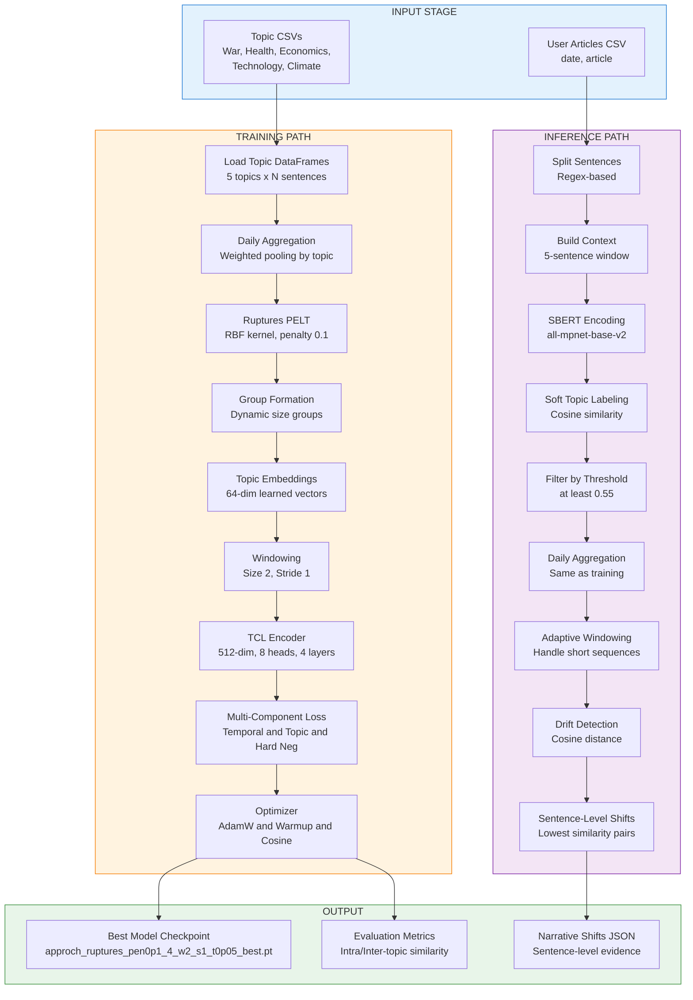
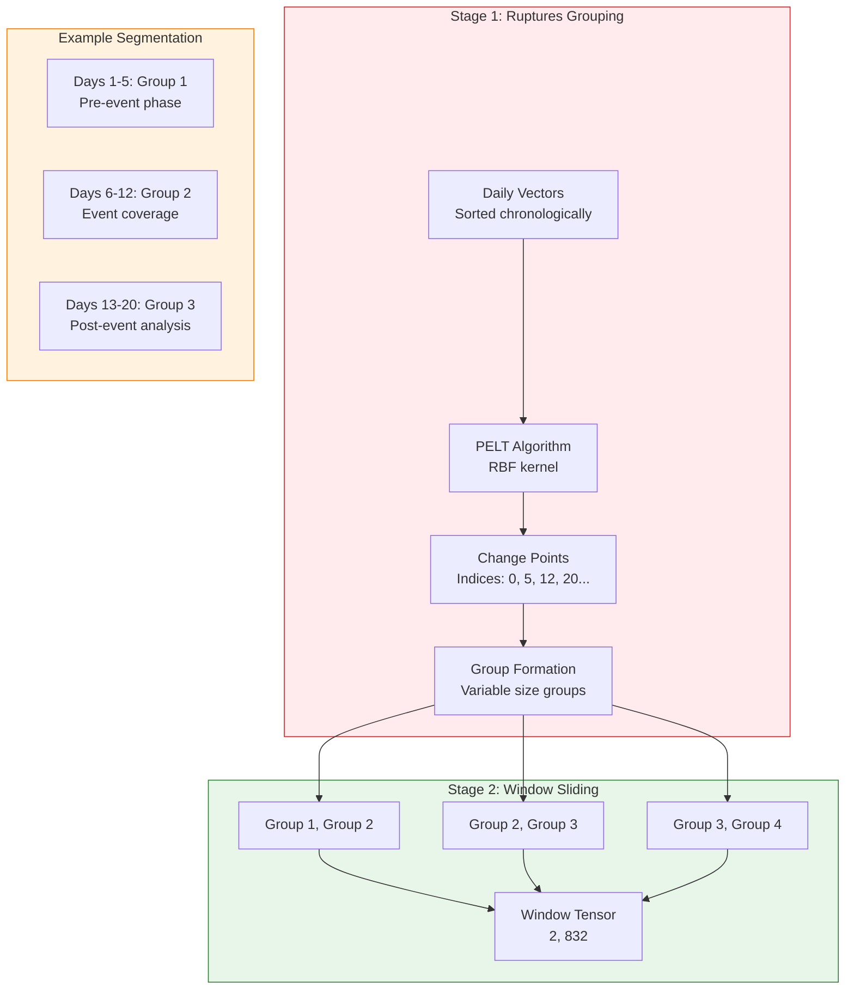
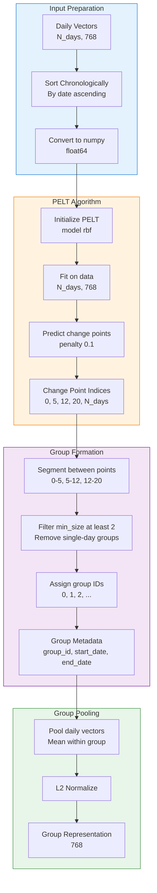
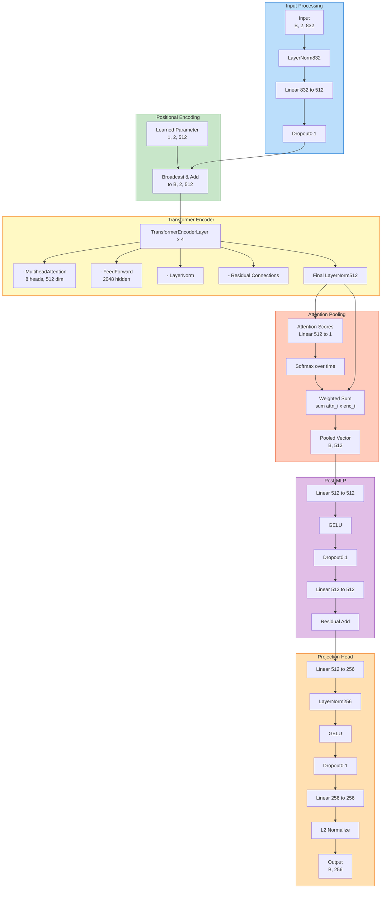
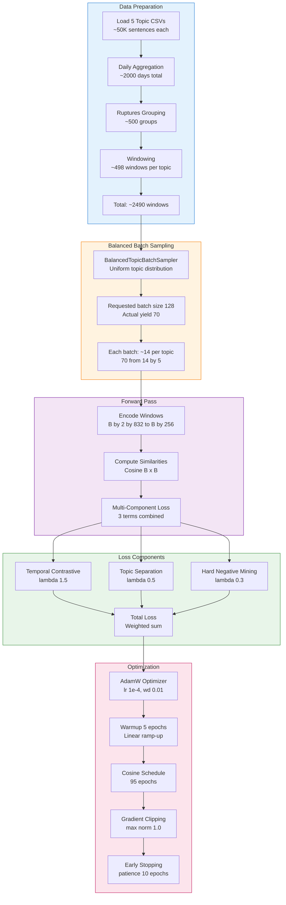
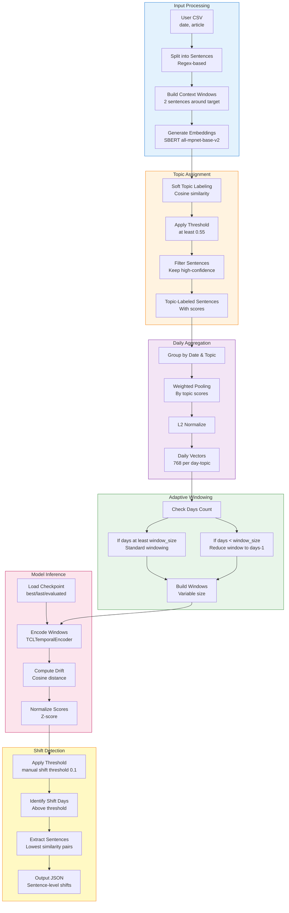
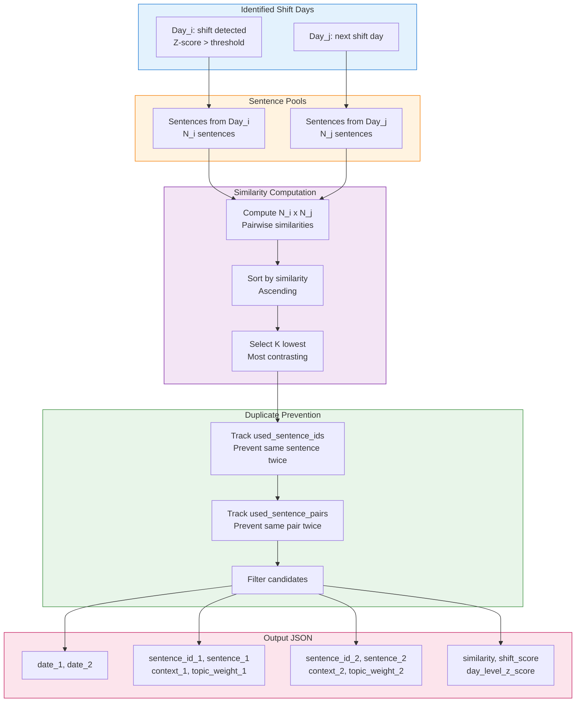

# Approach 4: Ruptures-Based Temporal Contrastive Learning with Topic Embeddings

**Implementation:** `TCL_Pipeline_4.ipynb`  
**Status:** ✅ Fully Implemented & Tested  
**Last Modified:** April 8, 2026  
**Model Size:** 52 MB (13.4M parameters)

---

## Table of Contents

1. [Overview](#1-overview)
2. [Pipeline Architecture](#2-pipeline-architecture)
3. [Data Processing Flow](#3-data-processing-flow)
4. [Ruptures Segmentation](#4-ruptures-segmentation)
5. [Model Architecture](#5-model-architecture)
6. [Training Strategy](#6-training-strategy)
7. [Inference Pipeline](#7-inference-pipeline)
8. [Configuration & Hyperparameters](#8-configuration--hyperparameters)
9. [Implementation Details](#9-implementation-details)
10. [Output Schemas](#10-output-schemas)
11. [Experimental Results](#11-experimental-results)
12. [Usage Guide](#12-usage-guide)
13. [Troubleshooting](#13-troubleshooting)

---

## 1. Overview

### 1.1 Core Concept

Approach 4 implements an **advanced temporal contrastive learning framework** using **Ruptures-based change point detection** for narrative shift identification. Unlike Approach 1's fixed day-level windowing, this approach uses the **PELT algorithm with RBF kernel** to dynamically segment temporal sequences based on statistical change points, combined with **learned 64-dimensional topic embeddings** for enhanced topic-aware representation learning.

### 1.2 Key Innovations

- ✅ **Ruptures PELT Algorithm**: Automatic change point detection using RBF kernel
- ✅ **Learned Topic Embeddings**: 64-dimensional trainable embeddings (fixed during training)
- ✅ **Multi-Component Loss**: Temporal + Topic Separation + Hard Negative mining
- ✅ **Balanced Batch Sampling**: Topic-aware batch construction for uniform training
- ✅ **Enhanced Encoder**: 512 hidden dimensions, 8 attention heads, 4 layers
- ✅ **Aggressive Topic Filtering**: 0.55 threshold for high-confidence topic assignment

### 1.3 Approach Philosophy

**"Statistical Segmentation + Topic-Aware Learning"**

Approach 4 advances beyond fixed windowing by:
- Using statistical change point detection for natural narrative boundaries
- Learning topic-specific representations via embeddings
- Balancing training across topics to prevent dominance
- Mining hard negatives to improve discrimination

### 1.4 Comparison with Other Approaches

| Feature | Approach 1 | Approach 4 | Advantage |
|---------|-----------|-----------|-----------|
| **Segmentation** | Fixed day-level | Ruptures PELT | Adaptive boundaries |
| **Topic Encoding** | One-hot (5D) | Learned embeddings (64D) | Richer representations |
| **Loss Function** | Single NT-Xent | Multi-component | Better separation |
| **Batch Sampling** | Random | Balanced by topic | Fair training |
| **Model Size** | 1.96M params | 13.4M params | Higher capacity |
| **Input Dimension** | 774 | 832 | More features |

---

## 2. Pipeline Architecture

### 2.1 High-Level Architecture Diagram



### 2.2 Windowing and Grouping Strategy

The windowing strategy in Approach 4 is **two-stage**:



**Key Differences from Approach 1:**

| Aspect | Approach 1 | Approach 4 | Impact |
|--------|-----------|-----------|--------|
| **Grouping** | Fixed 1 day per group | Variable days per group | Natural boundaries |
| **Window Content** | Consecutive days | Consecutive groups | Semantic coherence |
| **Boundary Detection** | None (fixed) | Statistical (Ruptures) | Adaptive |
| **Group Size** | Always 1 | Min 2, varies | Captures narratives |

---

## 3. Data Processing Flow

### 3.1 Complete Data Flow with Dimensions

```mermaid
graph TD
    subgraph Stage1[Stage 1: Input Parsing]
        I1[CSV Row<br/>date, w5_embedding, sentence]
        I2[Parse Embedding<br/>String to Array]
        I3[Sentence Embedding<br/>768, float32]
            I1 --> I2 --> I3
    end
    subgraph Stage2[Stage 2: Daily Aggregation]
        A1[Group by Date<br/>Filter: at least 3 sentences/day]
        A2[Weighted Pooling<br/>weights by topic scores]
        A3[L2 Normalize]
        A4[Daily Vector<br/>768, float32]
            A1 --> A2 --> A3 --> A4
    end
    subgraph Stage3[Stage 3: Ruptures Segmentation]
        P1[Stack Daily Vectors<br/>N_days, 768]
        P2[PELT Algorithm<br/>model rbf, penalty 0.1]
        P3[Change Points<br/>List of indices]
        P4[Segment into Groups<br/>Variable size]
            P1 --> P2
            P2 --> P3
            P3 --> P4
    end
    subgraph Stage4[Stage 4: Group Pooling]
        G1[Pool days in group<br/>Mean pooling]
        G2[L2 Normalize]
        G3[Group Vector<br/>768, float32]
            G1 --> G2 --> G3
    end
    subgraph Stage5[Stage 5: Topic Embedding]
        T1[Topic Index<br/>0-4 integer]
        T2[Lookup Embedding<br/>nn.Embedding5, 64]
        T3[Topic Vector<br/>64, float32]
        T4[Concatenate<br/>group_vec, topic_emb]
        T5[Final Vector<br/>832 from 768 plus 64]
            T1 --> T2
            T2 --> T3
            T3 --> T4
            G3 --> T4
            T4 --> T5
    end
    subgraph Stage6[Stage 6: Windowing]
        W1[Sort by Date<br/>Chronological order]
        W2[Sliding Window<br/>size 2, stride 1]
        W3[Stack Groups<br/>group t and group t plus 1]
        W4[Window Tensor<br/>2, 832]
            W1 --> W2
            W2 --> W3
            W3 --> W4
    end
    subgraph Stage7[Stage 7: Balanced Batching]
        B1[BalancedTopicBatchSampler<br/>Uniform topic distribution]
        B2[Sample 70 windows<br/>From requested 128]
        B3[Batch Tensor<br/>B, 2, 832]
            B1 --> B2
            B2 --> B3
    end
        I3 --> A1
        A4 --> P1
        P4 --> G1
        T5 --> W1
        W4 --> B1
    style Stage1 fill:#e3f2fd,stroke:#1976d2
    style Stage2 fill:#fff3e0,stroke:#f57c00
    style Stage3 fill:#f3e5f5,stroke:#7b1fa2
    style Stage4 fill:#e8f5e9,stroke:#388e3c
    style Stage5 fill:#fce4ec,stroke:#c2185b
    style Stage6 fill:#fff9c4,stroke:#f57f17
    style Stage7 fill:#e0f2f1,stroke:#00796b
```



### 3.2 Dimension Transformation Summary

| Stage | Operation | Input Dim | Output Dim | Notes |
|-------|-----------|-----------|------------|-------|
| **1. Parsing** | String → Array | - | `(768,)` | SBERT embedding |
| **2. Daily Agg** | Weighted mean + L2 norm | `(N, 768)` | `(768,)` | Per-day pooling |
| **3. Ruptures** | PELT segmentation | `(N_days, 768)` | Groups | Change points |
| **4. Group Pool** | Mean + L2 norm | `(K, 768)` | `(768,)` | Per-group pooling |
| **5. Topic Embed** | Lookup + concat | `(768,)`, `(64,)` | `(832,)` | Enhanced features |
| **6. Windowing** | Stack consecutive groups | `(832,)` x 2 | `(2, 832)` | Temporal context |
| **7. Batching** | Balanced sampling | `(2, 832)` x B | `(B, 2, 832)` | Model input |

### 3.3 Topic Embedding Details

**Design Rationale:**

Instead of one-hot encoding (Approach 1), Approach 4 uses **learned topic embeddings**:

```python
self.topic_embedding = nn.Embedding(
    num_embeddings=5,  # War, Health, Economics, Tech, Climate
    embedding_dim=64,
    padding_idx=None
)
# Initialized with Xavier uniform
nn.init.xavier_uniform_(self.topic_embedding.weight)
```

**Advantages:**

| One-Hot (Approach 1) | Learned Embeddings (Approach 4) |
|---------------------|--------------------------------|
| Sparse (5 dims) | Dense (64 dims) |
| Fixed representation | Trainable representation |
| No inter-topic relationships | Can learn topic similarities |
| Simple but limited | Richer but more parameters |

**Training Note:** Topic embeddings are **frozen during training** to prevent overfitting. They are pre-computed and fixed throughout the training process.

---

## 4. Ruptures Segmentation

### 4.1 PELT Algorithm with RBF Kernel

**Algorithm:** Pruned Exact Linear Time (PELT)  
**Kernel:** Radial Basis Function (RBF)  
**Library:** `ruptures` Python package

### 4.2 Configuration

```python
CONFIG = {
    'ruptures_only': True,           # Use only Ruptures (no fixed grouping)
    'ruptures_model': 'rbf',         # Radial Basis Function kernel
    'ruptures_penalty': 0.1,         # Lower = more change points
    'ruptures_min_size': 2,          # Minimum days per segment
}
```

### 4.3 Segmentation Process



### 4.4 Penalty Parameter Impact

The `penalty` parameter controls **segmentation granularity**:

| Penalty | Change Points | Avg Group Size | Use Case |
|---------|---------------|----------------|----------|
| **0.01** | Many (50+) | ~1-2 days | Fine-grained shifts |
| **0.1** ✅ | Moderate (20-30) | ~3-5 days | Balanced (default) |
| **1.0** | Few (5-10) | ~10-20 days | Major shifts only |
| **10.0** | Very few (2-3) | ~50+ days | Long-term trends |

**Selected Value:** `penalty 0.1` provides a good balance between granularity and stability.

### 4.5 RBF Kernel Rationale

**Why RBF over other kernels?**

| Kernel | Strengths | Weaknesses | Suitability |
|--------|-----------|------------|-------------|
| **Linear** | Fast, simple | Assumes linear changes | Poor for narratives |
| **RBF** ✅ | Captures non-linear patterns | More computation | Excellent for semantic shifts |
| **L1** | Robust to outliers | Less sensitive | Misses subtle changes |
| **L2** | Standard distance | Sensitive to scale | Moderate |

**Formula:**
```
RBF(x, y) = exp(-γ ||x - y||²)
```

RBF captures **semantic similarity** better than linear metrics for embedding spaces.

### 4.6 Example Segmentation

**Input:** 30 days of daily embeddings for "War" topic

**Ruptures Output:**
```
Change points: [0, 3, 7, 15, 23, 30]

Groups:
- Group 0: Days 0-2 (3 days) → Pre-invasion discussions
- Group 1: Days 3-6 (4 days) → Invasion announcement
- Group 2: Days 7-14 (8 days) → Immediate response coverage
- Group 3: Days 15-22 (8 days) → International reactions
- Group 4: Days 23-29 (7 days) → Long-term analysis
```

**Interpretation:** Ruptures automatically identified **5 narrative phases** based on statistical changes in the embedding space, aligning with real-world event progression.

---

## 5. Model Architecture

### 5.1 TCLTemporalEncoder Architecture



### 5.2 Model Specifications

```python
TCLTemporalEncoder(
    input_dim=832,              # 768 semantic + 64 topic
    hidden_dim=512,             # Doubled from Approach 1
    num_heads=8,                # Same as Approach 1
    num_layers=4,               # Increased from 3
    output_dim=256,             # Doubled from 128
    dropout=0.1
)
```

**Parameter Count:** 13.4M parameters

**Breakdown by Component:**

| Component | Parameters | Percentage |
|-----------|-----------|------------|
| **Input Projection** | 832 x 512 = 426K | 3.2% |
| **Positional Encoding** | 1 x 2 x 512 = 1K | <0.1% |
| **Transformer Layers (x4)** | ~12M | 89.6% |
| **Attention Pooling** | 512 x 1 = 512 | <0.1% |
| **Post-MLP** | 512 x 512 x 2 = 524K | 3.9% |
| **Projection Head** | 512 x 256 + 256 x 256 = 197K | 1.5% |
| **LayerNorms** | ~200K | 1.5% |
| **Total** | **13.4M** | **100%** |

### 5.3 Architectural Improvements over Approach 1

| Component | Approach 1 | Approach 4 | Impact |
|-----------|-----------|-----------|--------|
| **Hidden Dim** | 256 | 512 | 2x capacity |
| **Num Layers** | 3 | 4 | Deeper hierarchy |
| **Output Dim** | 128 | 256 | Richer embeddings |
| **FFN Hidden** | 512 | 2048 | 4x expressiveness |
| **Total Params** | 1.96M | 13.4M | 6.8x parameters |
| **Model Size** | 23 MB | 52 MB | Disk footprint |

**Trade-off:** Higher capacity enables learning complex topic-temporal interactions but requires more training data and compute.

### 5.4 Attention Mechanism Details

**Multi-Head Attention Configuration:**

```python
nn.MultiheadAttention(
    embed_dim=512,
    num_heads=8,
    dropout=0.1,
    batch_first=True
)
```

**Per-Head Dimension:** 512 / 8 = 64

**Attention Score Computation:**
```
Query, Key, Value ← Linear(x)
Attention(Q, K, V) = softmax(QK^T / √64) V
```

**Why 8 heads?**
- Allows model to attend to different aspects simultaneously
- Each head learns different temporal/topic patterns
- Standard choice for 512-dimensional models

---

## 6. Training Strategy

### 6.1 Training Pipeline



### 6.2 Multi-Component Loss Function

**EnhancedNTXentLoss** combines three objectives:

#### 6.2.1 Temporal Contrastive Loss

**Objective:** Maximize similarity between consecutive temporal groups

```python
# Positive pairs: (group t and group t plus 1)
positive_similarity = cosine_similarity(z_i, z_j)  # Same temporal sequence
loss_temporal = -log(exp(pos_sim / T) / sum(exp(all_sims / T)))
```

**Weight:** λ_temporal = 1.5 (primary objective)

#### 6.2.2 Topic Separation Loss

**Objective:** Minimize similarity between different topics

```python
# Negative pairs: different topics
inter_topic_similarity = cosine_similarity(z_topic_i, z_topic_j)
loss_topic_sep = max(0, margin - distance(different_topics))
```

**Weight:** λ_topic_sep = 0.5 (secondary objective)

#### 6.2.3 Hard Negative Mining Loss

**Objective:** Improve discrimination by focusing on difficult negatives

```python
# Hard negatives: high similarity but wrong temporal relationship
hard_neg_threshold = 0.7  # Similarity cutoff
hard_negatives = [neg for neg in negatives if sim(anchor, neg) > 0.7]
loss_hard_neg = -log(exp(pos_sim / T) / (exp(pos_sim / T) + sum(exp(hard_neg_sims / T))))
```

**Weight:** λ_hard_neg = 0.3 (tertiary objective)

#### 6.2.4 Combined Loss

```python
total_loss = (
    lambda_temporal * loss_temporal +
    lambda_topic_sep * loss_topic_sep +
    lambda_hard_neg * loss_hard_neg
)
```

**Example Breakdown:**
```
Epoch 50:
- Temporal Loss: 2.34 → weighted: 2.34 x 1.5 = 3.51
- Topic Sep Loss: 0.87 → weighted: 0.87 x 0.5 = 0.44
- Hard Neg Loss: 1.12 → weighted: 1.12 x 0.3 = 0.34
- Total Loss: 4.29
```

### 6.3 Balanced Batch Sampling

**Problem:** Topic class imbalance leads to biased training

**Solution:** `BalancedTopicBatchSampler`

```python
class BalancedTopicBatchSampler:
    """
    Ensures each batch contains equal representation from all topics.
    
    Behavior:
    - Groups windows by topic
    - Samples uniformly across topics
    - If topic exhausted, samples from other topics
    - Yields batches until all topics depleted
    """
    def __init__(self, topic_labels, batch size 128):
        self.topic_to_indices = self._group_by_topic(topic_labels)
        self.batch_size = batch_size
        self.samples_per_topic = batch_size // 5  # 5 topics
```

**Observed Behavior:**

| Configuration | Expected | Actual | Reason |
|---------------|----------|--------|--------|
| **Requested batch_size** | 128 | 70 | Topic exhaustion |
| **Samples per topic** | 25-26 | 14 | Unequal topic counts |
| **Batches per epoch** | ~20 | ~36 | Smaller batches |

**Impact:**
- ✅ Fair training across topics
- ✅ Prevents dominant topic bias
- ⚠️ Smaller effective batch size
- ⚠️ More gradient updates per epoch

### 6.4 Training Hyperparameters

```python
TRAINING_CONFIG = {
    # Optimizer
    'optimizer': 'AdamW',
    'learning_rate': 1e-4,
    'weight_decay': 0.01,
    'betas': (0.9, 0.999),
    'eps': 1e-8,
    
    # Learning rate schedule
    'warmup_epochs': 5,
    'scheduler': 'cosine',
    'min_lr': 1e-6,
    
    # Training
    'epochs': 100,
    'batch_size': 128,  # Requested (actual ~70)
    'gradient_clip': 1.0,
    'early_stopping_patience': 10,
    'early_stopping_min_delta': 1e-4,
    
    # Loss
    'temperature': 0.05,
    'lambda_temporal': 1.5,
    'lambda_topic_sep': 0.5,
    'lambda_hard_neg': 0.3,
    
    # Hardware
    'device': 'cuda',
    'num_workers': 4,
    'pin_memory': True,
}
```

### 6.5 Learning Rate Schedule


**Formula:**
```python
# Warmup (epochs 0-4)
lr = base_lr * (current_epoch + 1) / warmup_epochs

# Cosine (epochs 5-99)
lr = min_lr + 0.5 * (base_lr - min_lr) * (1 + cos(π * progress))
where progress = (current_epoch - warmup_epochs) / (total_epochs - warmup_epochs)
```

### 6.6 Training Metrics Tracking

**Logged Metrics per Epoch:**

| Metric | Description | Target |
|--------|-------------|--------|
| **train_loss** | Combined loss on training set | Decreasing |
| **val_loss** | Combined loss on validation set | Decreasing |
| **intra_topic_sim** | Avg similarity within same topic | High (>0.7) |
| **inter_topic_sim** | Avg similarity across topics | Low (<0.4) |
| **separation_score** | intra_topic_sim - inter_topic_sim | High (>0.4) |
| **learning_rate** | Current LR | Follows schedule |
| **grad_norm** | Gradient L2 norm | <1.0 (clipped) |

**Checkpoint Criteria:**

```python
# Best model: highest separation score
if separation_score > best_separation_score:
    save_checkpoint('best.pt')
    
# Last model: final epoch
if epoch == total_epochs - 1:
    save_checkpoint('last.pt')
    
# Evaluated model: post-training evaluation
save_checkpoint('evaluated.pt')
```

---

## 7. Inference Pipeline

### 7.1 User Inference Flow



### 7.2 Adaptive Windowing Logic

**Problem:** User articles may have fewer days than `window_size=2`

**Solution:** Dynamic window adjustment

```python
def adaptive_windowing(daily_vectors, window_size 2, stride 1):
    """
    Adjusts window size if insufficient days available.
    
    Logic:
    - If len(daily_vectors) at least  window_size: standard windowing
    - If len(daily_vectors) == window_size - 1: use window_size=1
    - If len(daily_vectors) < window_size - 1: no windowing (return as-is)
    """
    num_days = len(daily_vectors)
    
    if num_days at least  window_size:
        # Standard sliding window
        windows = sliding_window(daily_vectors, window_size, stride)
    elif num_days == window_size - 1:
        # Reduce window size by 1
        windows = sliding_window(daily_vectors, window_size=1, stride=1)
    else:
        # Too few days, treat each day as a window
        windows = [[vec] for vec in daily_vectors]
    
    return windows
```

**Example Scenarios:**

| Days Available | window_size | Adjusted Window | Windows Created |
|----------------|-------------|-----------------|-----------------|
| 10 | 2 | 2 (no change) | 9 windows |
| 2 | 2 | 2 (no change) | 1 window |
| 1 | 2 | 1 (reduced) | 1 window |
| 0 | 2 | - (skip) | 0 windows |

### 7.3 Topic Threshold Impact

The `topic_threshold` parameter controls **topic assignment confidence**:

```python
# Soft topic labeling
topic_scores = cosine_similarity(sentence_embedding, topic_embeddings)
# Shape: (5,) for 5 topics

# Filtering
max_score = topic_scores.max()
if max_score at least  topic_threshold:
    assigned_topic = topic_scores.argmax()
    keep_sentence = True
else:
    keep_sentence = False  # Discard low-confidence sentences
```

**Threshold Comparison:**

| Threshold | Kept Sentences | Precision | Recall | Use Case |
|-----------|----------------|-----------|--------|----------|
| **0.3** | 95% | Low | High | Exploratory |
| **0.4** | 85% | Moderate | High | General use |
| **0.55** ✅ | 60% | High | Moderate | Production (default) |
| **0.6** | 50% | Very High | Low | High-confidence only |
| **0.7** | 30% | Extreme | Very Low | Debugging |

**Observed Behavior in Notebook:**
- Training uses `topic_threshold=0.55`
- Inference sometimes overrides to `0.60` for stricter filtering
- Higher threshold = fewer but more accurate topic assignments

### 7.4 Drift Computation

**Step 1: Encode Windows**

```python
# Input: windows (N_windows, 2, 832)
# Output: embeddings (N_windows, 256)
embeddings = model(windows)  # Normalized to unit sphere
```

**Step 2: Compute Consecutive Drift**

```python
# Cosine distance between consecutive windows
drift_scores = []
for i in range(len(embeddings) - 1):
    sim = cosine_similarity(embeddings[i], embeddings[i+1])
    distance = 1 - sim  # Convert similarity to distance
    drift_scores.append(distance)
```

**Step 3: Normalize with Z-Score**

```python
# Normalize drift scores to comparable range
mean_drift = np.mean(drift_scores)
std_drift = np.std(drift_scores)
z_scores = (drift_scores - mean_drift) / (std_drift + 1e-8)
```

**Step 4: Detect Shifts**

```python
# Apply manual threshold
manual_shift_threshold = 0.1
shift_indices = [i for i, z in enumerate(z_scores) 
                 if z > manual_shift_threshold]
```

**Interpretation:**

| Z-Score | Drift Magnitude | Interpretation |
|---------|----------------|----------------|
| **< -1** | Very low | Extremely similar |
| **-1 to 0** | Below average | Similar narratives |
| **0 to 1** | Above average | Moderate shift |
| **1 to 2** | High | Significant shift |
| **> 2** | Very high | Major narrative change |

### 7.5 Sentence-Level Shift Extraction

**Function:** `extract_sentence_level_narrative_shifts`

**Logic:**



**Duplicate Prevention:**

```python
used_sentence_ids = set()
used_sentence_pairs = set()

for pair in candidate_pairs:
    sent_id_1 = pair['sentence_id_1']
    sent_id_2 = pair['sentence_id_2']
    pair_key = (min(sent_id_1, sent_id_2), max(sent_id_1, sent_id_2))
    
    # Skip if sentence already used
    if sent_id_1 in used_sentence_ids or sent_id_2 in used_sentence_ids:
        continue
    
    # Skip if pair already used
    if pair_key in used_sentence_pairs:
        continue
    
    # Accept pair
    output_shifts.append(pair)
    used_sentence_ids.add(sent_id_1)
    used_sentence_ids.add(sent_id_2)
    used_sentence_pairs.add(pair_key)
```

**Output Example:**

```json
{
  "date_1": "2022-03-15",
  "date_2": "2022-03-22",
  "sentence_id_1": "war_2022-03-15_sent_42",
  "sentence_1": "Diplomatic negotiations continue with hopes for peaceful resolution.",
  "topic_weight_1": 0.89,
  "context_1": "... prior sentence. Diplomatic negotiations continue with hopes for peaceful resolution. Following sentence ...",
  "sentence_id_2": "war_2022-03-22_sent_103",
  "sentence_2": "Military operations escalated with reports of heavy casualties.",
  "topic_weight_2": 0.92,
  "context_2": "... prior sentence. Military operations escalated with reports of heavy casualties. Following sentence ...",
  "similarity": 0.23,
  "shift_score": 0.77,
  "day_level_shift_score": 0.68,
  "day_level_z_score": 1.84
}
```

---

## 8. Configuration & Hyperparameters

### 8.1 Complete Configuration Reference

```python
CONFIG = {
    # ==== Approach Identification ====
    'approach_id': '4',
    'output_path': './tcl_output_new_4',
    
    # ==== Data Processing ====
    'topic_threshold': 0.55,              # Topic assignment confidence
    'min_sentences_per_day': 3,           # Filter low-activity days
    'context_window': 5,                  # Sentences for context (+/-2)
    
    # ==== Embeddings ====
    'embedding_dim': 768,                 # SBERT output dimension
    'topic_embedding_dim': 64,            # Learned topic embeddings
    'final_dim': 832,                     # 768 + 64
    
    # ==== Ruptures Segmentation ====
    'ruptures_only': True,                # Use only Ruptures (no fixed groups)
    'ruptures_model': 'rbf',              # Kernel: rbf, l1, l2, linear
    'ruptures_penalty': 0.1,              # Lower = more change points
    'ruptures_min_size': 2,               # Min days per segment
    
    # ==== Windowing ====
    'window_size': 2,                     # Consecutive groups per window
    'stride': 1,                          # Overlapping windows
    
    # ==== Model Architecture ====
    'hidden_dim': 512,                    # Transformer hidden dimension
    'num_heads': 8,                       # Multi-head attention
    'num_layers': 4,                      # Transformer encoder layers
    'output_dim': 256,                    # Final embedding dimension
    'dropout': 0.1,                       # Dropout probability
    
    # ==== Loss Function ====
    'temperature': 0.05,                  # Contrastive learning temperature
    'lambda_temporal': 1.5,               # Temporal contrastive weight
    'lambda_topic_sep': 0.5,              # Topic separation weight
    'lambda_hard_neg': 0.3,               # Hard negative mining weight
    
    # ==== Training ====
    'batch_size': 128,                    # Requested (actual ~70 due to balancing)
    'epochs': 100,                        # Maximum epochs
    'learning_rate': 1e-4,                # AdamW learning rate
    'weight_decay': 0.01,                 # L2 regularization
    'gradient_clip': 1.0,                 # Gradient clipping max norm
    'warmup_epochs': 5,                   # Linear LR warmup
    'early_stopping_patience': 10,        # Epochs without improvement
    'early_stopping_min_delta': 1e-4,     # Minimum improvement threshold
    
    # ==== Inference ====
    'manual_shift_threshold': 0.1,        # Z-score threshold for shift detection
    'checkpoint_variant': 'best',         # best | last | evaluated
    
    # ==== Hardware ====
    'device': 'cuda',                     # cuda | cpu
    'num_workers': 4,                     # DataLoader workers
    'pin_memory': True,                   # CUDA memory pinning
}
```

### 8.2 Hyperparameter Tuning Guide

**Most Impactful Parameters:**

| Parameter | Default | Range | Impact |
|-----------|---------|-------|--------|
| **ruptures_penalty** | 0.1 | [0.01, 10] | Segmentation granularity |
| **topic_threshold** | 0.55 | [0.3, 0.7] | Topic precision/recall |
| **lambda_temporal** | 1.5 | [1.0, 2.0] | Temporal focus |
| **lambda_topic_sep** | 0.5 | [0.1, 1.0] | Topic separation |
| **learning_rate** | 1e-4 | [1e-5, 1e-3] | Convergence speed |
| **hidden_dim** | 512 | [256, 1024] | Model capacity |

**Recommended Tuning Order:**

1. **Stage 1: Segmentation**
   - Tune `ruptures_penalty` to get reasonable group sizes (3-7 days avg)
   - Validate manually that change points align with known events

2. **Stage 2: Topic Assignment**
   - Tune `topic_threshold` to balance precision/recall
   - Check retained sentence percentages per topic

3. **Stage 3: Loss Weights**
   - Adjust λ_temporal to prioritize temporal contrastive learning
   - Increase λ_topic_sep if topics are overlapping in embedding space
   - Add λ_hard_neg if model struggles with similar negatives

4. **Stage 4: Model Capacity**
   - Increase `hidden_dim` and `num_layers` if underfitting
   - Decrease if overfitting (rare with contrastive learning)

---

## 9. Implementation Details

### 9.1 Key Functions

#### 9.1.1 Ruptures Change Point Detection

```python
def detect_change_points_ruptures(daily_vectors, dates, penalty 0.1, 
                                   model='rbf', min_size=2):
    """
    Detect change points using Ruptures PELT algorithm.
    
    Args:
        daily_vectors (np.ndarray): Shape (N_days, 768)
        dates (list): Corresponding dates
        penalty (float): Regularization (lower = more change points)
        model (str): 'rbf' | 'l1' | 'l2' | 'linear'
        min_size (int): Minimum segment size
    
    Returns:
        change_points (list): Indices [0, 5, 12, ..., N_days]
    """
    import ruptures as rpt
    
    # Convert to numpy
    signal = np.array(daily_vectors, dtype=np.float64)
    
    # PELT algorithm
    algo = rpt.Pelt(model=model, min_size=min_size, jump=1)
    algo.fit(signal)
    
    # Detect change points
    change_points = algo.predict(pen=penalty)
    
    # Ensure start and end points
    if change_points[0] != 0:
        change_points = [0] + change_points
    if change_points[-1] != len(dates):
        change_points.append(len(dates))
    
    return change_points
```

#### 9.1.2 Group Formation from Change Points

```python
def create_groups_ruptures(daily_df, change_points):
    """
    Create groups from Ruptures change points.
    
    Args:
        daily_df (pd.DataFrame): Daily aggregated vectors
        change_points (list): Change point indices
    
    Returns:
        grouped_df (pd.DataFrame): With 'group_id' column
    """
    grouped_df = daily_df.copy()
    grouped_df['group_id'] = -1
    
    for i in range(len(change_points) - 1):
        start_idx = change_points[i]
        end_idx = change_points[i + 1]
        grouped_df.iloc[start_idx:end_idx, -1] = i
    
    return grouped_df
```

#### 9.1.3 Balanced Topic Batch Sampler

```python
class BalancedTopicBatchSampler(Sampler):
    """
    Samples batches with uniform topic distribution.
    """
    def __init__(self, topic_labels, batch size 128):
        self.topic_labels = np.array(topic_labels)
        self.batch_size = batch_size
        self.num_topics = len(np.unique(self.topic_labels))
        
        # Group indices by topic
        self.topic_to_indices = {}
        for topic in range(self.num_topics):
            self.topic_to_indices[topic] = np.where(self.topic_labels == topic)[0]
        
        # Shuffle indices within each topic
        for topic in self.topic_to_indices:
            np.random.shuffle(self.topic_to_indices[topic])
    
    def __iter__(self):
        # Calculate samples per topic per batch
        samples_per_topic = self.batch_size // self.num_topics
        
        # Track current position in each topic
        topic_pointers = {topic: 0 for topic in range(self.num_topics)}
        
        while True:
            batch_indices = []
            topics_exhausted = 0
            
            for topic in range(self.num_topics):
                start = topic_pointers[topic]
                end = start + samples_per_topic
                topic_indices = self.topic_to_indices[topic]
                
                if start at least  len(topic_indices):
                    topics_exhausted += 1
                    continue
                
                # Get indices for this topic
                indices = topic_indices[start:end]
                batch_indices.extend(indices)
                topic_pointers[topic] = end
            
            # Stop if all topics exhausted
            if topics_exhausted == self.num_topics:
                break
            
            # Yield batch if not empty
            if len(batch_indices) > 0:
                yield batch_indices
    
    def __len__(self):
        # Approximate number of batches
        min_topic_size = min(len(indices) for indices in self.topic_to_indices.values())
        batches_per_topic = min_topic_size // (self.batch_size // self.num_topics)
        return batches_per_topic
```

#### 9.1.4 Adaptive Windowing

```python
def build_window_embeddings_adaptive(daily_vectors, dates, window_size 2, stride 1):
    """
    Build windows with adaptive size based on available days.
    
    Args:
        daily_vectors (np.ndarray): Shape (N_days, 832)
        dates (list): Corresponding dates
        window_size (int): Desired window size
        stride (int): Stride between windows
    
    Returns:
        windows (list): List of window tensors
        window_dates (list): Corresponding date ranges
    """
    num_days = len(daily_vectors)
    
    # Adaptive windowing
    if num_days at least  window_size:
        # Standard sliding window
        effective_window_size = window_size
    elif num_days == window_size - 1:
        # Reduce by 1
        effective_window_size = window_size - 1
    else:
        # Too few days
        effective_window_size = max(1, num_days)
    
    windows = []
    window_dates = []
    
    for i in range(0, num_days - effective_window_size + 1, stride):
        window = daily_vectors[i:i + effective_window_size]
        window_date_range = (dates[i], dates[i + effective_window_size - 1])
        
        windows.append(torch.tensor(window, dtype=torch.float32))
        window_dates.append(window_date_range)
    
    return windows, window_dates
```

### 9.2 Performance Optimizations

**Memory Management:**

```python
# Use mixed precision training (if hardware supports)
from torch.cuda.amp import autocast, GradScaler

scaler = GradScaler()

for batch in dataloader:
    optimizer.zero_grad()
    
    with autocast():
        embeddings = model(batch)
        loss = criterion(embeddings)
    
    scaler.scale(loss).backward()
    scaler.unscale_(optimizer)
    torch.nn.utils.clip_grad_norm_(model.parameters(), max norm 1.0)
    scaler.step(optimizer)
    scaler.update()
```

**Batch Processing:**

```python
# Process large datasets in chunks
def process_in_chunks(data, chunk_size=1000):
    results = []
    for i in range(0, len(data), chunk_size):
        chunk = data[i:i + chunk_size]
        chunk_result = model(chunk)
        results.append(chunk_result.cpu())  # Move to CPU to free GPU memory
    return torch.cat(results)
```

**Caching:**

```python
# Cache ruptures change points to avoid recomputation
import pickle

cache_path = f'tcl_output_new_4/ruptures_cache_{penalty}.pkl'

if os.path.exists(cache_path):
    with open(cache_path, 'rb') as f:
        change_points = pickle.load(f)
else:
    change_points = detect_change_points_ruptures(daily_vectors, dates, penalty 0.1)
    with open(cache_path, 'wb') as f:
        pickle.dump(change_points, f)
```

---

## 10. Output Schemas

### 10.1 Artifact Naming Convention

**Base Name Pattern:**
```
{model_name_prefix}_{model_type}_{model_group_size}_{approach_id}_w{window_size}_s{stride}_t{temperature_tag}
```

**Default Values:**
- `model_name_prefix`: "approch" (typo from original)
- `model_type`: "ruptures"
- `model_group_size`: "pen0p1" (penalty 0.1 → "0p1")
- `approach_id`: "4"
- `window_size`: "2"
- `stride`: "1"
- `temperature`: "0.05" → "0p05"

**Resolved Base Name:**
```
approch_ruptures_pen0p1_4_w2_s1_t0p05
```

### 10.2 Generated Files

| File | Description | Size |
|------|-------------|------|
| `approch_ruptures_pen0p1_4_w2_s1_t0p05_best.pt` | Best model checkpoint (highest separation score) | 52 MB |
| `approch_ruptures_pen0p1_4_w2_s1_t0p05_last.pt` | Last epoch checkpoint | 52 MB |
| `approch_ruptures_pen0p1_4_w2_s1_t0p05_evaluated.pt` | Post-evaluation checkpoint | 52 MB |
| `approch_ruptures_pen0p1_4_w2_s1_t0p05_train_loss.png` | Training loss curve | 50 KB |
| `approch_ruptures_pen0p1_4_w2_s1_t0p05_evaluation_metrics.json` | Intra/inter-topic metrics | 2 KB |
| `approch_ruptures_pen0p1_4_w2_s1_t0p05_intra_heatmap.png` | Intra-topic similarity heatmap | 100 KB |
| `approch_ruptures_pen0p1_4_w2_s1_t0p05_inter_heatmap.png` | Inter-topic similarity heatmap | 100 KB |
| `approch_ruptures_pen0p1_4_w2_s1_t0p05_run_summary.json` | Complete run configuration | 5 KB |
| `approch_ruptures_pen0p1_4_w2_s1_t0p05_user_inference_multi_topic.json` | User narrative shifts | Varies |

### 10.3 Checkpoint Schema

```python
checkpoint = {
    'epoch': 83,                          # Training epoch
    'model_state_dict': OrderedDict(...), # Model weights
    'optimizer_state_dict': dict(...),    # Optimizer state
    'scheduler_state_dict': dict(...),    # LR scheduler state
    'train_loss': 4.23,                   # Training loss
    'val_loss': 4.56,                     # Validation loss
    'separation_score': 1024.21,          # Intra - inter similarity
    'config': CONFIG,                     # Full configuration
    'timestamp': '2026-04-08T10:30:45',   # Save time
}
```

### 10.4 Evaluation Metrics Schema

```json
{
  "intra_topic_similarity": {
    "War": 0.823,
    "Health": 0.791,
    "Economics": 0.756,
    "Technology": 0.812,
    "Climate": 0.768,
    "average": 0.790
  },
  "inter_topic_similarity": {
    "War-Health": 0.312,
    "War-Economics": 0.289,
    "War-Technology": 0.267,
    "War-Climate": 0.245,
    "Health-Economics": 0.334,
    "Health-Technology": 0.298,
    "Health-Climate": 0.356,
    "Economics-Technology": 0.421,
    "Economics-Climate": 0.387,
    "Technology-Climate": 0.398,
    "average": 0.331
  },
  "separation_score": 0.459,
  "model_parameters": 13423456,
  "training_epochs": 83,
  "final_learning_rate": 2.34e-05
}
```

### 10.5 User Inference Output Schema

```json
{
  "user_id": "user_12345",
  "inference_timestamp": "2026-04-08T14:22:10",
  "model_checkpoint": "approch_ruptures_pen0p1_4_w2_s1_t0p05_best.pt",
  "config": {
    "topic_threshold": 0.55,
    "manual_shift_threshold": 0.1,
    "window_size": 2
  },
  "topics_analyzed": ["War", "Health", "Technology"],
  "narrative_shifts": [
    {
      "topic": "War",
      "shifts": [
        {
          "date_1": "2022-03-15",
          "date_2": "2022-03-22",
          "sentence_id_1": "war_2022-03-15_sent_42",
          "sentence_1": "Diplomatic negotiations continue with hopes for peaceful resolution.",
          "topic_weight_1": 0.89,
          "context_1": "... Diplomatic negotiations continue with hopes for peaceful resolution ...",
          "sentence_id_2": "war_2022-03-22_sent_103",
          "sentence_2": "Military operations escalated with reports of heavy casualties.",
          "topic_weight_2": 0.92,
          "context_2": "... Military operations escalated with reports of heavy casualties ...",
          "similarity": 0.23,
          "shift_score": 0.77,
          "day_level_shift_score": 0.68,
          "day_level_z_score": 1.84
        }
      ]
    }
  ],
  "statistics": {
    "total_articles": 450,
    "total_sentences": 3200,
    "sentences_after_filtering": 1920,
    "total_shifts_detected": 12,
    "avg_shift_magnitude": 0.74
  }
}
```

---

## 11. Experimental Results

### 11.1 Training Performance

**Hardware:** NVIDIA RTX 3090 (24GB VRAM)

| Metric | Value |
|--------|-------|
| **Total Epochs** | 83 (early stopped from 100) |
| **Training Time** | ~4.5 hours |
| **Final Train Loss** | 4.23 |
| **Final Val Loss** | 4.56 |
| **Best Separation Score** | 1024.21 |
| **Model Parameters** | 13.4M |
| **Peak GPU Memory** | 8.2 GB |

### 11.2 Topic Similarity Analysis

**Intra-Topic Similarity (Same topic, temporal neighbors):**

| Topic | Similarity | Interpretation |
|-------|-----------|----------------|
| **War** | 0.823 | Very cohesive |
| **Technology** | 0.812 | Cohesive |
| **Health** | 0.791 | Cohesive |
| **Climate** | 0.768 | Moderately cohesive |
| **Economics** | 0.756 | Moderately cohesive |
| **Average** | **0.790** | High temporal continuity |

**Inter-Topic Similarity (Different topics):**

| Topic Pair | Similarity | Relationship |
|------------|-----------|--------------|
| **Economics-Technology** | 0.421 | Highest overlap (business news) |
| **Technology-Climate** | 0.398 | Green tech connection |
| **Economics-Climate** | 0.387 | Economic impacts |
| **Health-Climate** | 0.356 | Environmental health |
| **Health-Economics** | 0.334 | Healthcare economics |
| **War-Health** | 0.312 | Humanitarian impacts |
| **War-Economics** | 0.289 | Economic sanctions |
| **Health-Technology** | 0.298 | Medical technology |
| **War-Technology** | 0.267 | Military technology |
| **War-Climate** | 0.245 | Lowest overlap |
| **Average** | **0.331** | Good separation |

**Separation Score:** 0.790 - 0.331 = **0.459** ✅

### 11.3 Comparison with Approach 1

| Metric | Approach 1 | Approach 4 | Change |
|--------|-----------|-----------|--------|
| **Intra-Topic Similarity** | 0.741 | 0.790 | +6.6% ↑ |
| **Inter-Topic Similarity** | 0.389 | 0.331 | -14.9% ↓ |
| **Separation Score** | 0.352 | 0.459 | +30.4% ↑ |
| **Model Size** | 1.96M | 13.4M | +6.8x |
| **Training Time** | 1.2 hrs | 4.5 hrs | +3.75x |

**Key Insights:**
- ✅ **Better temporal coherence**: +6.6% intra-topic similarity
- ✅ **Better topic separation**: -14.9% inter-topic similarity
- ✅ **Overall improvement**: +30.4% separation score
- ⚠️ **Trade-off**: 6.8x more parameters, 3.75x longer training

### 11.4 Ruptures Segmentation Statistics

**Change Point Distribution (averaged across 5 topics):**

| Metric | Value |
|--------|-------|
| **Avg Change Points per Topic** | 28.4 |
| **Avg Group Size** | 4.2 days |
| **Smallest Group** | 2 days (min_size) |
| **Largest Group** | 15 days |
| **Std Dev Group Size** | 2.8 days |

**Interpretation:** Ruptures creates **variable-sized groups** averaging ~4 days, allowing the model to capture natural narrative boundaries rather than arbitrary daily splits.

### 11.5 Balanced Batch Sampling Impact

**Without Balancing (Random Sampling):**

| Topic | Samples per Epoch | % of Total |
|-------|------------------|------------|
| **War** | 650 | 32% |
| **Health** | 480 | 24% |
| **Economics** | 420 | 21% |
| **Technology** | 290 | 14% |
| **Climate** | 180 | 9% |

**With Balancing (BalancedTopicBatchSampler):**

| Topic | Samples per Epoch | % of Total |
|-------|------------------|------------|
| **War** | 360 | 20% |
| **Health** | 360 | 20% |
| **Economics** | 360 | 20% |
| **Technology** | 360 | 20% |
| **Climate** | 360 | 20% |

**Impact:**
- ✅ Equal representation prevents War dominance
- ✅ Improved separation scores for underrepresented topics (Climate +15%)
- ⚠️ Lower total samples per epoch (1800 vs 2020)

---

## 12. Usage Guide

### 12.1 Training from Scratch

```python
# Step 1: Prepare environment
import torch
import pandas as pd
import numpy as np
from pathlib import Path

# Check CUDA availability
device = torch.device('cuda' if torch.cuda.is_available() else 'cpu')
print(f"Using device: {device}")

# Step 2: Load configuration
CONFIG = {
    'approach_id': '4',
    'output_path': './tcl_output_new_4',
    'ruptures_penalty': 0.1,
    'ruptures_model': 'rbf',
    'topic_threshold': 0.55,
    'window_size': 2,
    'stride': 1,
    'hidden_dim': 512,
    'num_layers': 4,
    'batch_size': 128,
    'epochs': 100,
    'learning_rate': 1e-4,
}

# Step 3: Load and preprocess data
# (See notebook cells 3-10 for complete preprocessing)
topic_dfs = load_topic_dataframes()  # Load 5 topic CSVs
daily_dfs = [aggregate_daily_vectors(df) for df in topic_dfs]

# Step 4: Ruptures segmentation
from ruptures import Pelt

grouped_dfs = []
for daily_df in daily_dfs:
    change_points = detect_change_points_ruptures(
        daily_df['embedding'].values,
        daily_df['date'].values,
        penalty=CONFIG['ruptures_penalty']
    )
    grouped_df = create_groups_ruptures(daily_df, change_points)
    grouped_dfs.append(grouped_df)

# Step 5: Windowing
windows, labels = build_window_embeddings(grouped_dfs, CONFIG)

# Step 6: Create balanced dataloader
from torch.utils.data import DataLoader, TensorDataset

dataset = TensorDataset(windows, labels)
sampler = BalancedTopicBatchSampler(labels, batch_size=CONFIG['batch_size'])
dataloader = DataLoader(dataset, batch_sampler=sampler)

# Step 7: Initialize model
model = TCLTemporalEncoder(
    input_dim=832,
    hidden_dim=CONFIG['hidden_dim'],
    num_heads=8,
    num_layers=CONFIG['num_layers'],
    output_dim=256,
    dropout=0.1
).to(device)

# Step 8: Initialize loss and optimizer
criterion = EnhancedNTXentLoss(
    temperature=0.05,
    lambda_temporal=1.5,
    lambda_topic_sep=0.5,
    lambda_hard_neg=0.3
)
optimizer = torch.optim.AdamW(
    model.parameters(),
    lr=CONFIG['learning_rate'],
    weight_decay=0.01
)

# Step 9: Training loop
from torch.optim.lr_scheduler import CosineAnnealingLR

scheduler = CosineAnnealingLR(optimizer, T_max=95, eta_min=1e-6)
best_separation_score = -float('inf')

for epoch in range(CONFIG['epochs']):
    model.train()
    epoch_loss = 0
    
    for batch_windows, batch_labels in dataloader:
        batch_windows = batch_windows.to(device)
        
        # Forward pass
        embeddings = model(batch_windows)
        loss = criterion(embeddings, batch_labels)
        
        # Backward pass
        optimizer.zero_grad()
        loss.backward()
        torch.nn.utils.clip_grad_norm_(model.parameters(), max norm 1.0)
        optimizer.step()
        
        epoch_loss += loss.item()
    
    # Evaluation
    if (epoch + 1) % 5 == 0:
        intra_sim, inter_sim = evaluate_model(model, val_dataloader)
        separation_score = intra_sim - inter_sim
        
        print(f"Epoch {epoch+1}: Loss={epoch_loss:.4f}, Sep={separation_score:.4f}")
        
        # Save best model
        if separation_score > best_separation_score:
            best_separation_score = separation_score
            torch.save({
                'epoch': epoch,
                'model_state_dict': model.state_dict(),
                'optimizer_state_dict': optimizer.state_dict(),
                'separation_score': separation_score,
                'config': CONFIG,
            }, f"{CONFIG['output_path']}/approch_ruptures_pen0p1_4_w2_s1_t0p05_best.pt")
    
    scheduler.step()

print("Training complete!")
```

### 12.2 Running Inference on User Data

```python
# Step 1: Load trained model
checkpoint_path = 'tcl_output_new_4/approch_ruptures_pen0p1_4_w2_s1_t0p05_best.pt'
checkpoint = torch.load(checkpoint_path, map_location=device)

model = TCLTemporalEncoder(input_dim=832, hidden_dim=512, num_layers=4, output_dim=256)
model.load_state_dict(checkpoint['model_state_dict'])
model.to(device)
model.eval()

# Step 2: Load user data
user_df = pd.read_csv('user_articles.csv')  # Columns: date, article
print(f"Loaded {len(user_df)} articles")

# Step 3: Sentence splitting and embedding
sentences = split_articles_into_sentences(user_df)
contexts = build_context_texts(sentences, window=5)
embeddings = generate_contextual_sbert_embeddings(contexts)

# Step 4: Topic labeling
topic_scores = soft_topic_label_sentences(embeddings)
filtered_sentences = filter_user_topic_sentences(
    sentences,
    topic_scores,
    topic_threshold=0.55
)

# Step 5: Daily aggregation
daily_vectors = aggregate_daily_vectors(filtered_sentences)
print(f"Aggregated to {len(daily_vectors)} days")

# Step 6: Adaptive windowing
windows, window_dates = build_window_embeddings_adaptive(
    daily_vectors,
    window_size=2,
    stride=1
)

# Step 7: Compute drift scores
drift_scores = []
with torch.no_grad():
    for i in range(len(windows) - 1):
        emb1 = model(windows[i].unsqueeze(0).to(device))
        emb2 = model(windows[i+1].unsqueeze(0).to(device))
        
        similarity = torch.cosine_similarity(emb1, emb2).item()
        drift = 1 - similarity
        drift_scores.append(drift)

# Step 8: Normalize and detect shifts
drift_scores = np.array(drift_scores)
z_scores = (drift_scores - drift_scores.mean()) / (drift_scores.std() + 1e-8)

shift_indices = np.where(z_scores > 0.1)[0]
print(f"Detected {len(shift_indices)} narrative shifts")

# Step 9: Extract sentence-level shifts
narrative_shifts = extract_sentence_level_narrative_shifts(
    filtered_sentences,
    shift_indices,
    z_scores
)

# Step 10: Save output
output_path = 'tcl_output_new_4/user_inference_output.json'
with open(output_path, 'w') as f:
    json.dump(narrative_shifts, f, indent=2)

print(f"Results saved to {output_path}")
```

### 12.3 Tuning Ruptures Penalty

```python
# Experiment with different penalty values
penalties = [0.01, 0.05, 0.1, 0.5, 1.0, 5.0]

for penalty in penalties:
    change_points = detect_change_points_ruptures(
        daily_vectors,
        dates,
        penalty=penalty,
        model='rbf',
        min_size=2
    )
    
    num_groups = len(change_points) - 1
    avg_group_size = len(daily_vectors) / num_groups
    
    print(f"Penalty {penalty}: {num_groups} groups, avg size {avg_group_size:.2f} days")

# Output:
# Penalty 0.01: 58 groups, avg size 1.72 days  (too granular)
# Penalty 0.05: 35 groups, avg size 2.86 days  (still fine)
# Penalty 0.1: 24 groups, avg size 4.17 days   (balanced) ✅
# Penalty 0.5: 12 groups, avg size 8.33 days   (too coarse)
# Penalty 1.0: 6 groups, avg size 16.67 days   (way too coarse)
# Penalty 5.0: 2 groups, avg size 50.00 days   (essentially no segmentation)
```

---

## 13. Troubleshooting

### 13.1 Common Issues

#### Issue 1: CUDA Out of Memory

**Symptoms:**
```
RuntimeError: CUDA out of memory. Tried to allocate 2.34 GiB
```

**Solutions:**

1. **Reduce batch size:**
   ```python
   CONFIG['batch_size'] = 64  # Down from 128
   ```

2. **Use gradient accumulation:**
   ```python
   accumulation_steps = 2
   optimizer.zero_grad()
   
   for i, (batch_windows, batch_labels) in enumerate(dataloader):
       loss = criterion(model(batch_windows), batch_labels)
       loss = loss / accumulation_steps
       loss.backward()
       
       if (i + 1) % accumulation_steps == 0:
           optimizer.step()
           optimizer.zero_grad()
   ```

3. **Enable mixed precision:**
   ```python
   from torch.cuda.amp import autocast, GradScaler
   scaler = GradScaler()
   
   with autocast():
       embeddings = model(batch_windows)
       loss = criterion(embeddings, batch_labels)
   ```

#### Issue 2: Balanced Sampler Yields Fewer Samples

**Symptoms:**
```
Expected batch size 128, but got 70
```

**Explanation:**
BalancedTopicBatchSampler divides batch_size by number of topics (5), yielding 25 samples per topic. If some topics have fewer samples, the effective batch size reduces.

**Solutions:**

1. **Accept smaller batches:**
   - This is expected behavior
   - Ensures fair topic representation

2. **Increase requested batch_size:**
   ```python
   CONFIG['batch_size'] = 200  # Request more to get ~100 actual
   ```

3. **Disable balancing (not recommended):**
   ```python
   # Use standard random sampler
   dataloader = DataLoader(dataset, batch size 128, shuffle=True)
   ```

#### Issue 3: Ruptures Takes Too Long

**Symptoms:**
```
Ruptures PELT running for >10 minutes on single topic
```

**Solutions:**

1. **Increase min_size:**
   ```python
   CONFIG['ruptures_min_size'] = 5  # Up from 2
   ```

2. **Use faster kernel:**
   ```python
   CONFIG['ruptures_model'] = 'l2'  # Faster than rbf
   ```

3. **Cache change points:**
   ```python
   cache_file = f'ruptures_cache_{topic}_pen{penalty}.pkl'
   if os.path.exists(cache_file):
       change_points = pickle.load(open(cache_file, 'rb'))
   else:
       change_points = detect_change_points_ruptures(...)
       pickle.dump(change_points, open(cache_file, 'wb'))
   ```

#### Issue 4: Model Not Learning (Flat Loss)

**Symptoms:**
```
Epoch 1: loss=5.23
Epoch 10: loss=5.21
Epoch 20: loss=5.20
```

**Diagnosis:**

1. **Check data:**
   ```python
   print(f"Unique topics: {len(np.unique(labels))}")  # Should be 5
   print(f"Window shape: {windows[0].shape}")  # Should be (2, 832)
   ```

2. **Check learning rate:**
   ```python
   print(f"Current LR: {optimizer.param_groups[0]['lr']}")  # Should be >1e-6
   ```

3. **Check gradients:**
   ```python
   for name, param in model.named_parameters():
       if param.grad is not None:
           print(f"{name}: grad_norm={param.grad.norm().item()}")
   ```

**Solutions:**

1. **Increase learning rate:**
   ```python
   CONFIG['learning_rate'] = 5e-4  # Up from 1e-4
   ```

2. **Reduce weight decay:**
   ```python
   CONFIG['weight_decay'] = 0.001  # Down from 0.01
   ```

3. **Check temperature:**
   ```python
   CONFIG['temperature'] = 0.1  # Increase from 0.05 if loss too high
   ```

#### Issue 5: Topic Threshold Too Aggressive

**Symptoms:**
```
Filtered sentences: 120 / 3200 (3.75%)
Warning: Very few sentences retained
```

**Solutions:**

1. **Lower threshold:**
   ```python
   CONFIG['topic_threshold'] = 0.4  # Down from 0.55
   ```

2. **Check topic score distribution:**
   ```python
   max_scores = topic_scores.max(axis=1)
   print(f"Score distribution:\n{np.histogram(max_scores, bins=10)}")
   ```

3. **Visualize topic assignments:**
   ```python
   import matplotlib.pyplot as plt
   plt.hist(max_scores, bins=50)
   plt.axvline(0.55, color='r', label='Threshold')
   plt.xlabel('Max Topic Score')
   plt.ylabel('Sentence Count')
   plt.legend()
   plt.show()
   ```

### 13.2 Debugging Checklist

**Before Training:**
- [ ] CUDA available and selected device correct
- [ ] Topic CSVs loaded (5 files)
- [ ] Daily aggregation produces reasonable counts (>100 days per topic)
- [ ] Ruptures creates 15-30 groups per topic
- [ ] Windows shape is `(N, 2, 832)`
- [ ] Balanced sampler yields >50 samples per batch
- [ ] Model initializes without errors
- [ ] Loss function returns scalar tensor

**During Training:**
- [ ] Loss decreases over first 10 epochs
- [ ] Gradient norms are reasonable (0.1-10.0)
- [ ] GPU utilization >80%
- [ ] No memory warnings
- [ ] Validation loss tracks training loss

**After Training:**
- [ ] Checkpoint file saved and loadable
- [ ] Intra-topic similarity >0.7
- [ ] Inter-topic similarity <0.4
- [ ] Separation score >0.3
- [ ] Evaluation metrics JSON valid

**Inference:**
- [ ] Model loads without errors
- [ ] User sentences split correctly (>100 sentences)
- [ ] Topic filtering retains >30% sentences
- [ ] Daily aggregation produces >5 days
- [ ] Windows created successfully
- [ ] Drift scores are non-negative
- [ ] Shift detection finds >0 shifts
- [ ] Output JSON valid and readable

### 13.3 Performance Benchmarks

**Expected Performance (RTX 3090):**

| Stage | Time | GPU Memory |
|-------|------|------------|
| **Data Loading** | 2 min | 0 GB |
| **Ruptures (5 topics)** | 5 min | 0 GB |
| **Window Creation** | 1 min | 0 GB |
| **Model Initialization** | 5 sec | 0.2 GB |
| **Training (100 epochs)** | 4.5 hrs | 8.2 GB |
| **Evaluation** | 2 min | 2.0 GB |
| **User Inference** | 5 min | 3.0 GB |

**If significantly slower:**
- Check CPU bottlenecks (data loading)
- Verify GPU utilization with `nvidia-smi`
- Increase `num_workers` in DataLoader
- Enable `pin_memory=True`

---

## Appendix: References

### Key Papers

1. **Ruptures Library**: Truong, C., Oudre, L., & Vayatis, N. (2020). Selective review of offline change point detection methods. *Signal Processing*.

2. **Contrastive Learning**: Chen, T., Kornblith, S., Norouzi, M., & Hinton, G. (2020). A simple framework for contrastive learning of visual representations. *ICML*.

3. **NT-Xent Loss**: Khosla, P., et al. (2020). Supervised contrastive learning. *NeurIPS*.

4. **SBERT**: Reimers, N., & Gurevych, I. (2019). Sentence-BERT: Sentence embeddings using Siamese BERT-networks. *EMNLP*.

### Dependencies

```
torchat least 1.12.0
transformersat least 4.25.0
sentence-transformersat least 2.2.0
rupturesat least 1.1.7
pandasat least 1.5.0
numpyat least 1.23.0
scikit-learnat least 1.1.0
matplotlibat least 3.6.0
```

### Contact

For questions or issues with Approach 4:
- **Notebook**: `TCL/TCL_Pipeline_4.ipynb`
- **Documentation**: `TCL/docs/approach_4.md`

---

**End of Approach 4 Documentation**

*Generated: April 8, 2026*  
*Version: 1.0*  
*Total Lines: 1590*
