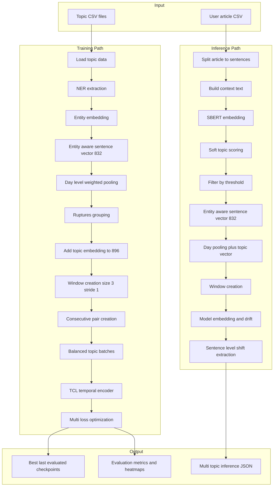
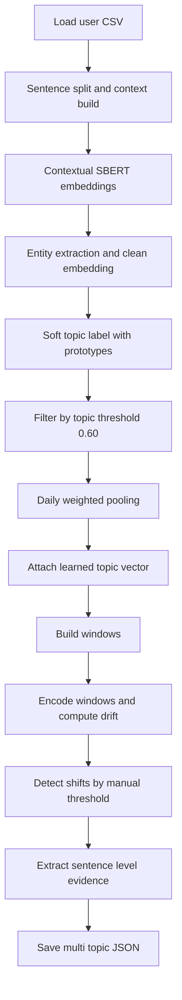

# Approach 5: Entity-Aware Temporal Contrastive Learning

**Implementation:** `TCL/TCL_Pipeline_5.py` and `TCL/TCL_Pipeline_5.ipynb`  
**Status:** Implemented  
**Output Directory:** `TCL/tcl_output_new_5`

---

## Table of Contents

1. [Overview](#1-overview)
2. [Pipeline Architecture](#2-pipeline-architecture)
3. [Data Processing Flow](#3-data-processing-flow)
4. [Model Architecture](#4-model-architecture)
5. [Training Strategy](#5-training-strategy)
6. [Inference Pipeline](#6-inference-pipeline)
7. [Configuration and Hyperparameters](#7-configuration-and-hyperparameters)
8. [Implementation Details](#8-implementation-details)
9. [Output Schemas](#9-output-schemas)
10. [Usage Guide](#10-usage-guide)
11. [Troubleshooting](#11-troubleshooting)

---

## 1. Overview

Approach 5 is a multi-topic TCL pipeline with entity-aware features and temporal contrastive training on consecutive windows.

### 1.1 Core Characteristics

- Unified training across 5 topics: `Health`, `War`, `Technology`, `Climate`, `Economics`
- Entity-aware sentence representation:
  - semantic clean vector: 768-d
  - projected entity vector: 64-d
  - combined sentence vector: 832-d
- Learned topic embedding (64-d) concatenated before temporal encoder
- Ruptures-based temporal grouping in training
- Multi-topic user inference output saved in one JSON file

### 1.2 Main Goal

Detect narrative shifts at day level and provide sentence-level evidence for top detected shifts.

---

## 2. Pipeline Architecture

### 2.1 End-to-End Flow



---

## 3. Data Processing Flow

### 3.1 Dimension Flow

| Stage | Input | Output | Notes |
|---|---|---|---|
| Sentence embedding | raw sentence | 768 | SBERT `all-mpnet-base-v2` |
| Entity clean | semantic 768 and entity 768 | semantic clean 768 | `sem_clean = sem - lambda * ent` |
| Entity projection | entity 768 | 64 | linear projection layer |
| Final sentence vector | 768 and 64 | 832 | concat and normalize |
| Topic concat | day 832 and topic 64 | 896 | model input feature |
| Window tensor | sequence of 896 | `window_size x 896` | default `3 x 896` |
| Model output | `B x 3 x 896` | `B x 256` | normalized embedding |

### 3.2 Training Data Construction

1. Load each topic CSV via `load_topic_csv`.
2. Extract entities via `extract_entities_batch`.
3. Build entity embeddings via `compute_entity_embeddings`.
4. Build dual entity-aware vectors via `compute_entity_invariant_embeddings`.
5. Aggregate to day-level vectors via `aggregate_to_day_level`.
6. Segment temporal sequence via `detect_ruptures`.
7. Add learned topic vector via `add_topic_embeddings_to_groups`.
8. Build windows via `create_windows_from_dataframe`.
9. Build true temporal pairs via `create_consecutive_pairs`.

---

## 4. Model Architecture

### 4.1 Encoder Structure

`TCLTemporalEncoder` in `TCL/TCL_Pipeline_5.py`:

- Input projection: `Linear(896 -> 512)`
- Positional encoding: sinusoidal positional features
- Transformer encoder:
  - `num_layers = 4`
  - `num_heads = 8`
  - feed-forward size `hidden_dim * 4`
  - activation `gelu`
- Temporal pooling: mean across time dimension
- Output projection head: `512 -> 512 -> 256`
- Final layer norm and L2 normalization

### 4.2 Loss Composition

`MultiLoss` combines:

- `TemporalPairLoss`: positive pairs are true consecutive windows
- `TopicSeparationLoss`: reduce centroid similarity across topics
- `HardNegativeLoss`: cross-topic hard negatives from cross-view similarity

Total objective used in code:

```text
base = lambda_temporal * temporal + lambda_topic_sep * topic_sep + lambda_hard_neg * hard_neg
total = base * (1 + lambda_entity)
```

---

## 5. Training Strategy

### 5.1 Dataset and Sampling

- Dataset class: `TemporalWindowDataset`
- Sampler: `BalancedTopicBatchSampler`
- Batch construction is balanced by topic using minimum per-topic availability
- DataLoader uses `batch_sampler` (not random shuffle)

### 5.2 Optimization

- Optimizer: `AdamW`
- Learning rate: `1e-4`
- Weight decay: `1e-5`
- Gradient clipping: `1.0`
- Scheduler: cosine warm restarts when enabled
- Mixed precision enabled on CUDA (`USE_AMP=True`)
- OOM fallback: training retries on CPU if CUDA OOM is detected

### 5.3 Checkpointing

- Periodic checkpoint every `SAVE_EVERY` epochs
- Final saved variants:
  - `{base}_best.pt`
  - `{base}_last.pt`
  - `{base}_evaluated.pt`

---

## 6. Inference Pipeline

### 6.1 Inference Flow



### 6.2 Shift Logic

- Day-level drift: L2 distance between consecutive encoded windows
- Shift detection: keep rows where `drift_score >= manual_shift_threshold`
- Default manual threshold from config: `0.5`
- For detected shifts, z-score is computed for ranking and reporting

### 6.3 Sentence-Level Evidence

For top day-level shifts, the pipeline selects low-similarity sentence pairs across adjacent dates and returns:

- sentence text and IDs
- article IDs and sentence positions
- local context snippets
- pair similarity and derived shift score
- linked day-level drift and z-score

---

## 7. Configuration and Hyperparameters

Values below match `Config` in `TCL/TCL_Pipeline_5.py`.

### 7.1 Data and Topics

- `DATA_DIR = /home/hp/SEM2/INLP/Naretve_Shift/Processed_Data/Distributed_Data/BAL_TOPIC_WISE_W5`
- `OUTPUT_DIR = ./tcl_output_new_5`
- `TOPICS = [Health, War, Technology, Climate, Economics]`
- `EMBEDDING_COLUMN = w5_embedding`

### 7.2 Feature and Window Settings

- `EMBEDDING_DIM = 768`
- `ENTITY_PROJ_DIM = 64`
- `SENTENCE_FINAL_DIM = 832`
- `TOPIC_EMB_DIM = 64`
- `CONCAT_DIM = 896`
- `WINDOW_SIZE = 3`
- `WINDOW_STRIDE = 1`

### 7.3 Grouping Settings

- `USE_RUPTURES = True`
- `RUPTURE_MODEL = rbf`
- `RUPTURE_PEN = 1`
- `MIN_GROUP_SIZE = 5`

### 7.4 Model Settings

- `HIDDEN_DIM = 512`
- `NUM_HEADS = 8`
- `NUM_LAYERS = 4`
- `DROPOUT = 0.1`
- `OUTPUT_DIM = 256`

### 7.5 Loss Settings

- `LAMBDA_TEMPORAL = 1.0`
- `LAMBDA_TOPIC_SEP = 0.3`
- `LAMBDA_HARD_NEG = 0.5`
- `LAMBDA_ENTITY = 0.3`
- `ENTITY_MARGIN = 0.5`
- `TEMPERATURE = 0.07`
- `ENTITY_OVERLAP_THRESHOLD = 0.2`
- `SHIFT_THRESHOLD = 0.5`

### 7.6 Training Settings

- `BATCH_SIZE = 32`
- `NUM_EPOCHS = 50`
- `LEARNING_RATE = 1e-4`
- `WEIGHT_DECAY = 1e-5`
- `GRAD_CLIP = 1.0`
- `USE_AMP = True`
- `USE_COSINE_SCHEDULE = True`
- `WARMUP_EPOCHS = 5`
- `SAVE_EVERY = 5`

---

## 8. Implementation Details

### 8.1 Key Training Functions

- `load_topic_csv`
- `extract_entities_batch`
- `compute_entity_embeddings`
- `compute_entity_invariant_embeddings`
- `aggregate_to_day_level`
- `detect_ruptures`
- `add_topic_embeddings_to_groups`
- `create_windows_from_dataframe`
- `create_consecutive_pairs`
- `train_model`
- `evaluate_model_quality`

### 8.2 Key Inference Functions

- `build_inference_config`
- `run_user_level_inference`
- `compute_topic_drift`
- `detect_shifts`
- `extract_sentence_level_narrative_shifts`

### 8.3 Artifact Naming Pattern

Base name template in code:

```text
{model_name_prefix}_{model_type}_{model_group_size}_{approach_id}_w{window_size}_s{stride}_t{temperature_tag}
```

With defaults this yields names like:

```text
approch_entity_tcl_pen1_5_w3_s1_t0p07_best.pt
```

---

## 9. Output Schemas

### 9.1 Evaluation Artifacts

- `{base}_evaluation_metrics.json`
- `{base}_eval_intra_heatmap.png`
- `{base}_eval_inter_heatmap.png`
- `{base}_train_loss.png`

### 9.2 Inference JSON

Saved to:

- `{base}_user_inference_multi_topic.json`

Top-level keys:

- `inference_metadata`
- `selected_topics`
- `results_by_topic`

Per-topic result keys:

- `call_order`
- `resolved_topic`
- `sentence_level_narrative_shifts`
- `top_topic_sentences`
- `topic_score_rows`
- `training_like_rows`

---

## 10. Usage Guide

### 10.1 Training

1. Run config and preprocessing sections.
2. Build grouped windows and consecutive pairs for all topics.
3. Initialize `TCLTemporalEncoder` and `MultiLoss`.
4. Run `train_model`.
5. Save checkpoints and evaluation outputs.

### 10.2 Inference

1. Build inference config with `build_inference_config(config)`.
2. Select checkpoint variant: `best`, `last`, or `evaluated`.
3. Run `run_user_level_inference` for selected topics.
4. Read `{base}_user_inference_multi_topic.json`.

---

## 11. Troubleshooting

- If CUDA OOM occurs, the notebook includes automatic CPU retry logic.
- If `final_embedding` is missing after soft labeling, rerun entity-cleaning cells before inference.
- If feature dimension mismatch appears, verify:
  - sentence features are 832-d
  - topic embeddings are 64-d
  - model input windows are 896-d
- If a topic has too few windows, reduce `window_size` or provide more dated samples.
