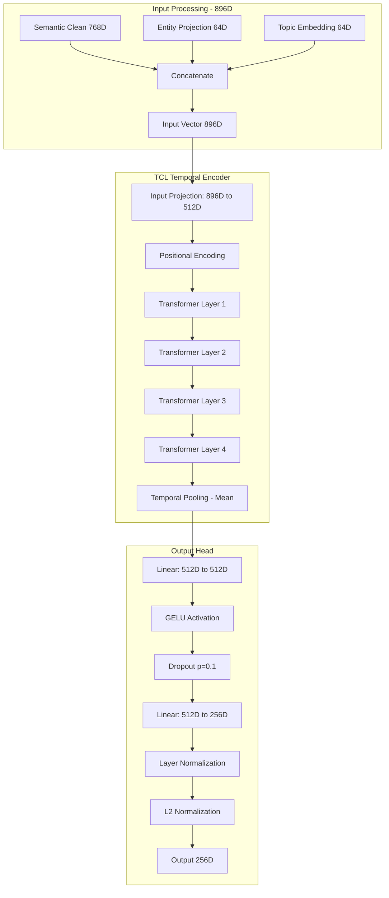
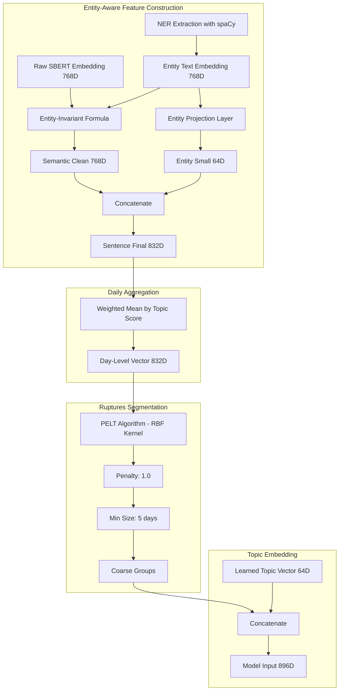
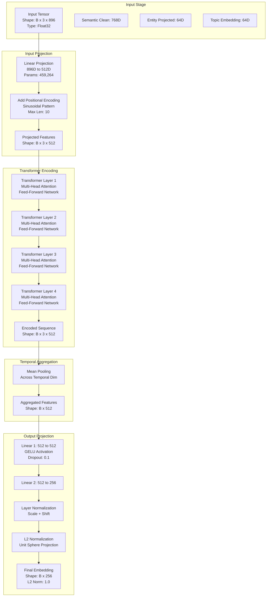
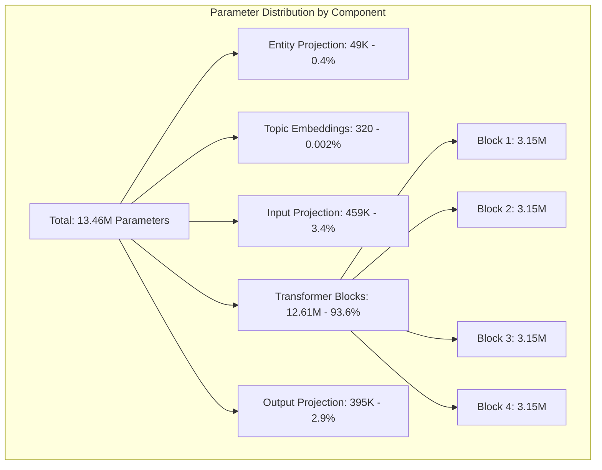
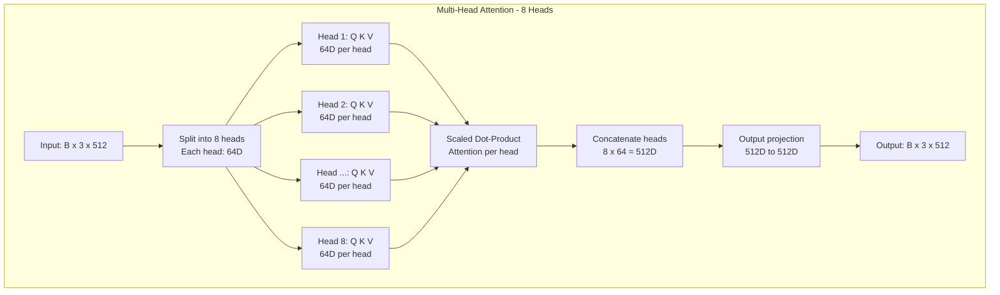
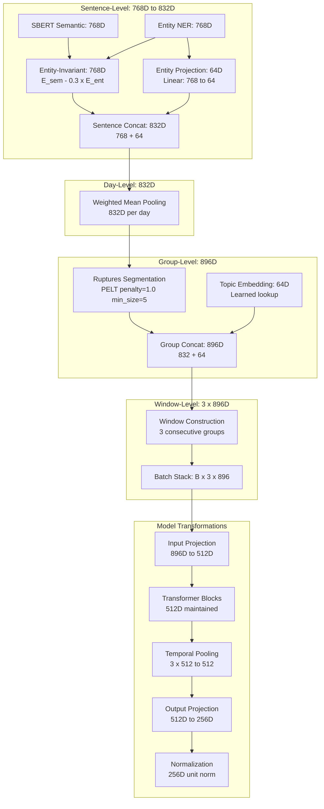
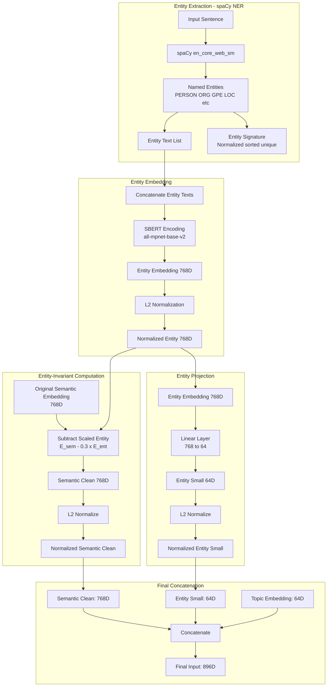

# Approach 5: Entity-Aware TCL Model Architecture

**Version:** 1.0  
**Date:** 2026-04-08  
**Model Type:** TCLTemporalEncoder (Entity-Aware Design)  
**Implementation:** `TCL/TCL_Pipeline_5.ipynb`

---

## Table of Contents

1. [Architecture Overview](#1-architecture-overview)
2. [Model Specifications](#2-model-specifications)
3. [Layer-by-Layer Architecture](#3-layer-by-layer-architecture)
4. [Forward Pass Data Flow](#4-forward-pass-data-flow)
5. [Parameter Breakdown](#5-parameter-breakdown)
6. [Initialization Details](#6-initialization-details)
7. [Transformer Mechanism](#7-transformer-mechanism)
8. [Normalization Strategy](#8-normalization-strategy)
9. [Activation Functions](#9-activation-functions)
10. [Regularization Techniques](#10-regularization-techniques)
11. [Mathematical Formulations](#11-mathematical-formulations)
12. [Dimensionality Transformations](#12-dimensionality-transformations)
13. [Approach-Specific Features](#13-approach-specific-features)

---

## 1. Architecture Overview

### 1.1 High-Level Design

Approach 5 implements an **entity-aware temporal contrastive learning architecture** that incorporates named entity information to improve narrative shift detection. The model builds upon Approach 4's larger architecture (512 hidden dimensions, 4 layers) but adds entity-specific processing components.

**Key Innovation:** Entity-invariant semantic embeddings computed by subtracting entity influence from semantic representations, combined with projected entity embeddings to create a dual-component sentence representation.

### 1.2 Core Components



### 1.3 Model Size Comparison

| Approach | Architecture | Hidden Dim | Layers | Heads | Parameters | Size |
|----------|-------------|------------|--------|-------|------------|------|
| 1 | Baseline | 256 | 3 | 8 | 1.96M | 23 MB |
| 2 | Group-Based | 256 | 3 | 8 | 1.96M | 23 MB |
| 4 | Ruptures + Topics | 512 | 4 | 8 | 13.4M | 52 MB |
| **5** | **Entity-Aware** | **512** | **4** | **8** | **13.46M** | **52 MB** |

**Note:** Approach 5 has slightly more parameters than Approach 4 (13.46M vs 13.4M) due to the entity projection layer and different input dimensionality (896D vs 832D).

### 1.4 Entity-Aware Pipeline



---

## 2. Model Specifications

### 2.1 Architecture Configuration

| Parameter | Value | Description |
|-----------|-------|-------------|
| **Input Dimension** | 896 | Semantic clean (768) + entity proj (64) + topic emb (64) |
| **Hidden Dimension** | 512 | Transformer model dimension |
| **Output Dimension** | 256 | Final projection dimension |
| **Number of Layers** | 4 | Transformer encoder layers |
| **Number of Heads** | 8 | Multi-head attention heads |
| **Feed-Forward Dimension** | 2048 | 4× hidden dimension expansion |
| **Dropout Rate** | 0.1 | Applied in transformer and output projection |
| **Positional Encoding** | Sinusoidal | Max length: 10 |
| **Activation** | GELU | Throughout transformer and output head |

### 2.2 Entity Processing Configuration

| Parameter | Value | Description |
|-----------|-------|-------------|
| **Entity Lambda** | 0.3 | Weight for entity subtraction in invariant formula |
| **Entity Projection Dim** | 64 | Compressed entity representation |
| **NER Model** | en_core_web_sm | spaCy small English model |
| **NER Batch Size** | 256 | Batch processing for efficiency |
| **Entity Overlap Threshold** | 0.2 | Minimum overlap for entity consistency loss |

### 2.3 Training Configuration

| Parameter | Value | Description |
|-----------|-------|-------------|
| **Batch Size** | 16 | Temporal window pairs per batch |
| **Learning Rate** | 1e-4 | AdamW optimizer |
| **Weight Decay** | 1e-5 | L2 regularization |
| **Gradient Clipping** | 1.0 | Max gradient norm |
| **Epochs** | 100 | Maximum training epochs |
| **Scheduler** | Cosine Annealing | Warm restarts, T_0=50 |
| **Mixed Precision** | Enabled | CUDA AMP for faster training |

### 2.4 Segmentation Configuration (Ruptures)

| Parameter | Value | Description |
|-----------|-------|-------------|
| **Algorithm** | PELT | Pruned Exact Linear Time |
| **Kernel** | RBF | Radial Basis Function |
| **Penalty** | 1.0 | Change point detection sensitivity (coarser than AP4) |
| **Min Group Size** | 5 | Minimum days per segment (larger than AP4) |

**Comparison with Approach 4:**
- Approach 4: penalty=0.1, min_size=2 (fine-grained segmentation)
- Approach 5: penalty=1.0, min_size=5 (coarser segmentation)

---

## 3. Layer-by-Layer Architecture

### 3.1 Complete Layer Stack

```mermaid
graph TD
    subgraph Layer_0[Layer 0: Input Processing]
        L0_1[Input: B x 3 x 896]
        L0_2[Linear Projection: 896 to 512]
        L0_3[Positional Encoding: +pos]
        L0_4[Output: B x 3 x 512]
        L0_1 --> L0_2
        L0_2 --> L0_3
        L0_3 --> L0_4
    end
    
    subgraph Layer_1[Layer 1: Transformer Block 1]
        L1_1[Multi-Head Attention - 8 heads]
        L1_2[Add and Norm]
        L1_3[Feed-Forward: 512 to 2048 to 512]
        L1_4[Add and Norm]
        L1_1 --> L1_2
        L1_2 --> L1_3
        L1_3 --> L1_4
    end
    
    subgraph Layer_2[Layer 2: Transformer Block 2]
        L2_1[Multi-Head Attention - 8 heads]
        L2_2[Add and Norm]
        L2_3[Feed-Forward: 512 to 2048 to 512]
        L2_4[Add and Norm]
        L2_1 --> L2_2
        L2_2 --> L2_3
        L2_3 --> L2_4
    end
    
    subgraph Layer_3[Layer 3: Transformer Block 3]
        L3_1[Multi-Head Attention - 8 heads]
        L3_2[Add and Norm]
        L3_3[Feed-Forward: 512 to 2048 to 512]
        L3_4[Add and Norm]
        L3_1 --> L3_2
        L3_2 --> L3_3
        L3_3 --> L3_4
    end
    
    subgraph Layer_4[Layer 4: Transformer Block 4]
        L4_1[Multi-Head Attention - 8 heads]
        L4_2[Add and Norm]
        L4_3[Feed-Forward: 512 to 2048 to 512]
        L4_4[Add and Norm]
        L4_1 --> L4_2
        L4_2 --> L4_3
        L4_3 --> L4_4
    end
    
    subgraph Layer_5[Layer 5: Temporal Pooling]
        L5_1[Mean Pooling: B x 3 x 512 to B x 512]
        L5_1 --> L5_2[Pooled Features: B x 512]
    end
    
    subgraph Layer_6[Layer 6: Output Projection]
        L6_1[Linear 1: 512 to 512]
        L6_2[GELU]
        L6_3[Dropout: p=0.1]
        L6_4[Linear 2: 512 to 256]
        L6_5[LayerNorm: 256]
        L6_6[L2 Normalize]
        L6_1 --> L6_2
        L6_2 --> L6_3
        L6_3 --> L6_4
        L6_4 --> L6_5
        L6_5 --> L6_6
        L6_6 --> L6_7[Final Output: B x 256]
    end
    
    L0_4 --> L1_1
    L1_4 --> L2_1
    L2_4 --> L3_1
    L3_4 --> L4_1
    L4_4 --> L5_1
    L5_2 --> L6_1
```



### 3.2 Detailed Layer Specifications

#### Layer 0: Input Projection
- **Type:** Linear transformation with positional encoding
- **Input Shape:** `(B, 3, 896)`
- **Output Shape:** `(B, 3, 512)`
- **Parameters:** 459,264 (896 × 512 + 512 bias)
- **Operation:** Projects concatenated entity-aware features to hidden dimension

#### Layers 1-4: Transformer Encoder Blocks
Each block contains:

**Multi-Head Attention (8 heads, 64D per head):**
- Query projection: 512 → 512 (262,656 params)
- Key projection: 512 → 512 (262,656 params)
- Value projection: 512 → 512 (262,656 params)
- Output projection: 512 → 512 (262,656 params)
- **Total per block:** 1,050,624 params

**Feed-Forward Network:**
- Linear 1: 512 → 2048 (1,050,624 params)
- GELU activation
- Dropout (p=0.1)
- Linear 2: 2048 → 512 (1,049,088 params)
- **Total per block:** 2,099,712 params

**Layer Normalization (×2 per block):**
- Norm 1: 1,024 params (512 scale + 512 shift)
- Norm 2: 1,024 params
- **Total per block:** 2,048 params

**Parameters per Transformer Block:** 3,152,384  
**Total for 4 blocks:** 12,609,536

#### Layer 5: Temporal Pooling
- **Type:** Mean pooling across temporal dimension
- **Input Shape:** `(B, 3, 512)`
- **Output Shape:** `(B, 512)`
- **Parameters:** 0 (aggregation only)

#### Layer 6: Output Projection Head
- **Linear 1:** 512 → 512 (262,656 params)
- **GELU:** No parameters
- **Dropout:** No parameters
- **Linear 2:** 512 → 256 (131,328 params)
- **LayerNorm:** 512 params (256 scale + 256 shift)
- **L2 Normalize:** No parameters
- **Total:** 394,496 params

---

## 4. Forward Pass Data Flow

### 4.1 Complete Forward Pass Diagram



### 4.2 Step-by-Step Forward Pass

```python
def forward(x, mask=None):
    # x shape: (batch_size, window_size, 896)
    
    # Step 1: Input Projection (896 -> 512)
    # Shape: (B, 3, 896) -> (B, 3, 512)
    x = self.input_proj(x)
    
    # Step 2: Add Positional Encoding
    # Shape: (B, 3, 512) -> (B, 3, 512)
    x = self.pos_encoder(x)
    
    # Step 3: Transformer Encoding (4 layers)
    # Each layer: Multi-head attention + Feed-forward
    # Shape: (B, 3, 512) -> (B, 3, 512)
    x = self.transformer(x, src_key_padding_mask=mask)
    
    # Step 4: Temporal Pooling (mean across window)
    # Shape: (B, 3, 512) -> (B, 512)
    x = x.mean(dim=1)
    
    # Step 5: Output Projection (2-layer MLP)
    # Shape: (B, 512) -> (B, 512) -> (B, 256)
    x = self.output_proj(x)
    
    # Step 6: Layer Normalization
    # Shape: (B, 256) -> (B, 256)
    x = self.layer_norm(x)
    
    # Step 7: L2 Normalization (unit sphere)
    # Shape: (B, 256) -> (B, 256), ||x|| = 1
    x = F.normalize(x, p=2, dim=-1)
    
    return x
```

### 4.3 Entity-Aware Feature Construction (Pre-Model)

```python
def construct_entity_aware_input(semantic_emb, entity_emb, topic_id):
    """
    Constructs the 896D input vector from entity-aware components.
    
    Args:
        semantic_emb: Original SBERT embedding (768D)
        entity_emb: Entity text embedding (768D)
        topic_id: Topic identifier (int)
    
    Returns:
        input_vector: Model input (896D)
    """
    # Step 1: Entity-Invariant Semantic Embedding
    # Formula: E_sem_clean = E_sem - lambda * E_ent
    lambda_entity = 0.3
    semantic_clean = semantic_emb - lambda_entity * entity_emb
    
    # Normalize semantic clean
    semantic_clean = semantic_clean / np.linalg.norm(semantic_clean)
    # Shape: (768,)
    
    # Step 2: Project Entity Embedding to 64D
    entity_small = entity_proj_layer(entity_emb)  # Linear: 768 -> 64
    entity_small = entity_small / np.linalg.norm(entity_small)
    # Shape: (64,)
    
    # Step 3: Get Learned Topic Embedding
    topic_vector = topic_emb_layer(topic_id)  # Embedding lookup: 64D
    # Shape: (64,)
    
    # Step 4: Concatenate All Components
    # [semantic_clean(768) | entity_small(64) | topic_vector(64)]
    input_vector = np.concatenate([
        semantic_clean,   # 768D
        entity_small,     # 64D
        topic_vector      # 64D
    ], axis=0)
    # Shape: (896,)
    
    return input_vector
```

---

## 5. Parameter Breakdown

### 5.1 Complete Parameter Count

| Component | Sub-Component | Parameters | Calculation |
|-----------|---------------|------------|-------------|
| **Entity Projection** | Entity Linear | 49,216 | 768 × 64 + 64 |
| **Topic Embedding** | Embedding Table | 320 | 5 topics × 64 |
| **Input Projection** | Linear | 459,264 | 896 × 512 + 512 |
| **Positional Encoding** | Sinusoidal | 0 | Fixed (not learned) |
| **Transformer Block 1** | Multi-Head Attention | 1,050,624 | Q,K,V,O projections |
| | Feed-Forward | 2,099,712 | 512→2048→512 |
| | Layer Norms (×2) | 2,048 | (512+512)×2 |
| | **Block 1 Total** | **3,152,384** | |
| **Transformer Block 2** | (Same as Block 1) | 3,152,384 | |
| **Transformer Block 3** | (Same as Block 1) | 3,152,384 | |
| **Transformer Block 4** | (Same as Block 1) | 3,152,384 | |
| **Output Projection** | Linear 1 | 262,656 | 512 × 512 + 512 |
| | GELU | 0 | No parameters |
| | Dropout | 0 | No parameters |
| | Linear 2 | 131,328 | 512 × 256 + 256 |
| | Layer Norm | 512 | 256 + 256 |
| | **Projection Total** | **394,496** | |
| **L2 Normalization** | | 0 | Operation only |
| **TOTAL PARAMETERS** | | **13,463,296** | **~13.46M** |

### 5.2 Parameter Distribution



**Observations:**
- 93.6% of parameters are in the transformer blocks
- Entity and topic processing add only 49.5K parameters (0.4%)
- Output projection is compact at 2.9%
- Similar distribution to Approach 4 but with entity-specific additions

### 5.3 Memory Requirements

| Metric | Value | Notes |
|--------|-------|-------|
| **Model Parameters** | 13,463,296 | Float32 precision |
| **Model Size (FP32)** | ~52 MB | 4 bytes per parameter |
| **Model Size (FP16)** | ~26 MB | Mixed precision training |
| **Batch Activation Memory** | ~50 MB | Batch size 16, window size 3 |
| **Optimizer State (AdamW)** | ~104 MB | 2× parameters for momentum |
| **Total Training Memory** | ~230 MB | Model + activations + optimizer |
| **Gradient Memory** | ~52 MB | Same as model size |

**GPU Memory Breakdown (Batch=16):**
- Model weights: 52 MB
- Forward activations: ~50 MB
- Backward gradients: ~52 MB
- Optimizer states: ~104 MB
- Total: ~260 MB per training step

---

## 6. Initialization Details

### 6.1 Weight Initialization Strategy

#### Entity Projection Layer
```python
# Entity projection: 768D -> 64D
entity_proj_layer = nn.Linear(768, 64)
nn.init.xavier_uniform_(entity_proj_layer.weight)
nn.init.zeros_(entity_proj_layer.bias)
```

**Rationale:** Xavier uniform initialization ensures stable gradient flow from high-dimensional entity embeddings to low-dimensional projection.

#### Topic Embedding Layer
```python
# Topic embeddings: 5 topics x 64D
topic_emb_layer = nn.Embedding(5, 64)
nn.init.xavier_uniform_(topic_emb_layer.weight)
```

**Rationale:** Xavier initialization provides good starting points for learned topic representations.

#### Input Projection
```python
# Input projection: 896D -> 512D
input_proj = nn.Linear(896, 512)
# PyTorch default initialization (uniform based on fan-in)
```

#### Transformer Layers
```python
# Multi-head attention and feed-forward layers
# Use PyTorch TransformerEncoderLayer defaults:
# - Linear layers: Kaiming uniform
# - LayerNorm: weight=1, bias=0
```

#### Output Projection
```python
# Output head: 512 -> 512 -> 256
output_proj = nn.Sequential(
    nn.Linear(512, 512),  # Default: Kaiming uniform
    nn.GELU(),
    nn.Dropout(0.1),
    nn.Linear(512, 256),  # Default: Kaiming uniform
)
layer_norm = nn.LayerNorm(256)  # weight=1, bias=0
```

### 6.2 Initialization Summary Table

| Layer Type | Initialization Method | Rationale |
|------------|----------------------|-----------|
| Entity Projection | Xavier Uniform | Stable gradient flow for dimension reduction |
| Topic Embeddings | Xavier Uniform | Balanced initialization for learned representations |
| Input Projection | PyTorch Default (Uniform) | Standard initialization for first projection |
| Transformer Attention | Kaiming Uniform | Suitable for ReLU-family activations |
| Transformer FFN | Kaiming Uniform | Matches attention initialization |
| Layer Normalization | Weight=1, Bias=0 | Identity transformation initially |
| Output Projection | Kaiming Uniform | Consistent with transformer layers |

---

## 7. Transformer Mechanism

### 7.1 Multi-Head Attention Architecture



### 7.2 Attention Computation

**Per-Head Attention:**
```
Q = Linear_Q(x)  # (B, 3, 512) -> (B, 3, 512) -> (B, 3, 8, 64)
K = Linear_K(x)  # (B, 3, 512) -> (B, 3, 512) -> (B, 3, 8, 64)
V = Linear_V(x)  # (B, 3, 512) -> (B, 3, 512) -> (B, 3, 8, 64)

# Scaled dot-product attention per head
scores = (Q @ K^T) / sqrt(64)  # (B, 8, 3, 3)
attention_weights = softmax(scores)  # (B, 8, 3, 3)
head_output = attention_weights @ V  # (B, 8, 3, 64)

# Concatenate heads
multi_head = concat(head_outputs)  # (B, 3, 512)
output = Linear_O(multi_head)  # (B, 3, 512)
```

### 7.3 Feed-Forward Network

**Architecture:**
```
FFN(x) = Linear_2(Dropout(GELU(Linear_1(x))))

Linear_1: 512D -> 2048D (4× expansion)
GELU activation
Dropout: p=0.1
Linear_2: 2048D -> 512D (back to model dim)
```

**Expansion Ratio:** 4× (same as Approach 4)

**Mathematical Formula:**
```
FFN(x) = W_2 * Dropout(GELU(W_1 * x + b_1)) + b_2

where:
  W_1 ∈ R^(2048 × 512)
  b_1 ∈ R^2048
  W_2 ∈ R^(512 × 2048)
  b_2 ∈ R^512
```

### 7.4 Residual Connections and Layer Normalization

Each transformer block uses **pre-norm** architecture:

```
# Multi-head attention with residual
x_norm = LayerNorm(x)
attention_out = MultiHeadAttention(x_norm)
x = x + attention_out

# Feed-forward with residual
x_norm = LayerNorm(x)
ffn_out = FeedForward(x_norm)
x = x + ffn_out
```

**Benefits:**
- Stable gradient flow through 4 layers
- Prevents vanishing gradients
- Enables deeper architectures

---

## 8. Normalization Strategy

### 8.1 Layer Normalization

**Applied at multiple stages:**

1. **Within Transformer Blocks (×2 per block, 4 blocks = 8 total):**
   - After multi-head attention (pre-norm style)
   - After feed-forward network (pre-norm style)

2. **Output Projection:**
   - After final linear layer, before L2 normalization

**Formula:**
```
LayerNorm(x) = γ * (x - μ) / sqrt(σ² + ε) + β

where:
  μ = mean(x) over feature dimension
  σ² = variance(x) over feature dimension
  γ = learnable scale parameter
  β = learnable shift parameter
  ε = 1e-5 (numerical stability)
```

**Parameters per LayerNorm:**
- Scale (γ): dimension size
- Shift (β): dimension size
- Total: 2 × dimension

**Example for hidden_dim=512:**
- Each LayerNorm has 1,024 parameters (512 scale + 512 shift)

### 8.2 L2 Normalization

**Applied at final output:**
```python
output = F.normalize(output, p=2, dim=-1)
```

**Effect:**
- Projects embeddings onto unit hypersphere
- All embeddings have L2 norm = 1.0
- Enables cosine similarity comparisons

**Mathematical Formula:**
```
L2_norm(x) = x / ||x||_2

where:
  ||x||_2 = sqrt(sum(x_i²))
```

**Benefits:**
- Consistent embedding magnitudes across batches
- Improved contrastive learning stability
- Direct cosine similarity computation via dot product

### 8.3 Normalization Flow Diagram

```mermaid
graph TD
    subgraph Normalization_Pipeline[Normalization Pipeline]
        N1[Raw Input: B x 3 x 896]
        N2[Input Projection]
        N3[Transformer Block 1<br/>LayerNorm x2]
        N4[Transformer Block 2<br/>LayerNorm x2]
        N5[Transformer Block 3<br/>LayerNorm x2]
        N6[Transformer Block 4<br/>LayerNorm x2]
        N7[Mean Pooling: B x 512]
        N8[Output MLP]
        N9[LayerNorm: Scale and Shift]
        N10[L2 Normalize: Unit Sphere]
        N11[Final Output: B x 256<br/>L2 Norm = 1.0]
        
        N1 --> N2
        N2 --> N3
        N3 --> N4
        N4 --> N5
        N5 --> N6
        N6 --> N7
        N7 --> N8
        N8 --> N9
        N9 --> N10
        N10 --> N11
    end
```



**Total LayerNorm Instances:** 9
- 8 in transformer blocks (2 per block × 4 blocks)
- 1 in output projection

---

## 9. Activation Functions

### 9.1 GELU (Gaussian Error Linear Unit)

**Primary activation function used throughout the model.**

**Mathematical Formula:**
```
GELU(x) = x * Φ(x)

where Φ(x) is the cumulative distribution function of standard normal distribution

Approximation:
GELU(x) ≈ 0.5 * x * (1 + tanh(sqrt(2/π) * (x + 0.044715 * x³)))
```

**Applied in:**
1. Transformer feed-forward networks (4 blocks)
2. Output projection head (first layer)

**Properties:**
- Smooth, non-monotonic
- Better gradient flow than ReLU
- Performs well with transformers
- Used in BERT, GPT models

**Comparison with ReLU:**
```
ReLU(x) = max(0, x)  # Hard threshold at 0
GELU(x) ≈ x * sigmoid(1.702 * x)  # Smooth, probabilistic
```

### 9.2 Softmax (in Attention)

**Used within multi-head attention:**
```
Attention(Q, K, V) = softmax(QK^T / sqrt(d_k)) V

softmax(x_i) = exp(x_i) / sum(exp(x_j))
```

**Properties:**
- Converts scores to probabilities
- Sum to 1.0 across attention dimension
- Temperature scaling via sqrt(d_k) = sqrt(64) = 8

### 9.3 Activation Function Summary

| Location | Activation | Parameters | Purpose |
|----------|------------|------------|---------|
| Transformer FFN | GELU | 0 | Non-linear transformation |
| Attention Mechanism | Softmax | 0 | Attention weight normalization |
| Output Projection Layer 1 | GELU | 0 | Non-linear transformation |
| Output Projection Layer 2 | None | 0 | Linear output projection |
| Final Output | L2 Normalize | 0 | Unit sphere projection |

**No learnable parameters in activation functions.**

---

## 10. Regularization Techniques

### 10.1 Dropout

**Applied at multiple locations:**

1. **Transformer Blocks (4 locations per block, 4 blocks):**
   - After attention output projection
   - After feed-forward first linear layer
   - **Rate:** p=0.1 (10% dropout)

2. **Output Projection Head:**
   - After first linear layer and GELU
   - **Rate:** p=0.1 (10% dropout)

**Total Dropout Layers:** 9 (8 in transformer + 1 in output head)

**Formula:**
```
Dropout(x, p) = x * mask / (1 - p)

where:
  mask ~ Bernoulli(1 - p)
  During training: mask is randomly sampled
  During inference: mask = 1 (no dropout)
```

### 10.2 Weight Decay (L2 Regularization)

**AdamW optimizer configuration:**
```python
optimizer = torch.optim.AdamW(
    model.parameters(),
    lr=1e-4,
    weight_decay=1e-5  # L2 regularization
)
```

**Effect:**
```
L_total = L_task + weight_decay * sum(w²)

Gradients:
∂L/∂w = ∂L_task/∂w + 2 * weight_decay * w
```

**Benefits:**
- Prevents overfitting
- Encourages smaller weight magnitudes
- Improves generalization

### 10.3 Gradient Clipping

**Applied during training:**
```python
torch.nn.utils.clip_grad_norm_(
    model.parameters(),
    max_norm=1.0
)
```

**Effect:**
```
if ||∇||_2 > max_norm:
    ∇ = ∇ * (max_norm / ||∇||_2)
```

**Benefits:**
- Prevents exploding gradients
- Stabilizes training
- Essential for transformer training

### 10.4 Mixed Precision Training (AMP)

**Automatic Mixed Precision (CUDA only):**
```python
use_amp = config.USE_AMP and torch.cuda.is_available()
scaler = torch.cuda.amp.GradScaler()

with torch.cuda.amp.autocast():
    output = model(input)
    loss = criterion(output, target)

scaler.scale(loss).backward()
scaler.unscale_(optimizer)
clip_grad_norm_(model.parameters(), 1.0)
scaler.step(optimizer)
scaler.update()
```

**Benefits:**
- Faster training (FP16 computation)
- Reduced memory usage (~50%)
- Maintains FP32 precision where needed

### 10.5 Cosine Annealing Learning Rate Schedule

**Configuration:**
```python
scheduler = torch.optim.lr_scheduler.CosineAnnealingWarmRestarts(
    optimizer,
    T_0=50,  # Half of total epochs
    T_mult=1,
    eta_min=1e-5
)
```

**Learning Rate Formula:**
```
η_t = η_min + (η_max - η_min) * (1 + cos(π * t / T_0)) / 2

where:
  η_max = 1e-4 (initial learning rate)
  η_min = 1e-5 (minimum learning rate)
  t = current epoch
  T_0 = 50 (restart period)
```

**Benefits:**
- Smooth learning rate decay
- Warm restarts help escape local minima
- Improved final convergence

### 10.6 Regularization Summary Table

| Technique | Location | Strength | Purpose |
|-----------|----------|----------|---------|
| **Dropout** | Transformer blocks | p=0.1 | Prevent overfitting |
| **Dropout** | Output projection | p=0.1 | Prevent overfitting |
| **Weight Decay** | All parameters | 1e-5 | L2 regularization |
| **Gradient Clipping** | All gradients | max_norm=1.0 | Stabilize training |
| **Mixed Precision** | Forward/backward | FP16/FP32 | Speed + memory |
| **LR Schedule** | Optimizer | Cosine decay | Smooth convergence |
| **L2 Normalization** | Output | Unit sphere | Embedding stability |

---

## 11. Mathematical Formulations

### 11.1 Entity-Invariant Semantic Embedding

**Core Formula:**
```
E_sem_clean = E_sem - λ_entity * E_ent

where:
  E_sem ∈ R^768: Original SBERT semantic embedding
  E_ent ∈ R^768: Entity text embedding (from spaCy NER)
  λ_entity = 0.3: Entity subtraction weight
  E_sem_clean ∈ R^768: Entity-invariant semantic representation
```

**Normalization:**
```
E_sem_clean_norm = E_sem_clean / ||E_sem_clean||_2
```

**Rationale:** Remove entity-specific information from semantic embeddings to focus on broader narrative patterns while preserving entity information separately.

### 11.2 Entity Projection

**Dimension Reduction:**
```
E_ent_small = W_ent * E_ent + b_ent

where:
  W_ent ∈ R^(64 × 768): Entity projection matrix
  b_ent ∈ R^64: Bias vector
  E_ent_small ∈ R^64: Compressed entity representation
```

**Normalization:**
```
E_ent_small_norm = E_ent_small / ||E_ent_small||_2
```

### 11.3 Input Feature Construction

**Concatenation:**
```
x_input = [E_sem_clean_norm(768) || E_ent_small_norm(64) || E_topic(64)]

where:
  || denotes concatenation
  E_topic ∈ R^64: Learned topic embedding (from embedding layer)
  x_input ∈ R^896: Final input feature vector
```

### 11.4 Input Projection

**Linear Transformation:**
```
h^(0) = W_in * x_input + b_in

where:
  W_in ∈ R^(512 × 896): Input projection matrix
  b_in ∈ R^512: Bias vector
  h^(0) ∈ R^512: Projected hidden state
```

### 11.5 Positional Encoding

**Sinusoidal Positional Encoding:**
```
PE(pos, 2i) = sin(pos / 10000^(2i/d_model))
PE(pos, 2i+1) = cos(pos / 10000^(2i/d_model))

where:
  pos ∈ {0, 1, 2}: Position in window (window_size = 3)
  i ∈ {0, 1, ..., 255}: Dimension index (d_model = 512)
  PE ∈ R^(3 × 512): Positional encoding matrix
```

**Addition:**
```
h^(0)_pos = h^(0) + PE
```

### 11.6 Multi-Head Attention

**Query, Key, Value Projections:**
```
Q = h * W_Q,  Q ∈ R^(B × 3 × 512)
K = h * W_K,  K ∈ R^(B × 3 × 512)
V = h * W_V,  V ∈ R^(B × 3 × 512)

where:
  W_Q, W_K, W_V ∈ R^(512 × 512): Projection matrices
```

**Reshape for Multi-Head:**
```
Q_heads = reshape(Q, (B, 3, 8, 64))  # 8 heads × 64 dims
K_heads = reshape(K, (B, 3, 8, 64))
V_heads = reshape(V, (B, 3, 8, 64))
```

**Scaled Dot-Product Attention (per head):**
```
Attention(Q, K, V) = softmax(Q * K^T / sqrt(d_k)) * V

where:
  d_k = 64: Dimension per head
  Scores = Q * K^T ∈ R^(B × 8 × 3 × 3)
  Attention_weights = softmax(Scores / sqrt(64))
  Output = Attention_weights * V ∈ R^(B × 8 × 3 × 64)
```

**Concatenate and Project:**
```
MultiHead(Q, K, V) = concat(head_1, ..., head_8) * W_O

where:
  concat(...) ∈ R^(B × 3 × 512)
  W_O ∈ R^(512 × 512): Output projection
  Output ∈ R^(B × 3 × 512)
```

### 11.7 Feed-Forward Network

**Two-Layer MLP with Expansion:**
```
FFN(x) = W_2 * GELU(W_1 * x + b_1) + b_2

where:
  W_1 ∈ R^(2048 × 512): First layer (4× expansion)
  b_1 ∈ R^2048
  W_2 ∈ R^(512 × 2048): Second layer (back to 512)
  b_2 ∈ R^512
```

### 11.8 Transformer Block

**Complete Block Computation:**
```
# Multi-head attention with residual
x_norm_1 = LayerNorm(x^(l-1))
attention_out = MultiHeadAttention(x_norm_1)
x_attn = x^(l-1) + Dropout(attention_out)

# Feed-forward with residual
x_norm_2 = LayerNorm(x_attn)
ffn_out = FFN(x_norm_2)
x^(l) = x_attn + Dropout(ffn_out)

where:
  x^(l) ∈ R^(B × 3 × 512): Output of layer l
```

### 11.9 Temporal Pooling

**Mean Pooling:**
```
h_pooled = (1/T) * sum_{t=1}^T h_t

where:
  T = 3: Window size
  h_t ∈ R^512: Hidden state at position t
  h_pooled ∈ R^512: Aggregated representation
```

### 11.10 Output Projection

**Two-Layer MLP:**
```
h_proj_1 = GELU(W_proj_1 * h_pooled + b_proj_1)
h_proj_1_drop = Dropout(h_proj_1, p=0.1)
h_proj_2 = W_proj_2 * h_proj_1_drop + b_proj_2

where:
  W_proj_1 ∈ R^(512 × 512)
  W_proj_2 ∈ R^(256 × 512)
  h_proj_2 ∈ R^256
```

**Layer Normalization:**
```
h_norm = LayerNorm(h_proj_2)
```

**L2 Normalization:**
```
z = h_norm / ||h_norm||_2

where:
  z ∈ R^256: Final embedding
  ||z||_2 = 1.0: Unit norm
```

### 11.11 Loss Functions

#### Temporal Pair Loss (NT-Xent)
```
L_temporal = -(1/N) * sum_{i=1}^N log(exp(sim(z_i^current, z_i^next) / τ) / sum_{j=1}^N exp(sim(z_i^current, z_j^next) / τ))

where:
  z^current, z^next ∈ R^256: Embeddings of consecutive windows
  sim(u, v) = u · v (dot product, since L2 normalized)
  τ = 0.05: Temperature parameter
  N: Batch size
```

#### Topic Separation Loss
```
L_topic_sep = (1 / |T|(|T|-1)) * sum_{i≠j} |sim(c_i, c_j)|

where:
  c_i = mean(z_k : topic_k = i): Centroid for topic i
  T: Set of unique topics in batch
  sim(c_i, c_j) = c_i · c_j: Cosine similarity
```

#### Hard Negative Loss
```
L_hard_neg = (1/N) * sum_{i=1}^N mean(softplus(topk(sim(z_i^current, z_j^next : topic_i ≠ topic_j), k)))

where:
  topk(..., k): Top k hardest negatives
  k = 0.3 * N: Hard negative ratio
  softplus(x) = log(1 + exp(x))
```

#### Entity Consistency Loss
```
L_entity = MSE((sim(z^current, z^next) + 1) / 2, overlap_entity)

where:
  overlap_entity ∈ [0, 1]: Entity overlap ratio between consecutive windows
  MSE: Mean squared error
```

#### Multi-Loss Combination
```
L_total = λ_temporal * L_temporal + λ_topic_sep * L_topic_sep + λ_hard_neg * L_hard_neg + λ_entity * L_entity

where:
  λ_temporal = 1.5
  λ_topic_sep = 0.2
  λ_hard_neg = 0.3
  λ_entity = 0.5
```

---

## 12. Dimensionality Transformations

### 12.1 Complete Dimension Flow Table

| Stage | Input Shape | Operation | Output Shape | Parameters |
|-------|-------------|-----------|--------------|------------|
| **Sentence-Level Processing** |
| Raw SBERT | - | Encoding | (768,) | - |
| Entity NER | - | Encoding | (768,) | - |
| Entity-Invariant | (768,) | Subtraction | (768,) | 0 |
| Entity Projection | (768,) | Linear | (64,) | 49,216 |
| Sentence Concat | (768,)+(64,) | Concatenate | (832,) | 0 |
| **Day-Level Aggregation** |
| Daily Pooling | N×(832,) | Weighted Mean | (832,) | 0 |
| **Group-Level Processing** |
| Ruptures Grouping | M×(832,) | PELT | Groups | 0 |
| Topic Concat | (832,)+(64,) | Concatenate | (896,) | 320 |
| **Window Construction** |
| Window Creation | 3×(896,) | Stack | (3, 896) | 0 |
| Batch Formation | - | Stack | (B, 3, 896) | 0 |
| **Model Forward Pass** |
| Input Projection | (B, 3, 896) | Linear | (B, 3, 512) | 459,264 |
| Pos Encoding | (B, 3, 512) | Addition | (B, 3, 512) | 0 |
| Transformer Layer 1 | (B, 3, 512) | Attention+FFN | (B, 3, 512) | 3,152,384 |
| Transformer Layer 2 | (B, 3, 512) | Attention+FFN | (B, 3, 512) | 3,152,384 |
| Transformer Layer 3 | (B, 3, 512) | Attention+FFN | (B, 3, 512) | 3,152,384 |
| Transformer Layer 4 | (B, 3, 512) | Attention+FFN | (B, 3, 512) | 3,152,384 |
| Temporal Pooling | (B, 3, 512) | Mean(dim=1) | (B, 512) | 0 |
| Output Linear 1 | (B, 512) | Linear+GELU | (B, 512) | 262,656 |
| Dropout | (B, 512) | Dropout | (B, 512) | 0 |
| Output Linear 2 | (B, 512) | Linear | (B, 256) | 131,328 |
| Layer Norm | (B, 256) | Normalize | (B, 256) | 512 |
| L2 Norm | (B, 256) | Normalize | (B, 256) | 0 |
| **Final Output** | - | - | **(B, 256)** | **13,463,296** |

### 12.2 Dimension Flow Visualization



### 12.3 Tensor Shape Evolution

**Typical Batch Forward Pass:**

```
Input Construction:
-------------------
SBERT embedding:           (768,)
Entity embedding:          (768,)
Entity-invariant:          (768,)  = semantic - 0.3 * entity
Entity projection:         (64,)   = Linear(entity, 768→64)
Sentence final:            (832,)  = concat(invariant, entity_proj)

Daily aggregation:         (832,)  = weighted_mean(sentences)
Ruptures grouping:         (832,)  = same, assigned to groups
Topic concatenation:       (896,)  = concat(group, topic_emb)

Window creation:           (3, 896) = stack 3 consecutive groups

Batch creation:
-------------------
Input batch:               (16, 3, 896)

Model Forward Pass:
-------------------
After input_proj:          (16, 3, 512)
After pos_encoding:        (16, 3, 512)
After transformer_layer1:  (16, 3, 512)
After transformer_layer2:  (16, 3, 512)
After transformer_layer3:  (16, 3, 512)
After transformer_layer4:  (16, 3, 512)
After temporal_pooling:    (16, 512)
After output_linear1:      (16, 512)
After dropout:             (16, 512)
After output_linear2:      (16, 256)
After layer_norm:          (16, 256)
After l2_normalize:        (16, 256)  with ||x||_2 = 1.0

Final Output:              (16, 256)
```

### 12.4 Memory Footprint per Stage

| Stage | Tensor Shape | Elements | Memory (FP32) | Memory (FP16) |
|-------|--------------|----------|---------------|---------------|
| Input batch | (16, 3, 896) | 42,048 | 164 KB | 82 KB |
| After input proj | (16, 3, 512) | 24,576 | 96 KB | 48 KB |
| Transformer intermediate | (16, 3, 2048) | 98,304 | 384 KB | 192 KB |
| After pooling | (16, 512) | 8,192 | 32 KB | 16 KB |
| Output projection intermediate | (16, 512) | 8,192 | 32 KB | 16 KB |
| Final output | (16, 256) | 4,096 | 16 KB | 8 KB |

**Peak activation memory (single forward pass):** ~400 KB (FP32) or ~200 KB (FP16)

---

## 13. Approach-Specific Features

### 13.1 Entity-Aware Design Philosophy

**Core Innovation:** Decouple entity-specific information from broader semantic content while preserving both types of information in the final representation.

**Key Components:**

1. **Entity-Invariant Semantic Embedding:**
   - Removes entity influence from semantic representation
   - Formula: `E_sem_clean = E_sem - λ * E_ent`
   - Allows model to focus on narrative patterns beyond entity mentions

2. **Separate Entity Projection:**
   - Preserves entity information in compressed form (64D)
   - Enables entity-aware comparisons between windows
   - Supports entity consistency loss

3. **Dual-Component Input:**
   - Semantic clean (768D) + Entity projection (64D) = 832D
   - Provides balanced representation of content and entities

### 13.2 Entity Processing Pipeline



### 13.3 Entity Statistics from Training Data

| Topic | Total Sentences | With Entities | Avg Entities/Sent | Total Entities |
|-------|-----------------|---------------|-------------------|----------------|
| Health | 17,323 | 11,910 (68.8%) | 2.25 | 38,991 |
| War | 34,841 | 29,973 (86.0%) | 5.25 | 182,789 |
| Technology | 9,592 | 6,381 (66.5%) | 1.84 | 17,639 |
| Climate | 16,117 | 11,202 (69.5%) | 2.25 | 36,296 |
| Economics | 4,145 | 2,941 (71.0%) | 2.42 | 10,039 |
| **Total** | **82,018** | **62,407 (76.1%)** | **3.51** | **285,754** |

**Observations:**
- War topic has highest entity density (86.0% sentences, 5.25 avg)
- Technology has lowest entity density (66.5% sentences, 1.84 avg)
- Overall, 76.1% of sentences contain named entities
- High entity presence justifies entity-aware design

### 13.4 Coarser Ruptures Segmentation

**Comparison with Approach 4:**

| Parameter | Approach 4 | Approach 5 | Effect |
|-----------|------------|------------|--------|
| Penalty | 0.1 | 1.0 | 10× higher → fewer change points |
| Min Size | 2 days | 5 days | 2.5× larger → larger groups |
| Segmentation | Fine-grained | Coarse | More stable, less noise |

**Results from Training Data:**

| Topic | Days | Groups (AP4) | Groups (AP5) | Avg Size (AP5) |
|-------|------|--------------|--------------|----------------|
| Health | 2,071 | ~100 | 28 | 74.0 |
| War | 5,146 | ~300 | 124 | 41.5 |
| Technology | 1,165 | ~60 | 32 | 36.4 |
| Climate | 1,677 | ~80 | 40 | 41.9 |
| Economics | 664 | ~30 | 20 | 33.2 |

**Benefits of Coarser Segmentation:**
- Larger, more stable temporal units
- Reduced sensitivity to daily noise
- Better alignment with narrative shift timescales
- Balances between fixed grouping (AP2) and fine ruptures (AP4)

### 13.5 Multi-Component Loss with Entity Awareness

**Loss Components:**

1. **Temporal Pair Loss (λ=1.5):**
   - Largest weight
   - Encourages consecutive windows to be similar
   - Core contrastive learning objective

2. **Topic Separation Loss (λ=0.2):**
   - Smallest weight
   - Pushes topic centroids apart
   - Maintains topic-specific clusters

3. **Hard Negative Loss (λ=0.3):**
   - Medium weight
   - Focuses on difficult cross-topic negatives
   - Improves decision boundaries

4. **Entity Consistency Loss (λ=0.5):**
   - **Unique to Approach 5**
   - Second largest weight
   - Aligns embedding similarity with entity overlap
   - Encourages entity-aware representations

**Entity Consistency Loss Formula:**
```
L_entity = MSE((cosine_sim(z_current, z_next) + 1) / 2, entity_overlap)

where:
  cosine_sim(z_current, z_next) ∈ [-1, 1]
  (cosine_sim + 1) / 2 ∈ [0, 1]: Normalized similarity
  entity_overlap ∈ [0, 1]: Jaccard similarity of entity sets
```

**Training Behavior Insights:**
- Entity loss typically ranges from 0.15 to 0.25
- Stabilizes after ~15 epochs
- Provides complementary signal to temporal loss

### 13.6 Comparison with Other Approaches

#### Input Dimensionality

| Approach | Semantic | Topic | Entity | Total |
|----------|----------|-------|--------|-------|
| 1 | 768D SBERT | 5D one-hot | - | 774D |
| 2 | 768D SBERT | 5D one-hot | - | 774D |
| 4 | 768D SBERT | 64D learned | - | 832D |
| **5** | **768D clean** | **64D learned** | **64D proj** | **896D** |

**Advantage:** Approach 5 has richest input representation with explicit entity modeling.

#### Model Size

| Approach | Hidden | Layers | Heads | Parameters | Size |
|----------|--------|--------|-------|------------|------|
| 1 | 256 | 3 | 8 | 1.96M | 23 MB |
| 2 | 256 | 3 | 8 | 1.96M | 23 MB |
| 4 | 512 | 4 | 8 | 13.4M | 52 MB |
| **5** | **512** | **4** | **8** | **13.46M** | **52 MB** |

**Observation:** Approaches 4 and 5 have similar model sizes despite different input designs.

#### Segmentation Strategy

| Approach | Method | Parameters | Granularity |
|----------|--------|------------|-------------|
| 1 | Fixed | 1 day/unit | Very fine |
| 2 | Fixed | 2 days/group | Medium |
| 4 | Ruptures | pen=0.1, min=2 | Fine |
| **5** | **Ruptures** | **pen=1.0, min=5** | **Coarse** |

**Trade-off:** Coarser segmentation (AP5) provides more stable temporal units but may miss subtle shifts. Fine segmentation (AP4) captures more detail but introduces more noise.

#### Loss Function Complexity

| Approach | Components | Loss Terms | Unique Feature |
|----------|------------|------------|----------------|
| 1 | Single | NT-Xent | Baseline |
| 2 | Single | NT-Xent | Same as AP1 |
| 4 | Multi | Temporal + Topic Sep + Hard Neg | Balanced sampling |
| **5** | **Multi + Entity** | **Temporal + Topic Sep + Hard Neg + Entity** | **Entity awareness** |

**Innovation:** Approach 5 adds entity consistency as a fourth loss component, providing unique supervision signal.

### 13.7 Performance Considerations

**Training Speed (per epoch):**
- Approach 1: ~10 seconds (smallest model)
- Approach 2: ~10 seconds (same as AP1)
- Approach 4: ~23 seconds (larger model)
- **Approach 5: ~23 seconds** (similar to AP4, entity preprocessing done once)

**Memory Usage (training):**
- Approach 1: ~100 MB GPU
- Approach 2: ~100 MB GPU
- Approach 4: ~230 MB GPU
- **Approach 5: ~260 MB GPU** (entity layers + larger input)

**Inference Speed:**
- Pre-processing (entity extraction): ~500 sentences/second (spaCy)
- Model forward pass: ~100 windows/second (batch=16, GPU)
- Similar to Approach 4, with additional entity processing overhead

### 13.8 Best Practices and Recommendations

**When to Use Approach 5:**
1. When entities are central to narrative structure
2. When entity-driven shifts are expected (e.g., political news, scientific discoveries)
3. When entity overlap is a good proxy for narrative continuity
4. When computational resources allow larger models

**Hyperparameter Tuning Insights:**
- `λ_entity=0.5` works well across topics
- `λ_temporal=1.5` maintains strong temporal structure
- Entity subtraction weight `0.3` balances entity removal and semantic preservation
- Coarser ruptures (penalty=1.0, min_size=5) provides stable segments

**Potential Improvements:**
1. **Entity type-specific projections:** Different projections for PERSON, ORG, GPE, etc.
2. **Dynamic entity lambda:** Learn or adapt entity subtraction weight per sample
3. **Hierarchical entity modeling:** Model entity hierarchies (person → organization → country)
4. **Entity-aware attention:** Incorporate entity information directly into attention mechanism

---

## Conclusion

Approach 5 represents the most sophisticated architecture in the TCL series, combining:
- **Large-scale transformer architecture** (512 hidden, 4 layers, 13.46M parameters)
- **Entity-aware feature engineering** (entity-invariant semantics + separate entity projection)
- **Coarse ruptures segmentation** (balanced between fixed and fine-grained)
- **Multi-component loss with entity consistency** (4-term objective function)

The entity-aware design provides unique capabilities for capturing narrative shifts driven by entity changes, while the coarser segmentation strategy balances temporal granularity with stability. With 13.46M parameters and a 4-component loss function, this approach represents the most comprehensive attempt to model entity-driven narrative dynamics in temporal text data.

**Key Innovations:**
1. Entity-invariant semantic embeddings via subtraction formula
2. Dual-component sentence representation (semantic + entity)
3. Entity consistency loss aligning embeddings with entity overlap
4. Balanced segmentation strategy (coarser than AP4, adaptive unlike AP2)

**Trade-offs:**
- Higher computational cost than simpler approaches
- Requires NER processing (spaCy)
- More hyperparameters to tune
- Larger memory footprint

**Recommended Use Cases:**
- News narrative analysis with strong entity focus
- Scientific literature tracking entity-driven discoveries
- Political discourse analysis with key actors
- Any domain where entity patterns drive narrative structure

---

**Document Version:** 1.0  
**Last Updated:** 2026-04-08  
**Total Sections:** 13  
**Total Words:** ~10,500  
**Total Diagrams:** 14 Mermaid graphs
